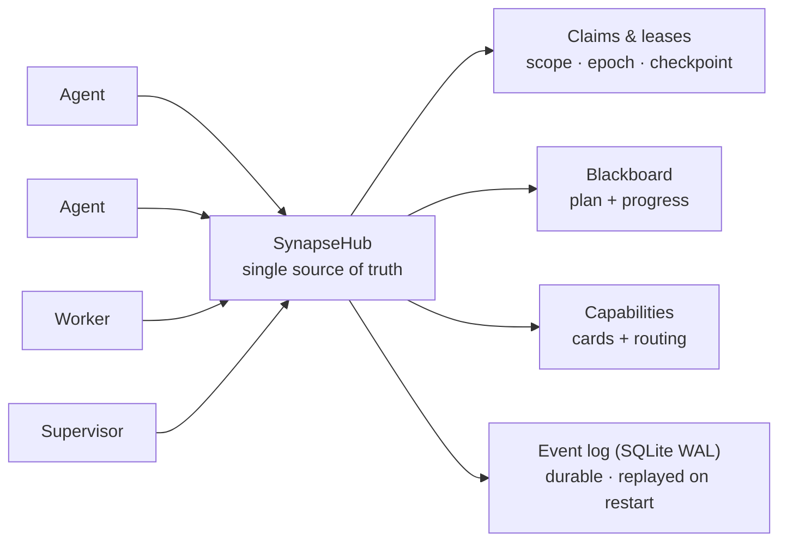

<!--
SPDX-License-Identifier: AGPL-3.0-or-later
Commercial license available
© Concepts 1996–2026 Miroslav Šotek. All rights reserved.
© Code 2020–2026 Miroslav Šotek. All rights reserved.
ORCID: 0009-0009-3560-0851
Contact: www.anulum.li | protoscience@anulum.li
SYNAPSE CHANNEL — repository overview
-->

<p align="center">
  
</p>

<p align="center">
  <strong>Local-first coordination bus for AI agents working in parallel — one repository or a whole ecosystem of them</strong>
</p>

<p align="center">
  <a href="https://github.com/anulum/synapse-channel/actions/workflows/ci.yml"></a>
  <a href="https://github.com/anulum/synapse-channel/actions/workflows/codeql.yml"></a>
  <a href="https://pypi.org/project/synapse-channel/"></a>
  <a href="https://pypi.org/project/synapse-channel/"></a>
  <a href="https://pepy.tech/project/synapse-channel"></a>
  <a href="LICENSE"></a>
  <a href="https://anulum.li/synapse/pricing.html"></a>
  
  <a href="https://codecov.io/gh/anulum/synapse-channel"></a>
  <a href="https://api.reuse.software/info/github.com/anulum/synapse-channel"></a>
  <a href="https://securityscorecards.dev/viewer/?uri=github.com/anulum/synapse-channel"></a>
  <a href="https://github.com/astral-sh/ruff"></a>
  <a href="https://doi.org/10.5281/zenodo.20801559"></a>
</p>

A local-first coordination bus for a fleet of AI agents working in parallel —
within a single repository or spread across a whole ecosystem of them. One
WebSocket hub is the shared source of truth for **presence**, **work claims**,
**chat**, **task status**, and **resource offers**: agents address each other
across projects and share one plan, while file-scope claims keep the agents in any
one repository off each other's files.

The bus is transport-light (one dependency, `websockets`), hub-centric by design
(one place owns presence, leases, and history), and runs entirely on the local
machine. Model workers reply on-channel through any OpenAI-compatible endpoint,
including a local Ollama server, with a deterministic rule-based fallback for
offline use.

## At a glance



A claim leases a unit of work with a file scope, so two agents never edit the
same files; the plan, handoffs, checkpoints, and a stall supervisor keep the work
moving; and the durable event log means a hub restart resumes live leases rather
than losing them.

## Install

```bash
python -m pip install synapse-channel       # the release from PyPI
python -m pip install -e ".[dev]"           # or an editable dev checkout
```

This installs the `synapse` command. To run the hub as an always-on local service
or a container, see the [deployment guide](docs/deployment.md) (a `systemd` user
unit and `docker compose` are both included).

## Releases

This package is developed in the open and dogfooded daily: a fleet of coding
agents runs its own coordination on it, so problems surface in real use and are
fixed quickly. Releases are therefore frequent and mostly small — fixes and
hardening rather than churn. The wire protocol and the public Python API stay
backwards-compatible within a major version; any breaking change is called out in
the changelog.

If you need a fixed target, pin a version (`synapse-channel==X.Y.Z`); to get the
latest fixes, track the newest release. Both are supported.

## Quick start

Launch a hub plus one or two local model workers in one command:

```bash
synapse team
```

Then, from another terminal, watch the channel or send a message:

```bash
synapse listen --name USER
synapse send --name USER --target FAST "what is the status of TASK-1?"
```

### Running pieces individually

```bash
synapse hub --port 8876
synapse hub --port 8876 --db ./synapse.db            # crash-safe: resumes leases + history on restart
synapse hub --port 8876 --relay-log ./feed.ndjson    # mirror the channel to a compact file for observers
synapse worker --name FAST --provider ollama --model gemma3:4b
synapse worker --name OFFLINE --provider rule        # no network, canned replies
synapse worker --name TIER --provider tiered --model small --heavy-model big  # route trivial→rule, hard→heavy
synapse relay ./feed.ndjson                          # decode and print that file as readable lines
synapse ingest ./synapse.db --memory --cursor ./mem.cursor  # stream durable memory events since a seq cursor (NDJSON)
synapse board                                        # print the shared task/progress blackboard
synapse task declare BUILD --title "compile"         # declare/update the shared plan from the CLI
synapse task update BUILD --status done              # mark a plan task done so dependents unblock
synapse supervisor --idle-seconds 300                # LLM-free: re-offer tasks that stall
synapse manifest                                     # print the capability cards agents advertised
synapse hub --host 0.0.0.0 --token s3cret            # require a shared secret when binding off-loopback
synapse send --token s3cret --name USER "hello"      # agents present the token to a secured hub
```

### Agent ergonomics — the `syn` commands

For the short loop an agent runs every session — arm a waiter, send a message,
read the inbox, glance at the board — the package also ships `syn`, a thin,
identity-correct front end over the commands above:

```bash
syn name                          # resolve and print this terminal's identity
syn arm                           # arm a directed-only waiter (named <project>-rx, distinct from the sender)
syn say REMANENTIA,CEO "ack"      # send to one, several, or all
syn inbox                         # print messages addressed to you since the cursor
syn board                         # the shared task/progress board
```

The one thing it gets right that a hand-rolled shell alias does not is **identity**.
The project is resolved from `--project`, then `$SYN_PROJECT` (or `$SYN_IDENTITY`
for a `project/<type>-<id>` multi-agent identity), and the working directory only
as a last resort — so a command run from the wrong directory does not silently
coordinate as the wrong project, and an identity that looks accidental (the home
directory, a system path) is flagged rather than used in silence. Set
`$SYN_PROJECT` once per terminal and the identity is stable across tool calls. The
`syn-name`/`syn-wait`/`syn-say`/`syn-inbox`/`syn-board` aliases are installed too.

### Durability

Passing `--db` backs the hub with an append-only SQLite event log (standard
library, WAL mode). Every claim, release, task update, resource offer, and chat
message is recorded, and the hub rebuilds its state by replaying the log on
start-up. The guarantee is split honestly by workload: the lease/claim path
commits at `synchronous=FULL` (durable across an OS crash); the high-volume
chat/history path commits at `synchronous=NORMAL` (durable across an application
crash, may lose the last commit on power loss).

### Token-thrifty observation

`--relay-log` mirrors every broadcast to a newline-delimited file in a compact
short-key form (`encode_lite`), so a token-budgeted agent can watch the channel
by tailing a file instead of holding a socket. `synapse relay <file>` decodes it
back to readable lines and can resume from a saved `--cursor`. The lite form
keeps the seven core envelope fields and drops auxiliary ones; the file is bounded
by `--relay-max-lines`. A committed benchmark measures the saving honestly —
see [`benchmarks/`](benchmarks/).

### Exposure

By default the hub binds to loopback and runs with no authentication — the right
posture for one operator on one machine. When that is not enough (a worker with
tool-use, or a hub bound off-loopback), `--token` requires a shared secret that
connecting agents present with `--token`; the hub warns if it is bound to a
non-loopback host without one. This is a proportionate gate, not a cryptographic
identity system.

### MCP server face

Any MCP-compatible agent — Claude Desktop, Claude Code, an editor assistant —
coordinates through Synapse with no Synapse-specific code. Install the optional
extra and point the host at the command:

```bash
pip install 'synapse-channel[mcp]'
synapse mcp --uri ws://localhost:8876
```

`synapse mcp` runs a Model Context Protocol server over stdio that is itself a hub
client, exposing the coordination verbs as MCP tools (claim, release, send, hand
off, declare and update tasks) and the board, state, and manifest as live
resources. The hub stays MCP-agnostic and the core install keeps its single
dependency — see the [MCP guide](docs/mcp.md).

### Git-native claims

A claim can be scoped to the git branch it happens on, resolved client-side:

```bash
synapse git-claim TASK-1 --paths src/auth.py     # claim, tagged with your branch
synapse git-hook install                         # auto-release on commit/merge
synapse conflicts --check-diff                   # predict cross-branch merge conflicts
```

`synapse state` shows each claim's branch; installed git hooks release a claim
when its files are committed or merged; and `synapse conflicts` flags two agents
about to edit the same files on branches that merge into the same base. The hub
stays **git-agnostic** — it stores the branch as opaque metadata and never runs
git or reads a filesystem — so all git work is on the client. See the
[git-native claims guide](docs/git-claims.md).

## Coordination model

1. Claim before you work: an agent leases a task by id; a live lease blocks other
   agents from claiming the same task.
2. Declare a file scope on the claim (a `worktree` and `paths`); the hub refuses a
   claim whose files overlap another agent's live claim — this is how two agents
   are kept off the same files. Agents in different worktrees never contend.
3. Leases auto-expire, so a crashed agent never holds a claim forever, and each
   lease carries an epoch so a superseded agent cannot act on a dead claim. An
   owner can save a durable checkpoint on the task; if its lease lapses, the next
   agent to claim the task inherits that checkpoint and resumes rather than
   restarting.
4. Release on completion; status and an optional artefact reference can be
   attached while the task is in progress. A held task can also be handed off
   atomically to another online agent — keeping its scope, status, and context,
   with no window for a third agent to grab it mid-transfer.
5. Presence, `who`, full state snapshots, and chat history are queryable at any
   time. After a reconnect, an agent resumes by `idem_key` (retried claims are not
   applied twice) and a `resume` cursor (fetch exactly the messages it missed).

Alongside the lease registry, a **shared blackboard** holds the team's plan: a
task ledger of declared work with dependencies (the hub refuses dependency
cycles, so `ready` tasks are well-defined) and an append-only progress ledger a
supervisor can read to spot stalls. A declared `LedgerTask` is the *plan*; a
claim is the *lease* on doing it — the two share a task id but stay independent,
so the simple claim flow keeps working. View it with `synapse board`.

See [`TEAM_PROTOCOL.md`](TEAM_PROTOCOL.md) for the working agreement and message
reference.

## Library use

```python
import asyncio
from synapse_channel import SynapseHub, SynapseAgent

async def main() -> None:
    hub = SynapseHub()
    asyncio.create_task(hub.serve("localhost", 8876))
    agent = SynapseAgent("ALPHA", uri="ws://localhost:8876")
    # ... drive the agent: claim, chat, request state ...
```

Two self-contained, runnable demos live in [`examples/`](examples/):
`coordination_demo.py` narrates a full task through the bus (declare, block,
claim, refuse an overlap, unblock, hand off), and `llm_team_demo.py` asks an
on-channel model worker a question. Each starts its own in-process hub, so
`python examples/coordination_demo.py` runs with nothing else set up.

## Architecture

| Module | Responsibility |
| --- | --- |
| `state` | Presence, scoped task-claim leases, epochs/versions, and resource offers (transport-agnostic). |
| `ledger` | Shared blackboard: the declared task plan (with dependencies) and an append-only progress stream. |
| `scoping` | Worktree- and path-overlap detection that keeps two agents off the same files. |
| `lifecycle` | Typed task-status states and the legal transitions the hub enforces. |
| `deadlock` | Wait-for cycle detection so circular hold-and-wait claims are refused. |
| `protocol` | The on-wire message envelope and message-type constants. |
| `relay` | Lite/heavy codec (`encode_lite`/`decode_lite`) and append-only NDJSON log helpers for file-based observers. |
| `hub` | The routing core: connections, names, history, broadcast. |
| `client` | The reusable async agent connection and coordination helpers. |
| `persistence` | Append-only SQLite event store (WAL) giving the hub a crash-durable spine. |
| `journal` | Records mutations as events and replays them to rebuild state on restart. |
| `ratelimit` | Per-agent token-bucket limiter so one runaway agent cannot swamp the hub. |
| `auth` | Optional shared-secret connect token (proportionate, not a cryptographic identity). |
| `chat_backends` | Pluggable reply backends (OpenAI-compatible HTTP, rule-based). |
| `routing` | Classify a request into a task class and route it to a tiered backend. |
| `llm_worker` | An on-channel agent that answers addressed messages via a backend. |
| `supervisor` | LLM-free watcher that spots stalled plan tasks and re-offers them. |
| `capability` | Agent capability cards (A2A-shaped) and the hub-aggregated manifest. |
| `launcher` | One-command local hub + worker startup. |
| `cli` | The unified `synapse` command. |

## Capability inventory

<details>
<summary><strong>Module and surface inventory</strong> — counts kept in sync with the source tree by CI.</summary>

<!-- capability-snapshot:start -->
<!-- Generated by tools/capability_manifest.py; do not edit counts by hand. -->

### SYNAPSE CHANNEL capability inventory

| Surface | Current inventory |
|---|---:|
| Package version | 0.41.0 |
| Public API exports | 59 |
| Package modules | 45 |
| Classes | 47 |
| Wire message types | 52 |
| CLI subcommands | 26 |
| Test functions | 979 |
| Benchmark harnesses | 3 |
| Documentation pages | 15 |
| GitHub Actions workflows | 10 |
| Optional-dependency groups | 4 |

This snapshot is a static inventory generated from the source tree. Performance and coverage claims have their own committed evidence — see `VALIDATION.md` and `benchmarks/`.
<!-- capability-snapshot:end -->

</details>

## Documentation and project

- [`ARCHITECTURE.md`](ARCHITECTURE.md) — the module map and coordination model.
- [`TEAM_PROTOCOL.md`](TEAM_PROTOCOL.md) — the working agreement and wire reference.
- [`VALIDATION.md`](VALIDATION.md) — how it is tested and the gates a change clears.
- [`CONTRIBUTING.md`](CONTRIBUTING.md) · [`SECURITY.md`](SECURITY.md) · [`GOVERNANCE.md`](GOVERNANCE.md) · [`ROADMAP.md`](ROADMAP.md)
- Full documentation site: <https://anulum.github.io/synapse-channel>

## Known limitations

- **Single hub, single machine.** There is no built-in failover or horizontal
  scale; the hub is one process and the design is deliberately local-first. A
  hub restart resumes from the durable log, but it is not a high-availability
  cluster.
- **Connect authentication is a proportionate shared secret**, not a
  cryptographic identity system — no key exchange, signatures, or per-message
  authentication. Do not expose the hub on an untrusted network and rely on the
  token alone.
- **Agents are trusted.** The bus coordinates agents; it does not sandbox them.
  An agent is trusted to the extent the operator trusts the process it runs in.
- **Task-class routing is heuristic.** The classifier sorts a request by length
  and a keyword set; tune the thresholds for your workload. Per-tier model
  latency is not benchmarked offline (it needs a live model server).
- **File-scope claims are advisory, not filesystem access.** The hub never reads
  a filesystem; a claim's `paths` are opaque strings compared only for glob
  overlap, so claiming `../../etc/passwd` coordinates nothing on disk and is not a
  path-traversal surface. See [`SECURITY.md`](SECURITY.md).
- **Metrics are opt-in and off by default.** `synapse hub --metrics` exposes a
  Prometheus `/metrics` and a JSON `/health` endpoint on the hub's port; without
  the flag the hub serves no HTTP. The endpoint carries operational metadata, so
  keep it on a loopback bind, or require a token with `--metrics-token` (presented
  as `Authorization: Bearer <token>` or `?token=<token>`) before exposing it. The
  live board, state, and manifest also remain available over the CLI and the MCP
  resources.
- **`synapse --version` checks PyPI for a newer release** (once a day, cached, no
  payload beyond the request itself). Silence it with `SYNAPSE_NO_UPDATE_CHECK=1`.

## Commercial use

SYNAPSE CHANNEL is **dual-licensed**, and there is **no feature difference between the
open-source and the commercial build** — the package on PyPI *is* the full product. A
commercial licence changes the terms, not the code.

- **Use it free under the AGPL-3.0** for open-source, research, internal, or personal
  work — including inside a company — as long as you do not expose a closed-source or
  hosted derivative over a network to third parties.
- **Buy a commercial licence** to ship a **closed-source** product or a **SaaS** without
  the AGPL's network-copyleft obligation.

| Plan | For | Grant |
| --- | --- | --- |
| **Community** — free (AGPL-3.0) | open source, research, personal | the full feature set; copyleft applies |
| **Indie** — pay-what-you-want, from CHF&nbsp;9.99 | a solo developer or one closed-source project | copyleft exemption for **one** product, perpetual for the purchased version line |
| **Team** | a company shipping closed-source or SaaS | exemption for **unlimited** projects in one legal entity, with email support |
| **Managed / Enterprise** | hosted multi-tenant coordination, SLAs, compliance | bespoke terms |

<p align="center">
  <a href="https://anulum.li/synapse/pricing.html"></a>
</p>

Plans and checkout are at **[anulum.li/synapse/pricing.html](https://anulum.li/synapse/pricing.html)** (Polar.sh, CHF). For enterprise, OEM, academic, or non-profit terms, write to [protoscience@anulum.li](mailto:protoscience@anulum.li). The full terms are in [`COMMERCIAL-LICENSE.md`](COMMERCIAL-LICENSE.md).

## How to cite

If you use SYNAPSE CHANNEL in your work, please cite it. Metadata is in
[`CITATION.cff`](CITATION.cff); a BibTeX entry:

```bibtex
@software{sotek_synapse_channel,
  author  = {Šotek, Miroslav},
  title   = {SYNAPSE CHANNEL: Local-first multi-agent coordination bus},
  url      = {https://github.com/anulum/synapse-channel},
  doi      = {10.5281/zenodo.20801559},
  version = {0.41.0},
  year     = {2026}
}
```

## Licence

Dual-licensed: **AGPL-3.0-or-later**, with a commercial licence available — see
[Commercial use](#commercial-use) for the plans and
[pricing](https://anulum.li/synapse/pricing.html). [`LICENSE`](LICENSE) holds the full
AGPL text, [`COMMERCIAL-LICENSE.md`](COMMERCIAL-LICENSE.md) the commercial terms, and
[`NOTICE.md`](NOTICE.md) the licensing boundary. The repository is
[REUSE](https://reuse.software/) 3.x compliant.

---

<p align="center">
  <a href="https://www.anulum.li"></a>
  &nbsp;&nbsp;&nbsp;
  
</p>

<p align="center">
  &copy; 1998–2026 Miroslav Šotek &middot; <a href="https://www.anulum.li">anulum.li</a> &middot; <code>protoscience@anulum.li</code>
</p>
