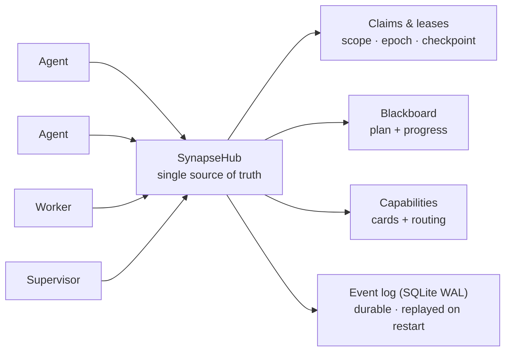

<!--
SPDX-License-Identifier: AGPL-3.0-or-later
Commercial license available
© Concepts 1996–2026 Miroslav Šotek. All rights reserved.
© Code 2020–2026 Miroslav Šotek. All rights reserved.
ORCID: 0009-0009-3560-0851
Contact: www.anulum.li | protoscience@anulum.li
SYNAPSE CHANNEL — repository overview
-->

<p align="center">
  
</p>

<p align="center">
  <strong>Stop parallel AI coding agents from clobbering each other's files.</strong><br>
  Local-first coordination bus — file-scope claims, a shared plan, and durable leases — for one repository or a whole ecosystem of them.
</p>

<p align="center">
  <a href="https://github.com/anulum/synapse-channel/actions/workflows/ci.yml"></a>
  <a href="https://github.com/anulum/synapse-channel/actions/workflows/codeql.yml"></a>
  <a href="https://pypi.org/project/synapse-channel/"></a>
  <a href="https://pypi.org/project/synapse-channel/"></a>
  <a href="https://pepy.tech/project/synapse-channel"></a>
  <a href="LICENSE"></a>
  <a href="https://anulum.li/synapse/pricing.html"></a>
  
  <a href="https://codecov.io/gh/anulum/synapse-channel"></a>
  <a href="https://api.reuse.software/info/github.com/anulum/synapse-channel"></a>
  <a href="https://securityscorecards.dev/viewer/?uri=github.com/anulum/synapse-channel"></a>
  <a href="https://github.com/astral-sh/ruff"></a>
  <a href="https://doi.org/10.5281/zenodo.20801559"></a>
</p>

A local-first coordination bus for a fleet of AI agents working in parallel —
within a single repository or spread across a whole ecosystem of them. One
WebSocket hub is the shared source of truth for **presence**, **work claims**,
**chat**, **task status**, and **resource offers**: agents address each other
across projects and share one plan, while file-scope claims keep the agents in any
one repository off each other's files.

The bus is transport-light (one dependency, `websockets`), hub-centric by design
(one place owns presence, leases, and history), and runs entirely on the local
machine. Model workers reply on-channel through any OpenAI-compatible endpoint,
including a local Ollama server, with a deterministic rule-based fallback for
offline use.

## At a glance

<p align="center">
  
</p>



A claim leases a unit of work with a file scope, so two agents never edit the
same files; the plan, handoffs, checkpoints, and a stall supervisor keep the work
moving; and the durable event log means a hub restart resumes live leases rather
than losing them.

> **Coming: Studio** — the dashboard is growing into an operator **[Studio](docs/studio.md)**:
> a control plane that answers, at a glance, what is happening, what is at risk, and
> what is safe to do next. The instrument-panel design system and the `/studio`
> reference have shipped; the live command centre is next. Local-first and read-only by
> default — an organisation-level workbench is planned as a separate layer.

## Install

```bash
python -m pip install synapse-channel       # the release from PyPI
python -m pip install -e ".[dev]"           # or an editable dev checkout
```

For an editable checkout, keep the local `.venv` aligned with the repository's
declared dev, docs, and benchmark extras:

```bash
.venv/bin/python tools/check_dev_dependency_drift.py --check
.venv/bin/python tools/audit_dependency_tooling.py --check
```

The second check is offline. It verifies that local preflight still covers the
expected tool gates, GitHub Actions are pinned to full commit SHAs, Dependabot
covers actions/Python/Docker, and the PyPI publish/download metadata surfaces
remain wired.

This installs the `synapse` command. To run the hub as an always-on local service
or a container, see the [deployment guide](docs/deployment.md) (a `systemd` user
unit and `docker compose` are both included).

## First 60 seconds

On a clean Python environment, verify the installed CLI before wiring agents into
a real repository:

```bash
python -m pip install synapse-channel
synapse doctor
synapse demo
synapse quickstart-coding
```

`synapse doctor` reports local setup issues such as identity, hub exposure,
root-filesystem pressure, and missing waiters. A brand-new machine may warn that
no hub or waiter is running; that is expected before service setup. `synapse
demo` starts its own local hub, drives a planner/worker coordination flow, and
succeeds when it prints:

```text
success: coordination demo completed
```

`synapse quickstart-coding` creates a temporary coding-fleet workspace, runs the
same no-collision coding demo used by generated workspaces, removes the temporary
workspace after success, and prints:

```text
success: coding fleet demo completed
```

## Fastest safe trial path

After the self-contained demos pass, try Synapse against a real checkout in this
order:

```bash
python -m pip install synapse-channel
synapse doctor
synapse demo
synapse quickstart-coding
synapse git-init --name trial-agent
synapse dashboard --port 8765
synapse a2a-card --endpoint-url http://127.0.0.1:8877
synapse a2a-serve --endpoint-url http://127.0.0.1:8877
```

Run this in a disposable or already-versioned repository. `synapse git-init
--name trial-agent` installs the claim-aware git hooks and writes the local
`.synapse/` conventions guide before agents edit files. The A2A bridge step is
optional and local-only: it lets another local tool inspect the Agent Card or
talk to the HTTP+JSON bridge, but it is not an external conformance claim. Do not
bind it off-loopback without bearer auth.

## Releases

This package is developed in the open and dogfooded daily: a fleet of coding
agents runs its own coordination on it, so problems surface in real use and are
fixed quickly. Releases are therefore frequent and mostly small — fixes and
hardening rather than churn. The wire protocol and the public Python API stay
backwards-compatible within a major version; any breaking change is called out in
the changelog.

Current `0.x` releases are pre-1.0 development releases, not the stable
commercial release line. `1.0.0` is planned as the first stable commercial
release of SYNAPSE CHANNEL, with the operational contracts, packaging, support
surface, and commercial licensing terms documented as part of that release.

SYNAPSE CHANNEL is seeking startup funding, strategic partners, and aligned
ecosystem co-owners who want to help mature the coordination layer for
production multi-agent development. See [commercial licensing](docs/commercial.md)
or write to `protoscience@anulum.li`.

If you need a fixed target, pin a version (`synapse-channel==X.Y.Z`); to get the
latest fixes, track the newest release. Both are supported.

## Quick start

Launch a hub plus one or two local model workers in one command:

```bash
synapse team
```

Then, from another terminal, watch the channel or send a message:

```bash
synapse listen --name USER
synapse send --name USER --target FAST "what is the status of TASK-1?"
synapse send --require-recipient --target FAST "ping"  # fail if FAST is not online
```

One-shot sends avoid the common waiter-name collision: `synapse send --name
api-dev-rx ...` sends as `api-dev`, leaving the persistent `api-dev-rx` wake
socket connected. Add `--require-recipient` for directed sends that must not
silently miss: the hub returns a private receipt naming the matched online
recipients, and the command exits non-zero when none match `--target`.

For selected sensitive payloads, encrypt the body before it reaches the hub and
decrypt it only on the recipient side:

```bash
synapse send --target FAST \
  --encrypt-key-file ./payload.key \
  --encrypt-key-id project-main-v1 \
  --encrypt-recipient FAST \
  "private handoff note"
synapse listen --name FAST --for FAST --decrypt-key-file ./payload.key
```

The hub still sees sender, target, channel id, key id, recipient names, nonce,
ciphertext, and delivery metadata. This does not manage key discovery or
rotation.

### Running pieces individually

```bash
synapse hub --port 8876
synapse hub --port 8876 --db ./synapse.db            # crash-safe: resumes leases + history on restart
synapse hub --port 8876 --relay-log ./feed.ndjson    # mirror the channel to a compact file for observers
synapse hub --shutdown-close-timeout 5               # bound active socket close handshakes on stop
synapse hub --max-progress-per-author 500            # cap retained board progress per author
synapse hub --max-findings-per-agent 200             # cap durable findings admitted per agent
synapse hub --tls-certfile ./hub.crt --tls-keyfile ./hub.key  # native wss://
synapse worker --name FAST --provider ollama --model gemma3:4b
synapse worker --name OFFLINE --provider rule        # no network, canned replies
synapse worker --name TIER --provider tiered --model small --heavy-model big  # route trivial→rule, hard→heavy
synapse relay ./feed.ndjson                          # decode and print that file as readable lines
synapse ingest ./synapse.db --memory --cursor ./mem.cursor  # stream durable memory events since a seq cursor (NDJSON)
synapse memory-recall ./synapse.db "transport handoff"       # local recall over durable memory records
synapse compact ./synapse.db --all --max-checkpoints-per-task 3 --archive-report ./compact-report.html
synapse board                                        # print the shared task/progress blackboard
synapse task declare BUILD --title "compile"         # declare/update the shared plan from the CLI
synapse task update BUILD --status done              # mark a plan task done so dependents unblock
syn ack BUILD --evidence "pytest -q"                 # post evidence and mark a board task done
synapse supervisor --idle-seconds 300 --history-multiplier 3  # re-offer stalled plan tasks
synapse manifest                                     # print capability cards, including contract counts
synapse directory                                    # print discovery-only agents/resources
synapse route-task BUILD --limit 3 --event-store ./synapse.db  # add observed evidence
synapse resource-bids BUILD --resource-kind gpu      # rank live resource offers without reserving capacity
synapse a2a-card --endpoint-url https://agent.example.com/a2a/v1  # emit A2A Agent Card JSON
synapse a2a-serve --endpoint-url http://127.0.0.1:8877             # run the HTTP+JSON A2A bridge
synapse doctor                                       # check for common misconfigs (identity, exposure, hub, waiter)
synapse demo                                         # installed self-check: local hub + planner/worker flow
synapse quickstart-coding                            # create a temporary coding fleet workspace and run it
synapse new coding-fleet ./demo-fleet                # scaffold a runnable two-agent coding demo workspace
synapse hub --host 0.0.0.0 --token s3cret            # require a shared secret when binding off-loopback
synapse hub --host 0.0.0.0 --token s3cret --tls-certfile ./hub.crt --tls-keyfile ./hub.key
synapse hub --max-connections-per-host 4             # cap simultaneous sockets from one remote host
synapse send --token s3cret --name USER "hello"      # agents present the token to a secured hub
```

### Use it with your coding agent

Synapse coordinates the agents you already run; it does not replace them.
Its MCP and A2A adapters are interop surfaces: they let Claude Code, Claude
Desktop, Cursor, Codex, Copilot-style hosts, Aider, orchestration frameworks,
and other agent tools participate in one local coordination bus while those
tools still own prompting, model choice, tool use, and editor/runtime behavior.
The [integration demo matrix](docs/integration-demos.md) lists three narrow,
repeatable paths and the unsupported behavior that remains outside each demo.

- **Claude Code / Claude Desktop / Cursor (MCP):** point the host at the MCP server
  and every coordination verb shows up as a tool — no Synapse-specific code.

  ```bash
  pip install 'synapse-channel[mcp]'
  synapse mcp --uri ws://localhost:8876        # add this to the host's MCP server config
  ```

- **Aider, or any non-MCP tool:** claim a file scope before editing and let a git
  hook release it on commit, so two sessions never touch the same files.

  ```bash
  synapse quickstart-coding                    # optional: run a temporary no-collision coding demo
  synapse new coding-fleet ./demo-fleet        # optional: keep the generated workspace
  synapse git-init --name aider-1              # one step: install the hooks + write the conventions guide
  synapse git-claim --task-id AUTH --paths src/auth --name aider-1
  aider src/auth/*.py                          # ... edit; the post-commit hook releases the claim
  ```

- **Check the wiring:** `synapse doctor` reports the common setup mistakes — no live
  waiter, a hub exposed without a token, an accidental identity, or a pressured
  root filesystem — each with its fix. Use `--disk-path <path>` to check the
  filesystem that holds a specific workspace or cache.

- **Inspect the live board:** `synapse dashboard --port 8765` opens a
  loopback-only read-only HTML view of roster, claims, board tasks, progress,
  fleet visibility, task-dependency graph edges, branch-conflict candidates,
  release receipts, and advertised capabilities, with the same snapshot
  available at `/snapshot.json` for local tooling. Pass `--a2a-state-file <path>`
  to add persisted A2A task and push-config counts to the fleet section. The
  dashboard derives task dependencies from the blackboard snapshot and uses live
  claim metadata for branch conflicts; run `synapse conflicts --check-diff` when
  you need client-side git-diff refinement. The dashboard is growing into an
  operator [Studio](docs/studio.md) — open `/studio` for the design-system reference.
  If you deliberately expose the
  dashboard with `--allow-non-loopback`, pass `--dashboard-token <token>` and
  require clients to send `Authorization: Bearer <token>`; when omitted on an
  exposed bind, Synapse generates and prints a startup token.

- **Verify a release redeploy:** `synapse doctor --redeploy-checklist` prints
  package, service, roster, durable-state, and git-hook checks for a post-release
  local fleet restart. It does not restart services by itself; it gives the
  operator copyable commands for the installed executable, hub service, presence
  daemon, wake listener, event log, and git hook path.

- **Install the always-on local services:** `synapse init` prints or installs the
  hub, project presence, and non-LLM wake listener units. `doctor --fix` prints
  the exact commands when a waiter is missing.

  ```bash
  synapse init --project myrepo --identity myrepo/worker --install-user-services
  synapse init --project myrepo --identity myrepo/worker --start-user-services
  synapse doctor --fix
  ```

- **Launch a provider command with Synapse identity:** `worker-session` exports
  the identity variables before the provider starts. Interactive terminal
  providers such as Codex, Claude, Kimi, and Grok run in a persistent tmux
  session by default when launched from an interactive terminal, with a directed
  waiter kept alive in the background. Non-terminal commands keep the temporary
  `syn arm` sidecar path.

  ```bash
  synapse worker-session --identity myrepo/worker -- codex --sandbox danger-full-access
  ```

- **Inspect or control the tmux wake path manually:** `codex-tmux` is the
  diagnostic/admin surface behind the automatic provider launch path. It keeps a
  provider TUI in a named tmux session and injects a fixed wake prompt when
  Synapse receives a directed message. It does not paste the Synapse payload into
  the terminal; the provider reads the inbox itself after waking.

  ```bash
  synapse codex-tmux start --identity myrepo/codex-main --session myrepo-codex --cwd "$PWD"
  synapse codex-tmux wait --identity myrepo/codex-main --session myrepo-codex --cwd "$PWD"
  ```

### Agent ergonomics — the `syn` commands

For the short loop an agent runs every session — arm a waiter, send a message,
read the inbox, glance at the board — the package also ships `syn`, a thin,
identity-correct front end over the commands above:

```bash
syn name                          # resolve and print this terminal's identity
syn arm                           # keep a directed-only waiter armed (named <project>-rx, distinct from the sender)
syn say REMANENTIA,CEO "ack"      # send to one, several, or all
syn ask CEO "status?"             # send, require an online recipient, and wait for replies
syn inbox                         # print messages addressed to you since the cursor
syn board                         # the shared task/progress board
syn who --me                      # show whether this identity and its -rx waiter are online
syn reap                          # list this identity's shell-hook waiter pidfile
syn reap --pid 1234               # remove a dead pidfile or SIGTERM only the verified waiter PID
syn locks                         # list this project's active leases with release commands
syn ack BUILD --evidence "pytest -q" --artifact coverage.xml
syn commit README.md -m "document the change"
```

The one thing it gets right that a hand-rolled shell alias does not is **identity**.
The project is resolved from `--project`, then `$SYN_PROJECT` (or `$SYN_IDENTITY`
for a `project/<type>-<id>` multi-agent identity), and the working directory only
as a last resort — so a command run from the wrong directory does not silently
coordinate as the wrong project, and an identity that looks accidental (the home
directory, a system path) is flagged rather than used in silence. Set
`$SYN_PROJECT` once per terminal and the identity is stable across tool calls. The
`syn who --me` shortcut dispatches to `synapse who --me --name <resolved identity>`;
it reports the identity's presence separately from its `-rx` waiter because
presence is not a wake loop.

`syn-name`/`syn-wait`/`syn-say`/`syn-ask`/`syn-inbox`/`syn-board`/`syn-reap`/`syn-locks`/`syn-ack`/`syn-commit`
aliases are installed too; `syn-wait` uses the same persistent auto-rearming path
as `syn arm`. `syn reap` is the safe cleanup path for shell-hook waiter sidecars:
it only inspects this resolved identity's pidfile, and it refuses to signal a PID
unless the live command line verifies as that exact identity's `synapse arm`
waiter. It never pattern-kills processes. `syn locks` queries the live state
snapshot using the resolved identity and prints active leases for the project:
holder, scope, age, remaining TTL, checkpoint/git context, and the explicit
`synapse release <task> --name <owner>` command. `syn ack <task>` posts repeatable
`--evidence` and `--artifact` values as an `assessment` progress note authored by
the resolved identity, waits for the hub confirmation, then marks the board task
`done`. `synapse release` can also attach a hub-echoed receipt with evidence,
artifacts, changed files, generated artifacts, approvals, known failures,
confidence, and evidence freshness. The receipt includes advisory
`epistemic_status` metadata (`supported`, `needs_freshness`, `stale`,
`degraded`, or `unsupported`) plus reasons derived from the submitted evidence;
`--receipt-json` prints the receipt for automation, and the board records it as
an assessment note. The `syn commit`
workflow holds the project git lease, stages only the requested paths, and
commits only those paths so unrelated staged or modified files stay out of the
commit.

To make fresh terminals connect automatically, install the shell hook once:

```bash
synapse install-shell-hook --shell auto
```

New Bash/Fish/Zsh terminals then export `SYN_PROJECT`/`SYN_IDENTITY` and keep a
cheap `synapse arm` sidecar running. The hook does **not** silently join whatever
git checkout the terminal happens to start in. It joins the neutral
`SYNAPSE_DEFAULT_PROJECT` lane, or `user` when unset, unless you explicitly set
`SYN_PROJECT`/`SYN_IDENTITY` or opt a repository in with `.synapse/project`:

```bash
mkdir -p .synapse
printf '%s\n' myrepo > .synapse/project
```

For legacy CWD-derived behavior, set `SYNAPSE_AUTO_PROJECT_FROM_CWD=1` in that
terminal. The hook also wraps common provider commands (`codex`, `claude`,
`kimi`, `grok`, `gemini`, `agent`, `ask`, `ollama`) through `synapse
worker-session`, so cloud and local LLM sessions inherit the same Synapse
identity from process start. In an interactive terminal, Codex/Claude/Kimi/Grok
launch through a persistent tmux session and directed wake bridge automatically;
the user still types only the provider command. Set `SYNAPSE_PROVIDER_TMUX=0` to
keep those providers on the direct execution path, or `SYNAPSE_AUTO_CONNECT=0` to
disable the hook for a terminal.

### Durability

Passing `--db` backs the hub with an append-only SQLite event log (standard
library, WAL mode). Every claim, release, task update, resource offer, and chat
message is recorded, and the hub rebuilds its state by replaying the log on
start-up. The guarantee is split honestly by workload: the lease/claim path
commits at `synchronous=FULL` (durable across an OS crash); the high-volume
chat/history path commits at `synchronous=NORMAL` (durable across an application
crash, may lose the last commit on power loss).

Use `synapse compact` to bound the durable memory spine after every read-side
consumer has advanced past a floor sequence. Add `--archive-report` when the
maintenance run should leave an operator-readable HTML record of the
pre-compaction event snapshot:

```bash
synapse compact ./synapse.db --all --max-checkpoints-per-task 3 \
  --archive-report ./compact-report.html
```

The report is written owner-only and includes event counts, the compaction floor,
checkpoint/finding removal counts, board tasks, release receipt notes, and a
bounded coordination timeline. It is an audit aid for a local event store; it
does not certify that release evidence is sufficient.

### Token-thrifty observation

`--relay-log` mirrors every broadcast to a newline-delimited file in a compact
short-key form (`encode_lite`), so a token-budgeted agent can watch the channel
by tailing a file instead of holding a socket. `synapse relay <file>` decodes it
back to readable lines and can resume from a saved `--cursor`. The lite form
keeps the seven core envelope fields and drops auxiliary ones; the file is bounded
by `--relay-max-lines`. A committed benchmark measures the saving honestly —
see [`benchmarks/`](benchmarks/).

### Exposure

By default the hub binds to loopback and runs with no authentication — the right
posture for one operator on one machine. When that is not enough (a worker with
tool-use, or a hub bound off-loopback), `--token` requires a shared secret that
connecting agents present with `--token`. Binding off loopback without a token is
**refused** rather than silently exposed: the hub will not start unless you set a
token (and `--metrics-token` when metrics are on), or explicitly pass
`--insecure-off-loopback` to accept the risk. This is a proportionate gate, not a
cryptographic identity system.
For native `wss://`, pass both `--tls-certfile` and `--tls-keyfile`. TLS protects
the transport but does not replace `--token`; an off-loopback hub still needs the
shared secret unless you explicitly opt into `--insecure-off-loopback`.

### MCP server face

Any MCP-compatible agent — Claude Desktop, Claude Code, an editor assistant —
coordinates through Synapse with no Synapse-specific code. Install the optional
extra and point the host at the command:

```bash
pip install 'synapse-channel[mcp]'
synapse mcp --uri ws://localhost:8876
```

`synapse mcp` runs a Model Context Protocol server over stdio that is itself a hub
client, exposing the coordination verbs as MCP tools (claim, release, send, hand
off, declare and update tasks) and the board, state, and manifest as live
resources. It also exposes read-only MCP resource templates for a single board
task, one agent, and one resource kind. The hub stays MCP-agnostic and the core
install keeps its single dependency — see the [MCP guide](docs/mcp.md).

For Agent2Agent discovery, `synapse a2a-card --endpoint-url ...` projects the
live capability manifest into an A2A Agent Card JSON document suitable for a
thin HTTP edge to serve as `/.well-known/agent-card.json`.
Capability cards can also carry declarative capability contracts: per-task-class
`input_schema` and `output_schema` mappings plus optional preconditions and
postconditions. These contracts are discovery metadata for routing and review;
they do not grant executable trust or certify that a remote peer conforms.
`synapse directory` joins the live capability manifest with resource offers into
a discovery-only capability directory for agents and tools. Directory entries
are routing hints and review evidence only; they do not reserve capacity,
authorize execution, or certify agent/tool trust.

### Official Go client

`clients/go/synapse` provides the official Go client for read-only ops and CI
tools. It fetches HTTP JSON surfaces such as `synapse dashboard` `/snapshot.json`
through `DashboardSnapshot` or `GetJSON`, with optional bearer authentication
for dashboard tokens on exposed HTTP surfaces.
It does not implement the WebSocket mutation protocol for claims, chat, board
writes, release receipts, or presence. See the [Go client guide](docs/go-client.md).

### Official TypeScript/JavaScript client

`clients/js` provides the official typed WebSocket client, published to npm as
`@anulum/synapse-channel`. Unlike the read-only Go client it speaks the mutation
protocol — chat, claims, releases, board reads, presence, and receipts — and runs
unchanged in the browser and in Node 20+ with no runtime dependencies. See the
[TypeScript/JavaScript client guide](docs/js-client.md).

`synapse route-task TASK-1` uses that live directory plus the shared board to
rank candidate agents with deterministic local signals. With
`--event-store ./synapse.db`, it also uses positive release-receipt assessment
notes as observed evidence and keeps each matched signal tied to its source task
and durable event sequence. The recommendation is advisory only: it does not
claim work, mutate the board, reserve resources, grade agents, or turn a
capability card into executable trust.
`synapse resource-bids TASK-1` uses the same live directory and board task to
rank resource offers with deterministic local reasons: resource kind, capacity,
provider task-class/skill matches, description overlap, resource-name overlap,
and matching metadata. It is an advisory marketplace-style view only; it does
not reserve capacity, authorize execution, mutate the board, or certify provider
trust.
`synapse memory-recall ./synapse.db "query"` provides the first product slice of
provenance-preserving memory recall. It reads only the local SQLite event store,
projects findings, checkpoints, and handoffs into deterministic token matches,
and returns the source sequence, event kind, task id, actor, and matched tokens.
It does not create external embeddings, contact a service, certify truth, or
mutate hub state.
To run that edge directly, use `synapse a2a-serve --endpoint-url ...`; it serves
the public Agent Card, forwards `POST /message:send` text/data/file parts into
SYNAPSE chat, supports immediate `POST /message:stream` Server-Sent Events,
exposes bridge-local task list/get/cancel plus push-notification configuration
routes, accepts JSON-RPC 2.0 calls on `/rpc`, and can enforce Bearer auth plus
request size/depth bounds, persist task state with `--state-file`, fail stale
open tasks with `--task-timeout`, and bound one subscription wait with
`--subscribe-timeout`.
The bridge is intentionally a local-first HTTP+JSON edge: it stores bridge task
state locally in owner-only state/temp files, rejects unsafe caller ids and
webhook targets including delivery-time DNS or redirect targets that resolve to
local networks, bounds stored tasks/history/artifacts/push configs/replay
history with terminal-task retention GC, emits subscription replay only from the
current bridge process, and does not claim independent A2A conformance until
remote CI, interoperability, and real webhook receiver validation have run. That
independent validation runs as a community track of reproducible
[validation receipts](docs/a2a-validation-receipts.md) — discovery, task lifecycle,
webhook, proxy/TLS, replay, and threat-model — rather than a single pass/fail.

### Git-native claims

A claim can be scoped to the git branch it happens on, resolved client-side:

```bash
synapse git-init                                 # one-step setup: install the hooks + write a .synapse/ guide
synapse git-claim TASK-1 --paths src/auth.py     # or: synapse git-claim --task-id TASK-1 ...
synapse git-hook install                         # (git-init already does this) auto-release on commit/merge
synapse conflicts --check-diff                   # predict cross-branch merge conflicts
```

The planned [policy engine](docs/policy-engine.md) builds on git-native claims,
release receipts, and event-log evidence so teams can evaluate required tests,
strict type checking, owner approval, evidence freshness, generated artifact
parity, and no-merge-without-receipt rules before turning any advisory output
into a local hook or CI gate.

[`synapse hub --paranoid`](docs/paranoid-mode.md) enforces a strict local hub
profile and prints an explicit missing-hook checklist: token-required hub access,
durable event logs, per-message authentication for selected mutating frames,
metrics bearer-token auth, disabled metrics query tokens, and clear gaps for
encryption, signed events, identity, ACLs, private channels, A2A profiles, and
exposed deployment review.

The planned [at-rest encryption](docs/at-rest-encryption.md) profile scopes
optional protection for SQLite event stores, relay logs, A2A state, cursor files,
archive reports, temporary files, and backups, with key storage, key derivation,
rotation, backup recovery, and lost-key recovery boundaries documented before
any encryption flag ships.

The [end-to-end encrypted channels](docs/end-to-end-encrypted-channels.md)
runtime encrypts selected chat payloads with `synapse send --encrypt-key-file`
and decrypts them locally with `synapse listen --decrypt-key-file`, while the
broader profile for private progress notes, handoff checkpoints, A2A artifacts,
key discovery, and rotation remains explicit follow-on work.

The [private channels](docs/private-channels.md) runtime scopes chat delivery to
explicit channel members, keeps a bounded member-only live history, mirrors
channel-tagged relay events for filtered export, and supports metadata-only
event-query channel filters. It does not encrypt payloads or create
cryptographic identity.

The planned [differential-privacy blackboard](docs/differential-privacy-blackboard.md)
profile scopes redacted and noisy shared blackboard projections for
multi-organisation views. It is not implemented yet, keeps raw local board data
exact for the operator, and does not encrypt payloads, replace private channels,
replace end-to-end encrypted channels, anonymize raw logs, or authorize board
writes.

The planned [signed events and mTLS](docs/signed-events-mtls.md) profile scopes
event signatures, key rotation, replay protection, verification results, trust
bundles, certificate pinning, and trusted multi-host peers. It is not
implemented yet, does not encrypt payloads, does not replace per-agent identity,
and does not certify external federation.

The [per-message authentication](docs/per-message-authentication.md) runtime
enforces opt-in HMAC-SHA256 authentication for selected mutating WebSocket
frames after connect authentication. It defines canonical frames, key ids,
sender-bound CLI keys, nonces, signed sequence metadata, timestamp windows,
bounded in-memory replay cache behavior, key rotation, revocation results, and
verification results without claiming payload encryption, public-key signatures,
signed events, or identity enforcement.

The planned [identity and ACL](docs/identity-and-acl.md) profile scopes
per-agent identity, identity-bound credentials, project namespaces, allowed
verbs, target patterns, metrics/A2A/dashboard/release privileges,
deny-by-default authorization, credential rotation, revocation, and migration
from shared-token mode without claiming runtime enforcement today.

The planned [signed capability cards](docs/signed-capability-cards.md) profile
scopes tamper-evident capability advertisements for manifests, directories,
dashboards, MCP resources, and A2A Agent Card projections. It is not implemented
yet, keeps unsigned local cards as advisory discovery, and does not authorize
tools, replace per-message authentication, replace signed events, or sandbox
agents.

`synapse git-init` bundles the hook install with a short `.synapse/git-claims.md`
onboarding guide (branch convention + worktree workflow). `synapse state` shows
each claim's branch; installed git hooks release a claim
when its files are committed or merged; and `synapse conflicts` flags two agents
about to edit the same files on branches that merge into the same base.
`--check-diff` narrows directory or whole-worktree claims to files both branches
actually changed when both branch diffs are available. The hub stays
**git-agnostic** — it stores the branch as opaque metadata and never runs git or
reads a filesystem — so all git work is on the client. See the
[git-native claims guide](docs/git-claims.md).

For a concise lease view while coordinating a session:

```bash
syn locks              # current project only
syn locks --all        # every active lease
syn locks --owner api  # one owner or project namespace
```

When a manual release is also the closeout record, attach the evidence directly:

```bash
synapse release BUILD --name api-dev \
  --evidence "pytest tests/test_feature.py -q: passed" \
  --changed-file src/synapse_channel/feature.py \
  --artifact coverage.xml \
  --receipt-json
```

When closeout evidence should be observed rather than hand-entered,
`synapse verify-release` runs declared commands, records exit codes and
stdout/stderr SHA-256 digests, hashes named artifacts, captures Git `HEAD`,
tree, and changed files, then writes receipt JSON for `synapse release --receipt`:

```bash
synapse verify-release BUILD --name api-dev \
  --run ".venv/bin/python -m pytest tests/test_feature.py -q" \
  --artifact coverage.xml \
  --output verified-release.json
synapse release BUILD --name api-dev --receipt verified-release.json --receipt-json
```

The resulting `supported` status remains advisory: it describes fresh submitted
evidence, not independent proof that the checks or artifacts are sufficient.

For safer task selection and release receipts, the local test ownership map
connects source files to likely owning tests using AST imports plus a
conservative filename fallback:

```bash
python tools/test_ownership_map.py --check \
  --source src/synapse_channel/core/receipts.py \
  --require-owned src/synapse_channel/core/receipts.py
```

It is a deterministic local aid for choosing focused tests; it does not replace
review, coverage, or the release receipt evidence itself.

When a source change can stale generated outputs, ask the generated-output
dependency map which generated paths should be included in the same claim:

```bash
python tools/generated_dependency_claims.py --claim-args \
  --source src/synapse_channel/core/receipts.py
```

The command prints `--paths ...` arguments for `synapse git-claim` and can also
emit JSON for release tooling. It is a deterministic coordination aid; the
owning generator, such as `python tools/capability_manifest.py --check`, remains
the freshness check for the generated artefact itself.

For semantic task scopes, resolve modules, public symbols, API surfaces, tests,
generated artefacts, migrations, or source paths into ordinary claim paths:

```bash
python tools/semantic_claims.py --selector \
  symbol:synapse_channel.core.receipts.build_release_receipt \
  --claim-args
```

The semantic claim resolver prints the source file, likely owning tests, and
generated outputs that should share the same file-scope claim. It keeps the hub
path-scope and local-first while giving agents a deterministic semantic planning
step before they call `synapse git-claim`.

For daily claims, `synapse git-claim` can resolve the same selectors directly:

```bash
synapse git-claim TASK-RECEIPTS \
  --symbol synapse_channel.core.receipts.build_release_receipt \
  --semantic-evidence-json semantic-evidence.json
```

The command resolves the current git root locally, expands the selector into
ordinary claim paths, and writes receipt-ready selector evidence when requested.
The hub still receives only file-scope paths.

Before merge or handoff, the import graph merge-risk radar compares changed
files with claimed paths, package-local Python import neighbours, CODEOWNERS,
and mapped test owners:

```bash
python tools/import_merge_risk.py --changed src/synapse_channel/core/receipts.py \
  --claimed src/synapse_channel/core/state.py --check
```

Use `--base main --head HEAD` instead of `--changed` to read a local branch diff,
or `--claims-json claims.json` to feed paths from an external claim snapshot.
The radar is an advisory local planning check; it predicts likely contention but
does not replace tests, review, or release receipt evidence.

For post-hoc coordination forensics, query the durable event log directly:

```bash
synapse event-query ./synapse.db "task TASK-1 timeline"
synapse event-query ./synapse.db "task TASK-1 at seq 120" --json
synapse event-query ./synapse.db "path src/auth.py between 0 9999999999"
synapse event-query ./synapse.db "conflicts at seq 120"
synapse event-query ./synapse.db 'timeline("TASK-1").'
synapse event-query ./synapse.db 'MATCH (task:TASK {id:"TASK-1"}) RETURN timeline'
synapse postmortem ./synapse.db TASK-1
synapse debug ./synapse.db --fork-at 142 --set status=blocked
synapse reproduce ./synapse.db TASK-1 --expect 9f2c…
synapse causality causes ./synapse.db 142
synapse merkle root ./synapse.db
synapse reliability ./synapse.db
synapse accounting report ./synapse.db --pricing pricing.json --budget budget.json
synapse approval request --name dev --subject TASK-1 --reason "needs sign-off"
synapse approval status ./synapse.db --pending
synapse ttl-advice ./synapse.db
```

This temporal event-log query path is read-only. It reconstructs task timelines,
task state at a sequence or timestamp, path-touch windows, and historical
file-scope conflicts from the SQLite event store created by `synapse hub --db`.
The Datalog-like and Cypher-like examples are prototype aliases for the same
small query model, not a separate graph database or mutable policy engine.

Use `synapse postmortem ./synapse.db TASK-1` when a task needs a replayable
postmortem for a handover or incident note. The report includes the durable task
timeline, owners, releases, assessment evidence, reconstructed path-overlap
conflicts, and candidate unanswered messages. Candidate unanswered messages mean
the log contains a directed chat mentioning the task id and no later matching
chat reply; it is an audit signal, not proof of intent.

Use `synapse debug ./synapse.db --fork-at 142` to rewind a task in the log and
inspect a what-if. It reconstructs the exact claim state — owner, status, paths,
and the saved resume checkpoint — that the task held at that sequence, then prints
the resume manifest an agent would pick up from there (with `--set FIELD=VALUE`
overriding a resume field) next to the events that really followed. The hub runs
no task, so this is read-only inspection, not re-execution; it exits `1` when the
task held no live claim at that point.

Use `synapse reproduce ./synapse.db TASK-1` to fingerprint a task's authoritative
history into a portable SHA-256 digest. Hub state is a pure fold of an append-only
log, so the same claim snapshots and releases replay to the same digest on every
machine; `--expect DIGEST` turns it into a gate that fails on any divergence, the
way a release receipt is verified.

Use `synapse causality causes ./synapse.db 142` to trace coordination causality
over the log. It folds the durable events into a directed acyclic graph of three
recorded relations — a task's own lifecycle, a declared `depends_on` satisfied by
the dependency's completion, and a release that let a later, path-overlapping
claim proceed — and answers against an event sequence: `causes` for what preceded
it, `effects` for what it enabled, and `counterfactual` for the downstream events
that would lose their recorded cause without it. This is coordination causality
inferred from recorded scheduling semantics, not statistical causal discovery;
every edge is backed by a concrete event, and the counterfactual is a structural
what-if over the inferred graph.

Use `synapse merkle root ./synapse.db` to commit the durable log to a single
Merkle root — a 32-byte fingerprint of every event, so two operators or two
federated hubs holding the same log derive the same root and a mismatch proves
they differ. `synapse merkle prove ./synapse.db 142` emits an `O(log n)`
inclusion proof for one event, and `synapse merkle verify proof.json` checks that
proof offline against a trusted root with no event store — the light-client
verification a follower runs. The tree follows RFC 6962 (Certificate
Transparency), so a leaf hash cannot be forged as an interior node. It commits
what the log contains — integrity and inclusion — complementing `reproduce` (a
per-task digest) with a log-wide, incrementally provable commitment.

Use `synapse reliability ./synapse.db` for evidence-only reliability memory. It
tracks stale claims, declared failed-check evidence, broken handoff candidates,
and merge-conflict frequency as audit signals, not scores. It does not rank
agents, assign trust grades, or replace review of the underlying event rows.

Use `synapse accounting` for opt-in model cost/token usage. Synapse never calls a
model provider and collects no telemetry, so usage exists only when you record
it: `synapse accounting record` posts a `usage`-kind progress note, and `synapse
accounting report ./synapse.db` aggregates those notes into per-agent and
per-model totals, with optional `--pricing` for cost estimates and `--budget` for
budget evidence. Budgets are evidence, not an enforcement gate.

Use `synapse approval` for human-in-the-loop approval gates on held tasks or
policy-gated releases. `synapse approval request` puts a subject in
`awaiting_approval`, `synapse approval decide --approve|--reject` records the
decision, and `synapse approval status ./synapse.db` replays the notes into the
current state per subject (the latest event wins, so a re-request re-opens the
gate). It is advisory evidence and an audit trail, not a hard runtime gate; an
approved subject can be cited in a release receipt via `synapse release
--approval`.

The planned [agent trust graph](docs/agent-trust-graph.md) profile connects
those reliability signals, release receipts, capability observations, handoff
outcomes, and conflict history into an inspectable evidence graph for routing
review. It is not implemented yet and does not rank agents, assign trust grades,
authorize execution, replace code review, or replace identity and ACL.

The planned [federated trust model](docs/federated-trust-model.md) profile
designs how independent operator-managed domains could peer — out-of-band,
deny-by-default bundle exchange composing identity, signed events, mutual TLS,
ACLs, and receipts across a domain boundary. It is not implemented yet, is not a
certificate authority, and does not change the local-first default.

The [Agent Air Traffic Control architecture](docs/agent-air-traffic-control.md)
names how the shipped parts compose into one control loop — separation (claims),
merge-risk radar (conflicts), evidence-gated completion (receipts, policy-check,
approval), post-incident replay (postmortem, reliability), and memory (the ingest
seam). It is an architecture, not a scheduler: only claims gate a mutation, and
everything else is read-only or advisory.

The planned [cross-agent adapter kits](docs/cross-agent-adapter-kits.md) design
specifies a `synapse adapters` step that detects installed coding tools (Claude
Code, Codex, Cursor, Aider, Copilot) and writes a thin claim-aware adapter into
each tool's native config, plus thin client shims for Python frameworks. Adapters
carry only "claim before edit, release on commit, reach the hub" — Synapse stays
persona-neutral and adds no new coordination primitive.

The [multi-hub sync (CRDT) research](docs/multi-hub-sync.md) asks whether several
hubs could synchronise state while keeping claim safety and local-first. Its
honest core: most state (the append-only event log, presence, progress) merges
conflict-free, but claims are mutual exclusion and **not** a CRDT — they are
routed by single-owner-per-namespace and fail closed on a partition. Not
implemented; it adds no cross-hub service to the local core.

The [sandboxed tools and marketplace research](docs/sandboxed-tools-and-marketplace.md)
asks what it would take to run untrusted tool code safely — a capability-limited
WebAssembly sandbox (deny-by-default filesystem, network, and resources) — and
only then a marketplace built on signed capability cards, an explicit permission
manifest, and run receipts. No untrusted code runs without the sandbox, and no
executable marketplace ships before all the preconditions exist. The sandbox itself
ships today behind the optional `[wasm]` extra; the
[WASM sandbox getting-started guide](docs/wasm-sandbox-getting-started.md) walks an
operator from a tool's source through `validate`, `test`, and `run`. The marketplace
remains a boundary specification — local-first and deny-by-default throughout.

The [managed GitHub App design](docs/managed-github-app.md) pins the boundary for
hosted cross-PR conflict prediction: the prediction itself reuses the existing
local-core conflict finder, while everything that makes it managed — webhooks,
GitHub auth, checks API, hosting — stays out of the local core. Advisory only,
not implemented, and gated on a local adoption signal.

Use `synapse ttl-advice ./synapse.db` for read-only adaptive lease TTL advice.
It derives completed-task duration samples, active live-claim counts, and stale
claim counts from the event log, then prints an advisory default. It never
changes the hub default and explicit manual TTL values still win.

## Coordination model

1. Claim before you work: an agent leases a task by id; a live lease blocks other
   agents from claiming the same task.
2. Declare a file scope on the claim (a `worktree` and `paths`); the hub refuses a
   claim whose files overlap another agent's live claim — this is how two agents
   are kept off the same files. Agents in different worktrees never contend.
3. Leases auto-expire, so a crashed agent never holds a claim forever, and each
   lease carries an epoch so a superseded agent cannot act on a dead claim. An
   owner can save a durable checkpoint on the task; if its lease lapses, the next
   agent to claim the task inherits that checkpoint and resumes rather than
   restarting.
4. Release on completion; status and an optional artefact reference can be
   attached while the task is in progress. A held task can also be handed off
   atomically to another online agent — keeping its scope, status, and context,
   with no window for a third agent to grab it mid-transfer.
5. Presence, `who`, full state snapshots, and chat history are queryable at any
   time. After a reconnect to the same running hub, an agent can resume by
   `idem_key` (retried claims are not applied twice while the hub retains its
   idempotency cache) and a `resume` cursor (fetch exactly the messages it
   missed).

Alongside the lease registry, a **shared blackboard** holds the team's plan: a
task ledger of declared work with dependencies (the hub refuses dependency
cycles, so `ready` tasks are well-defined) and an append-only progress ledger a
supervisor can read to spot stalls. A declared `LedgerTask` is the *plan*; a
claim is the *lease* on doing it — the two share a task id but stay independent,
so the simple claim flow keeps working. The hub keeps the progress view bounded
globally, per author, and per task id (`--max-progress`,
`--max-progress-per-author`, `--max-progress-per-task`), while the durable event
log remains append-only until explicit compaction. Durable findings also have a
per-agent admission cap (`--max-findings-per-agent`) so one producer cannot fill
the shared memory spine. View the board with `synapse board`.

`synapse supervisor` remains deterministic and LLM-free. It re-offers
`in_progress` tasks after the fixed `--idle-seconds` ceiling, and, by default,
can lower that ceiling when completed-task progress cadence in the same board
shows a faster local pattern. Use `--no-predictive-stall` to disable the
historical-cadence supplement; it is an advisory local board heuristic, not a
guarantee that work is actually abandoned.

See [`TEAM_PROTOCOL.md`](TEAM_PROTOCOL.md) for the working agreement and message
reference.

## Library use

```python
import asyncio
from synapse_channel import SynapseHub, SynapseAgent

async def main() -> None:
    hub = SynapseHub()
    asyncio.create_task(hub.serve("localhost", 8876))
    agent = SynapseAgent("ALPHA", uri="ws://localhost:8876")
    # ... drive the agent: claim, chat, request state ...
```

Two self-contained, runnable demos live in [`examples/`](examples/):
`coordination_demo.py` narrates a full task through the bus (declare, block,
claim, refuse an overlap, unblock, hand off), and `llm_team_demo.py` asks an
on-channel model worker a question. Each starts its own in-process hub, so
`python examples/coordination_demo.py` runs with nothing else set up.

## Architecture

| Module | Responsibility |
| --- | --- |
| `state` | Presence, scoped task-claim leases, epochs/versions, and resource offers (transport-agnostic). |
| `ledger` | Shared blackboard: the declared task plan (with dependencies) and a bounded progress stream. |
| `scoping` | Worktree- and path-overlap detection that keeps two agents off the same files. |
| `lifecycle` | Typed task-status states and the legal transitions the hub enforces. |
| `deadlock` | Wait-for cycle detection so circular hold-and-wait claims are refused. |
| `protocol` | The on-wire message envelope and message-type constants. |
| `relay` | Lite/heavy codec (`encode_lite`/`decode_lite`) and append-only NDJSON log helpers for file-based observers. |
| `archive_report` | Static HTML archive reports for compacted event-store history and release receipt notes. |
| `hub` | The routing core: connections, names, history, broadcast. |
| `client` | The reusable async agent connection and coordination helpers. |
| `persistence` | Append-only SQLite event store (WAL) giving the hub a crash-durable spine. |
| `journal` | Records mutations as events and replays them to rebuild state on restart. |
| `ratelimit` | Per-agent and per-host token-bucket limiters, plus per-host connection caps, so one runaway source cannot swamp the hub. |
| `auth` | Optional shared-secret connect token (proportionate, not a cryptographic identity). |
| `chat_backends` | Pluggable reply backends (OpenAI-compatible HTTP, rule-based). |
| `routing` | Classify a request into a task class and route it to a tiered backend. |
| `llm_worker` | An on-channel agent that answers addressed messages via a backend. |
| `stall` | Deterministic fixed-threshold and historical-cadence stall policy. |
| `supervisor` | LLM-free watcher that spots stalled plan tasks and re-offers them. |
| `capability` | Agent capability cards (A2A-shaped) and the hub-aggregated manifest. |
| `capability_contracts` | Declarative input/output capability contracts carried by manifest cards. |
| `capability_directory` | Discovery-only directory joining capability cards and resource offers. |
| `semantic_routing` | Advisory local task-to-agent recommendations over board tasks and capability cards. |
| `capability_observations` | Provenance-preserving observed release-receipt evidence for advisory routing. |
| `resource_bidding` | Advisory resource-offer bids over the live capability directory. |
| `memory_projection` | Deterministic local recall over durable findings, checkpoints, and handoffs. |
| `launcher` | One-command local hub + worker startup. |
| `cli` | The unified `synapse` command. |

## Capability inventory

<details>
<summary><strong>Module and surface inventory</strong> — counts kept in sync with the source tree by CI.</summary>

<!-- capability-snapshot:start -->
<!-- Generated by tools/capability_manifest.py; do not edit counts by hand. -->

### SYNAPSE CHANNEL capability inventory

| Surface | Current inventory |
|---|---:|
| Package version | 0.79.0 |
| Public API exports | 63 |
| Package modules | 255 |
| Classes | 344 |
| Wire message types | 65 |
| CLI subcommands | 110 |
| Test functions | 3310 |
| Benchmark harnesses | 6 |
| Documentation pages | 46 |
| GitHub Actions workflows | 12 |
| Optional-dependency groups | 6 |

This snapshot is a static inventory generated from the source tree. Performance and coverage claims have their own committed evidence — see `VALIDATION.md` and `benchmarks/`.
<!-- capability-snapshot:end -->

</details>

## Documentation and project

- New here? [Use cases](https://anulum.github.io/synapse-channel/use-cases/) · [How it compares](https://anulum.github.io/synapse-channel/comparison/) · [FAQ](https://anulum.github.io/synapse-channel/faq/) · [Troubleshooting](https://anulum.github.io/synapse-channel/troubleshooting/) · [Glossary](https://anulum.github.io/synapse-channel/glossary/)
- [`ARCHITECTURE.md`](ARCHITECTURE.md) — the module map and coordination model.
- [`TEAM_PROTOCOL.md`](TEAM_PROTOCOL.md) — the working agreement and wire reference.
- [`VALIDATION.md`](VALIDATION.md) — how it is tested and the gates a change clears.
- [`CONTRIBUTING.md`](CONTRIBUTING.md) · [`SECURITY.md`](SECURITY.md) · [`GOVERNANCE.md`](GOVERNANCE.md) · [`ROADMAP.md`](ROADMAP.md)
- Full documentation site: <https://anulum.github.io/synapse-channel>

## Known limitations

- **Single hub, single machine.** There is no built-in failover or horizontal
  scale; the hub is one process and the design is deliberately local-first. A
  hub restart resumes from the durable log, but it is not a high-availability
  cluster.
- **Connect authentication is a proportionate shared secret**, not a
  cryptographic identity system. Opt-in per-message HMAC authentication protects
  selected mutating frames, but there is no implemented key exchange,
  public-key signature trust, per-agent identity, ACL enforcement, or mTLS trust
  bundle. Do not expose the hub on an untrusted network and rely on the token
  alone.
- **Graceful shutdown is bounded, not transactional.** `SIGTERM`/`SIGINT` stop
  accepting new sockets, close active WebSocket sessions within
  `--shutdown-close-timeout`, and rely on per-mutation persistence for durable
  state already accepted by the hub.
- **Takeover is a local recovery tool, not authentication.** The hub rate-limits
  repeated takeovers with `--takeover-cooldown` and logs takeover/conflict
  outcomes with sender, remote host, and close reason, but agents remain trusted
  local processes.
- **Agents are trusted.** The bus coordinates agents; it does not sandbox them.
  An agent is trusted to the extent the operator trusts the process it runs in.
- **Task-class routing is heuristic.** The classifier sorts a request by length
  and a keyword set; tune the thresholds for your workload. Per-tier model
  latency is not benchmarked offline (it needs a live model server).
- **File-scope claims are advisory, not filesystem access.** The hub never reads
  a filesystem; a claim's `paths` are opaque strings compared only for overlap.
  Normal relative paths stay narrow, while absolute or traversal-like declarations
  such as `../../etc/passwd` widen to the whole worktree so they cannot
  underclaim and miss a conflict. They do not grant filesystem access. See
  [`SECURITY.md`](SECURITY.md).
- **Metrics are opt-in and off by default.** `synapse hub --metrics` exposes a
  Prometheus `/metrics` and a JSON `/health` endpoint on the hub's port; without
  the flag the hub serves no HTTP. The endpoint carries operational metadata, so
  keep it on a loopback bind, or require `--metrics-token` before exposing it.
  The header form, `Authorization: Bearer <token>`, is the default token
  presentation. The query-string form `?token=<token>` is disabled by default and
  is accepted only with `--metrics-query-token-ok`, because query tokens leak
  easily into logs and history. The live board, state, and manifest also remain
  available over the CLI and the MCP resources.
- **`synapse --version` is network-silent by default.** Set
  `SYNAPSE_UPDATE_CHECK=1` to opt in to a best-effort PyPI newer-release check
  (once a day, cached, no payload beyond the request itself). Set
  `SYNAPSE_NO_UPDATE_CHECK=1` to suppress the check even when opt-in is present.

## Commercial use

SYNAPSE CHANNEL is **dual-licensed**, and there is **no feature difference between the
open-source and the commercial build** — the package on PyPI *is* the full product. A
commercial licence changes the terms, not the code.

- **Use it free under the AGPL-3.0** for open-source, research, internal, or personal
  work — including inside a company — as long as you do not expose a closed-source or
  hosted derivative over a network to third parties.
- **Buy a commercial licence** to ship a **closed-source** product or a **SaaS** without
  the AGPL's network-copyleft obligation.

| Plan | For | Grant |
| --- | --- | --- |
| **Community** — free (AGPL-3.0) | open source, research, personal | the full feature set; copyleft applies |
| **Indie** — pay-what-you-want, from CHF&nbsp;9.99 | a solo developer or one closed-source project | copyleft exemption for **one** product, perpetual for the purchased version line |
| **Team** | a company shipping closed-source or SaaS | exemption for **unlimited** projects in one legal entity, with email support |
| **Managed / Enterprise** | hosted multi-tenant coordination, SLAs, compliance | bespoke terms |

<p align="center">
  <a href="https://anulum.li/synapse/pricing.html"></a>
</p>

Plans and checkout are at **[anulum.li/synapse/pricing.html](https://anulum.li/synapse/pricing.html)** (Polar.sh, CHF). For enterprise, OEM, academic, non-profit, managed-hosting, or co-ownership terms, write to [protoscience@anulum.li](mailto:protoscience@anulum.li) with the evaluation details listed in [`docs/commercial.md`](docs/commercial.md). The full terms are in [`COMMERCIAL-LICENSE.md`](COMMERCIAL-LICENSE.md).

## How to cite

If you use SYNAPSE CHANNEL in your work, please cite it. Metadata is in
[`CITATION.cff`](CITATION.cff); a BibTeX entry:

```bibtex
@software{sotek_synapse_channel,
  author  = {Šotek, Miroslav},
  title   = {SYNAPSE CHANNEL: Local-first multi-agent coordination bus},
  url      = {https://github.com/anulum/synapse-channel},
  doi      = {10.5281/zenodo.20801559},
  version = {0.79.0},
  year     = {2026}
}
```

## Licence

Dual-licensed: **AGPL-3.0-or-later**, with a commercial licence available — see
[Commercial use](#commercial-use) for the plans and
[pricing](https://anulum.li/synapse/pricing.html). [`LICENSE`](LICENSE) holds the full
AGPL text, [`COMMERCIAL-LICENSE.md`](COMMERCIAL-LICENSE.md) the commercial terms, and
[`NOTICE.md`](NOTICE.md) the licensing boundary. The repository is
[REUSE](https://reuse.software/) 3.x compliant.

---

<p align="center">
  <a href="https://www.anulum.li"></a>
  &nbsp;&nbsp;&nbsp;
  
</p>

<p align="center">
  &copy; 1998–2026 Miroslav Šotek &middot; <a href="https://www.anulum.li">anulum.li</a> &middot; <code>protoscience@anulum.li</code>
</p>
