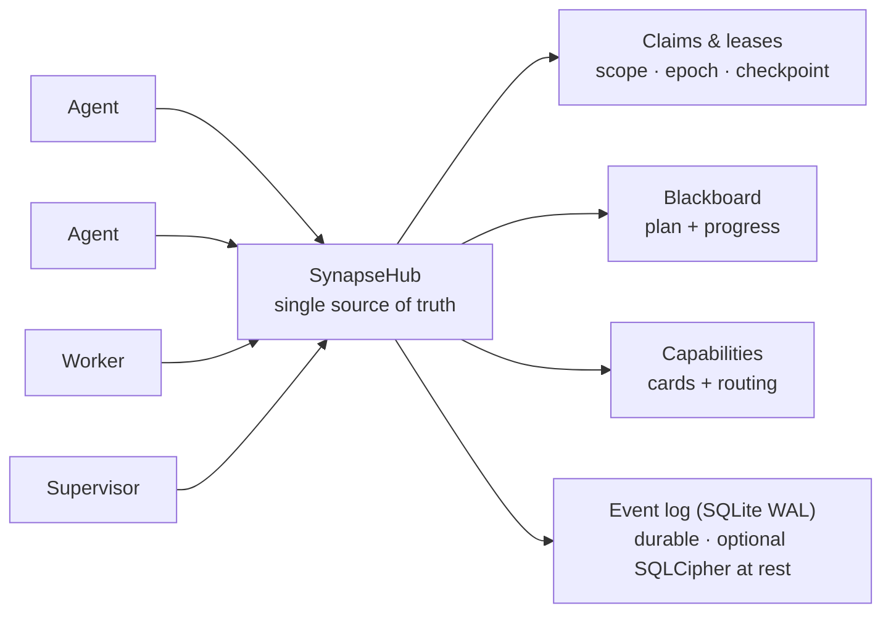
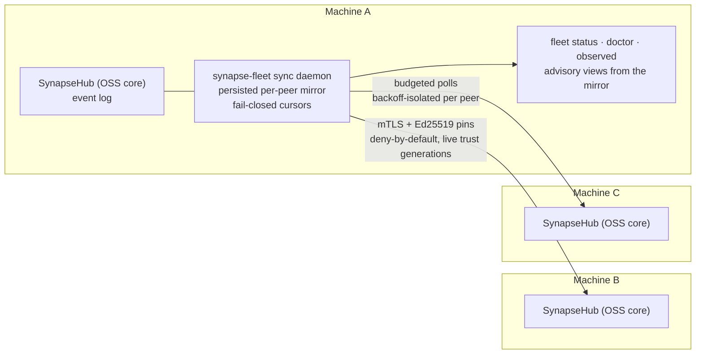

<!--
SPDX-License-Identifier: AGPL-3.0-or-later
Commercial license available
© Concepts 1996–2026 Miroslav Šotek. All rights reserved.
© Code 2020–2026 Miroslav Šotek. All rights reserved.
ORCID: 0009-0009-3560-0851
Contact: www.anulum.li | protoscience@anulum.li
mcp-name: io.github.anulum/synapse-channel
SYNAPSE CHANNEL — repository overview
-->

<p align="center">
  
</p>

<p align="center">
  <strong>Stop parallel AI coding agents from clobbering each other's files.</strong><br>
  Local-first coordination bus — file-scope claims, a shared plan, and durable leases — for one repository or a whole ecosystem of them.
</p>

<p align="center">
  <a href="https://github.com/anulum/synapse-channel/actions/workflows/ci.yml"></a>
  <a href="https://github.com/anulum/synapse-channel/actions/workflows/clients-cockpit.yml"></a>
  <a href="https://github.com/anulum/synapse-channel/actions/workflows/codeql.yml"></a>
  <a href="https://pypi.org/project/synapse-channel/"></a>
  <a href="https://pypi.org/project/synapse-channel/"></a>
  <a href="https://pepy.tech/project/synapse-channel"></a>
  <a href="LICENSE"></a>
  <a href="https://anulum.li/synapse/pricing.html"></a>
  
  <a href="https://codecov.io/gh/anulum/synapse-channel"></a>
  <a href="https://api.reuse.software/info/github.com/anulum/synapse-channel"></a>
  <a href="https://securityscorecards.dev/viewer/?uri=github.com/anulum/synapse-channel"></a>
  <a href="https://github.com/astral-sh/ruff"></a>
  <a href="https://doi.org/10.5281/zenodo.20801559"></a>
</p>

A local-first coordination bus for a fleet of AI agents working in parallel —
within a single repository or spread across a whole ecosystem of them. One
WebSocket hub is the shared source of truth for **presence**, **work claims**,
**chat**, **task status**, and **resource offers**: agents address each other
across projects and share one plan, while file-scope claims keep the agents in any
one repository off each other's files.

The bus is transport-light (one dependency, `websockets`), hub-centric by design
(one place owns presence, leases, and history), and runs entirely on the local
machine. Model workers reply on-channel through any OpenAI-compatible endpoint,
including a local Ollama server, with a deterministic rule-based fallback for
offline use.

**Your existing agents plug in without new code.** Any Model Context Protocol
host — Claude Code, Claude Desktop, Cursor — reaches the bus through the bundled
`synapse mcp` server, which exposes send, durable inbox, status, claim, release,
handoff, and task verbs as MCP tools plus the board, agents, and resources as
read-only MCP resources. Agents that speak A2A connect through the Agent Card face instead.
The hub itself stays protocol-agnostic and the core install keeps its single
dependency — the MCP and A2A adapters are optional extras (`pip install
'synapse-channel[mcp]'`). See the [MCP guide](docs/mcp.md).

## Coordinate. Observe. Govern.

Synapse's daily promise is three explicit loops:

- **Coordinate** before agents collide: `synapse git-init`, `synapse git-claim`,
  `synapse task`, and `syn ack` turn work scope, dependencies, and evidence into
  shared state instead of side-channel notes.
- **Observe** the fleet from durable state: `synapse who`, `synapse state`,
  `synapse dashboard`, `synapse event-query`, and observed peer rows show who is
  present, what is claimed, what changed, and which peer-hub facts are advisory.
- **Govern** risky actions with evidence: policy checks, approvals, release
  receipts, Merkle roots, ACL surfaces, federation, and encryption-key commands
  make operator decisions auditable. Governance surfaces report by default;
  operators decide what blocks a merge, release, or cross-hub action.
- **Protect the durable log at rest** with optional **SQLCipher** page encryption
  for the live hub event store (plus whole-file AES-GCM envelopes for relay
  logs, A2A state, cursors, and archives). See
  [SQLCipher live event store](#sqlcipher-live-event-store-at-rest) below.

## At a glance

<p align="center">
  
</p>



A claim leases a unit of work with a file scope, so two agents never edit the
same files; the plan, handoffs, checkpoints, and a stall supervisor keep the work
moving; and the durable event log means a hub restart resumes live leases rather
than losing them.

## Core and Optional Layers

SYNAPSE CHANNEL ships as one installable package, but the public surface is
tiered so the lean bus stays clear:

| Layer | Taxonomy tier | What belongs there |
|---|---|---|
| Local coordination core | `stable` | The hub, send/wait/listen/arm, claims, tasks, locks, status, board, init, and fleet bootstrap commands used for daily coordination. |
| Edge adapters | `adapter` | MCP, A2A, git hooks, tmux/provider bridges, shell hooks, ingestion, and worker seats that connect existing tools to the bus. |
| Operator analysis | `analysis` | Doctor, state, dashboard, causality, multihub, reliability, trust graph, directory, accounting, fleet scorecard export, manifests, and event queries. These do not mutate coordination state; explicit export modes can write to an operator-selected sink. |
| Governance and integrity | `governance` | Policy checks, approvals, ACL/role surfaces, federation, Merkle roots, release receipts, reproduction, compaction, encrypt-key / SQLCipher key operations. |
| Lab surfaces | `experimental` | Benchmarking, participant fabric, route-task, sandbox, workflow, TTL advice, memory recall, auto-action, and resource bidding. |

The authoritative map is [`synapse_channel.surface_taxonomy`](src/synapse_channel/surface_taxonomy.py)
and the generated operator view is [Public surface and stability](docs/public-surface.md).
Adapters and lab surfaces can be installed and used from the same package, but
they do not change the single-dependency local core.

> **Coming: Studio** — the dashboard is growing into an operator **[Studio](docs/studio.md)**:
> a control plane that answers, at a glance, what is happening, what is at risk, and
> what is safe to do next. The instrument-panel design system, `/studio` reference,
> live `/studio/command` shell, security-posture panel, and event-log LiveFeed have
> shipped. Local-first and read-only by default — an organisation-level workbench is
> planned as a separate layer.

## Install

```bash
python -m pip install synapse-channel       # the release from PyPI
python -m pip install -e ".[dev]"           # or an editable dev checkout
# optional: live hub event-store page encryption (SQLCipher)
python -m pip install 'synapse-channel[sqlcipher]'
# optional: whole-file AES-GCM envelope helpers (encrypt-key profile/migrate/rekey)
python -m pip install 'synapse-channel[encryption]'
```

For an editable checkout, keep the local `.venv` aligned with the repository's
declared dev, docs, and benchmark extras:

```bash
.venv/bin/python tools/check_dev_dependency_drift.py --check
.venv/bin/python tools/audit_dependency_tooling.py --check
```

The second check is offline. It verifies that local preflight still covers the
expected tool gates, GitHub Actions are pinned to full commit SHAs, Dependabot
covers actions/Python/Docker, and the PyPI publish/download metadata surfaces
remain wired.

This installs the `synapse` command. To run the hub as an always-on local service
or a container, see the [deployment guide](docs/deployment.md) (a `systemd` user
unit and `docker compose` are both included). On Linux, install only a permanent
exact-identity waiter with
`synapse arm install --identity myproject/agent --start`; it uses mailbox replay
and `Restart=always`, without installing a hub. Native Windows service setup is
not claimed; use WSL with systemd as documented in the deployment guide.

Two optional shell conveniences ship with the CLI: `synapse completions
bash|zsh|fish` prints tab completion for every subcommand (generated from the
live parser, so it never drifts), and `synapse install-shell-hook` adds the
guarded block that auto-arms a wake listener in each new terminal:

```bash
synapse completions bash > ~/.local/share/bash-completion/completions/synapse
synapse install-shell-hook          # auto-arm Bash, Zsh, and Fish terminals
```

## First 60 seconds

On a clean Python environment, verify the installed CLI before wiring agents into
a real repository:

```bash
python -m pip install synapse-channel
synapse doctor
synapse demo
synapse quickstart-coding
```

`synapse doctor` reports local setup issues such as identity, hub exposure,
root-filesystem pressure, and missing waiters. A brand-new machine may warn that
no hub or waiter is running; that is expected before service setup. `synapse
demo` starts its own local hub, drives a planner/worker coordination flow, and
succeeds when it prints:

```text
success: coordination demo completed
```

`synapse quickstart-coding` creates a temporary coding-fleet workspace, runs the
same no-collision coding demo used by generated workspaces, removes the temporary
workspace after success, and prints:

```text
success: coding fleet demo completed
```

Or run the whole first-run sequence as one command:

```bash
synapse fleet-init
```

It runs the doctor (`--fix` to repair the default local hub and waiter),
scaffolds a persistent `./synapse-fleet` workspace, probes which provider CLIs
this machine can seat (claude, codex, kimi, ollama, …), runs the demo smoke,
and prints the next-steps plan — waiter arming, per-provider seat commands,
`git-init`, dashboard — with the workspace's project name filled in.

## Fastest safe trial path

After the self-contained demos pass, try Synapse against a real checkout in this
order:

```bash
python -m pip install synapse-channel
synapse doctor
synapse demo
synapse quickstart-coding
synapse git-init --name trial-agent
synapse dashboard --port 8765
synapse a2a-card --endpoint-url http://127.0.0.1:8877
synapse a2a-conformance
synapse a2a-serve --endpoint-url http://127.0.0.1:8877
```

Run this in a disposable or already-versioned repository. `synapse git-init
--name trial-agent` installs the claim-aware git hooks and writes the local
`.synapse/` conventions guide before agents edit files. The A2A bridge step is
optional and local-only: it lets another local tool inspect the Agent Card or
talk to the HTTP+JSON bridge, but it is not an external conformance claim. Do not
bind it off-loopback without bearer auth.

## Releases

This package is developed in the open and dogfooded daily: a fleet of coding
agents runs its own coordination on it, so problems surface in real use and are
fixed quickly. Releases are therefore frequent and mostly small — fixes and
hardening rather than churn. The wire protocol and the public Python API stay
backwards-compatible within a major version; any breaking change is called out in
the changelog.

Current `0.x` releases are pre-1.0 development releases, not the stable
commercial release line. `1.0.0` is planned as the first stable commercial
release of SYNAPSE CHANNEL, with the operational contracts, packaging, support
surface, and commercial licensing terms documented as part of that release.

SYNAPSE CHANNEL is seeking startup funding, strategic partners, and aligned
ecosystem co-owners who want to help mature the coordination layer for
production multi-agent development. See [commercial licensing](docs/commercial.md)
or write to `protoscience@anulum.li`.

If you need a fixed target, pin a version (`synapse-channel==X.Y.Z`); to get the
latest fixes, track the newest release. Both are supported.

## Quick start

Launch a hub plus one or two local model workers in one command:

```bash
synapse team
```

Then, from another terminal, watch the channel or send a message:

```bash
synapse listen --name USER
synapse send --name USER --target FAST "what is the status of TASK-1?"
synapse send --require-recipient --target FAST "ping"  # also print the positive receipt
```

One-shot sends avoid the common waiter-name collision: `synapse send --name
api-dev-rx ...` sends as `api-dev`, leaving the persistent `api-dev-rx` wake
socket connected. Directed sends request a private receipt by default and exit
non-zero when no consume-live recipient matches — including when a stale socket
is still connected but has neither a recent reaction nor a live waiter. The
message remains journalled and best-effort routed, while the hub records a dead
letter instead of reporting socket presence as delivery. Add
`--require-recipient` when the positive receipt should also be printed and a hub
too old to return receipts must fail closed.

For selected sensitive payloads, encrypt the body before it reaches the hub and
decrypt it only on the recipient side:

```bash
synapse send --target FAST \
  --encrypt-key-file ./payload.key \
  --encrypt-key-id project-main-v1 \
  --encrypt-recipient FAST \
  "private handoff note"
synapse listen --name FAST --for FAST --decrypt-key-file ./payload.key
```

The hub still sees sender, target, channel id, key id, recipient names, nonce,
ciphertext, and delivery metadata. This does not manage key discovery or
rotation.

### Running pieces individually

```bash
synapse hub --port 8876
synapse hub --port 8876 --db ./synapse.db            # crash-safe: resumes leases + history on restart
synapse hub --port 8876 --relay-log ./feed.ndjson    # mirror the channel to a compact file for observers
synapse hub --shutdown-close-timeout 5               # bound active socket close handshakes on stop
synapse hub --max-progress-per-author 500            # cap retained board progress per author
synapse hub --max-findings-per-agent 200             # cap durable findings admitted per agent
synapse hub --tls-certfile ./hub.crt --tls-keyfile ./hub.key  # native wss://
synapse worker --name FAST --provider ollama --model gemma3:4b
synapse worker --name OFFLINE --provider rule        # no network, canned replies
synapse worker --name TIER --provider tiered --model small --heavy-model big  # route trivial→rule, hard→heavy
synapse relay ./feed.ndjson                          # decode and print that file as readable lines
synapse ingest ./synapse.db --memory --cursor ./mem.cursor  # stream durable memory events since a seq cursor (NDJSON)
synapse memory-recall ./synapse.db "transport handoff"       # local recall over durable memory records
synapse compact ./synapse.db --all --max-checkpoints-per-task 3 --archive-report ./compact-report.html
synapse board                                        # print the shared task/progress blackboard
synapse task declare BUILD --title "compile"         # declare/update the shared plan from the CLI
synapse task update BUILD --status done              # mark a plan task done so dependents unblock
syn ack BUILD --evidence "pytest -q"                 # post evidence and mark a board task done
synapse supervisor --idle-seconds 300 --history-multiplier 3  # re-offer stalled plan tasks
synapse manifest                                     # print capability cards, including contract counts
synapse directory                                    # print discovery-only agents/resources
synapse route-task BUILD --limit 3 --event-store ./synapse.db  # add observed evidence
synapse resource-bids BUILD --resource-kind gpu      # rank live resource offers without reserving capacity
synapse a2a-card --endpoint-url https://agent.example.com/a2a/v1  # emit A2A Agent Card JSON
synapse a2a-serve --endpoint-url http://127.0.0.1:8877             # run the HTTP+JSON A2A bridge
synapse doctor                                       # check for common misconfigs (identity, exposure, hub, waiter)
synapse demo                                         # installed self-check: local hub + planner/worker flow
synapse quickstart-coding                            # create a temporary coding fleet workspace and run it
synapse new coding-fleet ./demo-fleet                # scaffold a runnable two-agent coding demo workspace
synapse hub --host 0.0.0.0 --token s3cret            # require a shared secret when binding off-loopback
synapse hub --host 0.0.0.0 --token s3cret --tls-certfile ./hub.crt --tls-keyfile ./hub.key
synapse hub --max-connections-per-host 4             # cap simultaneous sockets from one remote host
synapse send --token s3cret --name USER "hello"      # agents present the token to a secured hub
```

### Use it with your coding agent

Synapse coordinates the agents you already run; it does not replace them.
Its MCP and A2A adapters are interop surfaces: they let Claude Code, Claude
Desktop, Cursor, Codex, Copilot-style hosts, Aider, orchestration frameworks,
and other agent tools participate in one local coordination bus while those
tools still own prompting, model choice, tool use, and editor/runtime behavior.
The [integration demo matrix](docs/integration-demos.md) lists three narrow,
repeatable paths and the unsupported behavior that remains outside each demo.

- **Claude Code / Codex / Claude Desktop / Cursor (MCP):** register the stdio
  server and its coordination tools load automatically — no shell hook or
  Synapse-specific client code.

  ```bash
  python -m pip install 'synapse-channel[mcp]'
  claude mcp add synapse -- synapse mcp         # resolves <git-project>/mcp
  codex mcp add synapse -- synapse mcp --name my-repo/codex
  ```

  Cursor and Claude Desktop can reuse the secret-free
  [`examples/mcp/.mcp.json`](examples/mcp/.mcp.json) template. MCP does not wake
  an idle provider in this adapter; call `synapse_inbox` at turn start and keep
  `synapse arm install --identity NAME --start` active for prompt delivery.

- **Aider, or any non-MCP tool:** claim a file scope before editing and let a git
  hook release it on commit, so two sessions never touch the same files.

  ```bash
  synapse quickstart-coding                    # optional: run a temporary no-collision coding demo
  synapse new coding-fleet ./demo-fleet        # optional: keep the generated workspace
  synapse git-init --name aider-1              # one step: install the hooks + write the conventions guide
  synapse git-claim --task-id AUTH --paths src/auth --name aider-1
  aider src/auth/*.py                          # ... edit; the post-commit hook releases the claim
  ```

- **Check the wiring:** `synapse doctor` reports the common setup mistakes — no live
  waiter, a hub exposed without a token, an accidental identity, or a pressured
  root filesystem — each with its fix. With a durable hub it also reports
  `N undelivered messages pending for <identity>` from the receiver watermark;
  this is mailbox transport acknowledgement, not proof a model processed the
  messages. Use `--disk-path <path>` to check the filesystem that holds a
  specific workspace or cache.

- **Inspect the live board:** `synapse dashboard --port 8765` opens a
  loopback-only read-only HTML view of roster, claims, board tasks, progress,
  fleet visibility, task-dependency graph edges, branch-conflict candidates,
  release receipts, and advertised capabilities, with the same snapshot
  available at `/snapshot.json` for local tooling. Pass `--a2a-state-file <path>`
  to add persisted A2A task and push-config counts to the fleet section. The
  dashboard derives task dependencies from the blackboard snapshot and uses live
  claim metadata for branch conflicts; run `synapse conflicts --check-diff` when
  you need client-side git-diff refinement. The state snapshot also carries
  `dead_letters` — directed chats that reached no live connection, per target
  with counts — so a message nobody is listening for shows up on the page
  instead of being discovered by a human relaying it. The dashboard is growing
  into an operator [Studio](docs/studio.md) — open `/studio` for the
  design-system reference — and ships a React cockpit under `clients/cockpit/`
  (build instructions in [its README](clients/cockpit/README.md); serve the
  built bundle with `synapse dashboard --cockpit-dist clients/cockpit/dist`).
  If you deliberately expose the
  dashboard with `--allow-non-loopback`, pass `--dashboard-token <token>` and
  require clients to send `Authorization: Bearer <token>`; the React cockpit
  loads its token-free static shell, asks for that bearer, and retains it only
  in the tab's session storage. It never accepts the bearer in a URL. When the
  token is omitted on an exposed bind, Synapse generates and prints a startup
  token. With `--operator`, its command palette exposes governed message,
  task-declaration, and task-update forms; each reports the hub's strict outcome
  and grants no authority beyond the hub's validation, ACL, rate limit, and audit
  decision. With `--feeds-db`, the cockpit's Audit tab incrementally renders the
  universal receipt ledger and governed operator-relay history as two distinct,
  bounded store-attested feeds; absence and stale last-good data remain visible.
  Add
  `--observed-peer HUB=URI` to include advisory peer-hub rows in the browser and
  `/snapshot.json`; those rows are labelled `observed@HUB` and never grant local
  claims.

- **Verify a release redeploy:** `synapse doctor --redeploy-checklist` prints
  package, service, roster, durable-state, and git-hook checks for a post-release
  local fleet restart. It does not restart services by itself; it gives the
  operator copyable commands for the installed executable, hub service, presence
  daemon, wake listener, event log, and git hook path.

- **Install the always-on local services:** `synapse init` prints or installs the
  hub, project presence, and non-LLM wake listener units. `doctor --fix` prints
  the exact commands when a waiter is missing.

  ```bash
  synapse init --project myrepo --identity myrepo/worker --install-user-services
  synapse init --project myrepo --identity myrepo/worker --start-user-services
  synapse doctor --fix
  ```

- **Launch a provider command with Synapse identity:** `worker-session` exports
  the identity variables before the provider starts. Interactive terminal
  providers such as Codex, Claude, Kimi, and Grok run in a persistent tmux
  session by default when launched from an interactive terminal, with a directed
  waiter kept alive in the background. Non-terminal commands keep the temporary
  `syn arm` sidecar path.

  ```bash
  synapse worker-session --identity myrepo/worker -- codex --sandbox danger-full-access
  ```

- **Inspect or control the tmux wake path manually:** `codex-tmux` is the
  diagnostic/admin surface behind the automatic provider launch path. It keeps a
  provider TUI in a named tmux session and injects a fixed wake prompt when
  Synapse receives a directed message. It does not paste the Synapse payload into
  the terminal; the provider reads the inbox itself after waking.

  ```bash
  synapse codex-tmux start --identity myrepo/codex-main --session myrepo-codex --cwd "$PWD"
  synapse codex-tmux wait --identity myrepo/codex-main --session myrepo-codex --cwd "$PWD"
  ```

### Agent ergonomics — the `syn` commands

For the short loop an agent runs every session — arm a waiter, send a message,
read the inbox, glance at the board — the package also ships `syn`, a thin,
identity-correct front end over the commands above:

```bash
syn name                          # resolve and print this terminal's identity
syn arm                           # keep a directed-only waiter armed (named <project>-rx, distinct from the sender)
syn say REMANENTIA,CEO "ack"      # send to one, several, or all
syn ask CEO "status?"             # send, require an online recipient, and wait for replies
syn inbox                         # print messages addressed to you since the cursor
syn inbox --project-wide          # explicitly include every identity in this project
syn inbox --name PROJ/role        # read one exact identity under its own cursor
syn board                         # the shared task/progress board
syn who --me                      # show whether this identity and its -rx waiter are online
syn reap                          # list this identity's shell-hook waiter pidfile
syn reap --pid 1234               # remove a dead pidfile or SIGTERM only the verified waiter PID
syn locks                         # list this project's active leases with release commands
syn ack BUILD --evidence "pytest -q" --artifact coverage.xml
syn commit README.md -m "document the change"
```

The one thing it gets right that a hand-rolled shell alias does not is **identity**.
The project is resolved from `--project`, then `$SYN_PROJECT`, and the working
directory only as a last resort. Ambient `$SYN_IDENTITY` is **never a silent
source**: it refines the identity to a full `project/<type>-<id>` only when
`$SYN_PROJECT` is also set and agrees with it — the pair the shell hook exports
together is the opt-in. A `SYN_IDENTITY` standing alone or disagreeing (the
borrowed-shell signature) is dropped out loud: the command proceeds as the local
identity and says so, or refuses entirely when the local fallback also looks
accidental (the home directory, a system path). Set `$SYN_PROJECT` once per
terminal and the identity is stable across tool calls.
`syn inbox` filters on that full resolved identity and advances a cursor named for
that identity. It never falls back to a shared project cursor. Use
`--project-wide` when the broader project feed is intentional, `--name PROJ/name`
for another exact address, or repeat `--as PROJ/name` to drain standing role
addresses under independent cursors. A bare `--as PROJ` is the explicit
project-wide alias form; `$SYN_ALIASES` supplies the same standing alias list.
On the hub side the waiter identity is protected by a **name-ownership lease**:
the first `synapse wait`/`arm` for a name is granted an opaque token (persisted
under `~/synapse/owner-lease/`), every re-arm presents it and re-takes its own
name, and a stranger claiming the name — takeover flag or not — is refused with
close code `4016` until the lease lapses (`--lease-offline-ttl`, default one
hour offline). Beneath the lease sits a **zero-config machine identity**: the
first connect provisions a per-machine Ed25519 key, the hub pins each signed
name to it on first use (durable across hub restarts, `--identity-pins`), and
a claim from any other machine is refused until the operator clears the pin.
One name, one owner, across reconnects and restarts.
While the hub is running, it also watches every unexpired claim and assigned
non-terminal board task. If that exact owner has no fresh `-rx` waiter for 30
continuous seconds, the hub broadcasts one machine-readable `dark_seat_alert`
with the affected work and the exact permanent-arm command. Re-arming clears the
episode; the monitor never releases or reassigns work on its own.
Hyphenated aliases
(`syn-name`/`syn-wait`/`syn-say`/`syn-ask`/`syn-inbox`/`syn-board`/`syn-reap`/`syn-locks`/`syn-ack`/`syn-commit`)
are installed too.

| Command | What it does | The detail it gets right |
| --- | --- | --- |
| `syn name` | Resolve and print this terminal's identity. | Same resolution order every `syn` command uses — what it prints is what you coordinate as. |
| `syn arm` | Keep a persistent directed-only waiter armed. | Connects as the `-rx` sidecar (never steals the sender name); announces exactly whose messages it wakes on; stays armed across many wakes. |
| `syn-wait` | The wake primitive: wait for one directed message, print it, exit. | Defaults to `--max-wakes 1` so a harness that re-invokes on background-task exit is actually woken; self-healing reconnect means a hub restart re-arms transparently and only a real wake ends the wait. |
| `syn say` | Send to one, several, or all. | Sends as the owner identity even when a waiter holds the `-rx` name. |
| `syn ask` | Send and wait for replies. | Requires an online recipient — a question never silently addresses nobody. |
| `syn inbox` | Print messages addressed to you. | Defaults to the exact resolved identity and its own cursor, so another terminal's mail is neither displayed nor consumed; broader project scope requires `--project-wide`. |
| `syn board` | The shared task/progress board. | One view of the plan every agent sees. |
| `syn who --me` | Presence of this identity and its waiter. | Reports the identity separately from its `-rx` waiter, because presence is not a wake loop. |
| `syn locks` | Active leases for the project. | Prints holder, scope, age, remaining TTL, checkpoint/git context, and the exact `synapse release <task> --name <owner>` command. |
| `syn reap` | Clean up shell-hook waiter sidecars. | Inspects only this identity's pidfile and refuses to signal a PID unless its live command line verifies as that exact waiter — it never pattern-kills. |
| `syn ack TASK` | Post evidence and close a board task. | Repeatable `--evidence`/`--artifact` land as an assessment note authored by the resolved identity; waits for hub confirmation before marking `done`. |
| `syn commit` | Lease-guarded, pathspec-scoped commit. | Holds the project git lease and stages/commits only the requested paths, so a co-agent's staged files stay out of your commit. |

Two follow-ons complete that loop. Adding `--mailbox` to `synapse arm` also wakes
the waiter on directed messages that arrived while it was disconnected — the
reconnect or re-arm gap — by asking the hub to replay them on connect, resuming
from a per-identity cursor under `~/synapse/mailbox-cursor/` so a re-arm does not
replay the whole backlog (off by default; needs a wire version `2` hub). And
`synapse release` can attach a hub-echoed receipt with evidence, artifacts,
changed files, approvals, known failures, confidence, and evidence freshness; the
receipt carries advisory `epistemic_status` metadata (`supported`,
`needs_freshness`, `stale`, `degraded`, or `unsupported`) with reasons derived
from the submitted evidence, and `--receipt-json` prints it for automation.

To make fresh terminals connect automatically, install the shell hook once:

```bash
synapse install-shell-hook --shell auto
```

New Bash/Fish/Zsh terminals then export `SYN_PROJECT`/`SYN_IDENTITY` and keep a
cheap `synapse arm` sidecar running. The hook does **not** silently join whatever
git checkout the terminal happens to start in. It joins the neutral
`SYNAPSE_DEFAULT_PROJECT` lane, or `user` when unset, unless you explicitly set
`SYN_PROJECT`/`SYN_IDENTITY` or opt a repository in with `.synapse/project`:

```bash
mkdir -p .synapse
printf '%s\n' myrepo > .synapse/project
```

For legacy CWD-derived behavior, set `SYNAPSE_AUTO_PROJECT_FROM_CWD=1` in that
terminal. The hook also wraps common provider commands (`codex`, `claude`,
`kimi`, `grok`, `gemini`, `agent`, `ask`, `ollama`) through `synapse
worker-session`, so cloud and local LLM sessions inherit the same Synapse
identity from process start. In an interactive terminal, Codex/Claude/Kimi/Grok
launch through a persistent tmux session and directed wake bridge automatically;
the user still types only the provider command. Set `SYNAPSE_PROVIDER_TMUX=0` to
keep those providers on the direct execution path, or `SYNAPSE_AUTO_CONNECT=0` to
disable the hook for a terminal.

### Durability

Passing `--db` backs the hub with an append-only SQLite event log (standard
library, WAL mode). Every claim, release, task update, resource offer, and chat
message is recorded, and the hub rebuilds its state by replaying the log on
start-up. The guarantee is split honestly by workload: the lease/claim path
commits at `synchronous=FULL` (durable across an OS crash); the high-volume
chat/history path commits at `synchronous=NORMAL` (durable across an application
crash, may lose the last commit on power loss).

Use `synapse compact` to bound the durable memory spine after every read-side
consumer has advanced past a floor sequence. Add `--archive-report` when the
maintenance run should leave an operator-readable HTML record of the
pre-compaction event snapshot:

```bash
synapse compact ./synapse.db --all --max-checkpoints-per-task 3 \
  --archive-report ./compact-report.html
```

The report is written owner-only and includes event counts, the compaction floor,
checkpoint/finding removal counts, board tasks, release receipt notes, and a
bounded coordination timeline. It is an audit aid for a local event store; it
does not certify that release evidence is sufficient.

### SQLCipher live event store (at rest)

**SQLCipher completes the at-rest encryption story for the live hub.** The
default install stays dependency-free and uses ordinary SQLite. When you need
page-level confidentiality for the durable coordination log while the hub holds
it open, install the optional extra and pass an owner-only key file:

```bash
python -m pip install 'synapse-channel[sqlcipher]'
synapse encrypt-key generate ~/synapse/hub.key
chmod 600 ~/synapse/hub.key

# New encrypted store (main DB + WAL stay ciphertext on disk):
synapse hub --db ~/synapse/hub.db --db-key-file ~/synapse/hub.key

# Plaintext → encrypted offline migration (hub stopped; destination must not exist):
synapse encrypt-key migrate-sqlcipher \
  --key ~/synapse/hub.key \
  --source ~/synapse/hub-plain.db \
  --destination ~/synapse/hub.db

# In-place key rotation via PRAGMA rekey (hub stopped):
synapse encrypt-key generate ~/synapse/hub.key.new
synapse sqlcipher rekey \
  --db ~/synapse/hub.db \
  --old-key ~/synapse/hub.key \
  --new-key ~/synapse/hub.key.new
```

Passphrase-derived keys (optional) tune scrypt cost on generation:

```bash
synapse encrypt-key generate --from-passphrase \
  --scrypt-n 65536 --scrypt-r 8 --scrypt-p 1 \
  ~/synapse/hub.key
```

**Operators and analysis CLIs** open the same store with the same key material —
missing or wrong keys **fail closed** (no silent empty report):

```bash
synapse doctor --db-path ~/synapse/hub.db --db-key-file ~/synapse/hub.key
synapse event-query ~/synapse/hub.db --db-key-file ~/synapse/hub.key 'task T timeline'
synapse postmortem ~/synapse/hub.db --db-key-file ~/synapse/hub.key T
synapse reliability ~/synapse/hub.db --db-key-file ~/synapse/hub.key
synapse causality contention ~/synapse/hub.db --db-key-file ~/synapse/hub.key
synapse dashboard --feeds-db ~/synapse/hub.db --feeds-db-key-file ~/synapse/hub.key
synapse multihub observe --peer-db ~/peer/hub.db --db-key-file ~/peer/hub.key
```

| Surface | What SQLCipher covers |
|---|---|
| **Live hub** | `synapse hub --db … --db-key-file` — page encryption for main DB + WAL while open |
| **Doctor** | `synapse doctor --db-path … --db-key-file` — verify the key opens the store |
| **Readers / analysis** | `event-query`, `postmortem`, `merkle`, `causality`, `accounting`, `reliability`, `trust-graph`, `memory-recall`, `debug`/`reproduce`, `approval status`, `ttl-advice`, `workflow contention`, `participant costs`, `cross-repo --db`, … |
| **Operator UI** | Dashboard store feeds via `--feeds-db-key-file` |
| **Multi-hub / MCP** | `multihub observe --db-key-file`; MCP tools take `event_store_key_file` for route observations and memory recall |

**Complementary whole-file envelopes** (optional `[encryption]` extra) protect
relay logs, A2A state files, cursors, and archives with AES-256-GCM via
`synapse encrypt-key profile|migrate|rekey|backup|restore`. They do **not**
replace page encryption for a live open SQLite database — that is SQLCipher's
job.

Honest limits: SQLCipher does not protect hub RAM, does not replace filesystem
permissions or connect authentication, and is not multi-tenant isolation. Stock
installs without `[sqlcipher]` refuse `--db-key-file` with an install hint.

Full operator profile, key handling, and rotation: **[at-rest encryption](docs/at-rest-encryption.md)**.

### Token-thrifty observation

`--relay-log` mirrors every broadcast to a newline-delimited file in a compact
short-key form (`encode_lite`), so a token-budgeted agent can watch the channel
by tailing a file instead of holding a socket. `synapse relay <file>` decodes it
back to readable lines and can resume from a saved `--cursor`. The lite form
keeps the seven core envelope fields and drops auxiliary ones; the file is bounded
by `--relay-max-lines`. A committed benchmark measures the saving honestly —
see [`benchmarks/`](benchmarks/).

### Exposure

By default the hub binds to loopback and runs with no authentication — the right
posture for one operator on one machine. When that is not enough (a worker with
tool-use, or a hub bound off-loopback), `--token` requires a shared secret that
connecting agents present with `--token`. Binding off loopback without a token is
**refused** rather than silently exposed: the hub will not start unless you set a
token (and `--metrics-token` when metrics are on), or explicitly pass
`--insecure-off-loopback` to accept the risk. This is a proportionate gate, not a
cryptographic identity system.
For native `wss://`, pass both `--tls-certfile` and `--tls-keyfile`. TLS protects
the transport but does not replace `--token`; an off-loopback hub still needs the
shared secret unless you explicitly opt into `--insecure-off-loopback`.

### MCP server face

Any MCP-compatible agent — Claude Desktop, Claude Code, an editor assistant —
coordinates through Synapse with no Synapse-specific code. Install the optional
extra and register the host in one command:

```bash
python -m pip install 'synapse-channel[mcp]'
claude mcp add synapse -- synapse mcp
# or: codex mcp add synapse -- synapse mcp --name my-repo/codex
```

`synapse mcp` runs a Model Context Protocol server over stdio that is itself a hub
client, exposing send, bounded durable inbox, status, claim, release, handoff,
and plan updates as MCP tools, with the board, state, and manifest as live
resources. It also exposes read-only resource templates for a single board task,
one agent, and one resource kind. The bridge derives a visible project identity
when `--name` is omitted, but concurrent clients should pin distinct names. It
does not wake an idle provider; the permanent waiter remains a separate path.
The hub stays MCP-agnostic and the core install keeps its single dependency — see
the [MCP guide](docs/mcp.md).

### Discovery, advisory routing, and memory

Every surface in this group is **advisory by design**: it prints ranked,
provenance-tagged evidence for a human or an agent to act on, and none of it
claims work, reserves capacity, mutates the board, or turns a capability card
into executable trust.

| Surface | What it prints or serves | Where its authority ends |
| --- | --- | --- |
| `synapse a2a-card` | The live capability manifest projected as an A2A Agent Card JSON document, ready for a thin HTTP edge to serve as `/.well-known/agent-card.json`. | Discovery metadata only. |
| `synapse a2a-conformance` | The local support matrix against the A2A 1.0.0 operation model — supported, partial, unsupported, and external rows. | Visible from the installed package; not an external conformance claim. |
| `synapse directory` | The capability manifest joined with live resource offers into a discovery-only directory. | Routing hints and review evidence; no reservation, authorisation, or trust certification. |
| `synapse route-task` | Candidate agents for a board task, ranked by deterministic local signals; with `--event-store` it adds positive release-receipt notes as observed evidence, each tied to its source task and durable event sequence. | Does not claim work, mutate the board, reserve resources, or grade agents. |
| `synapse resource-bids` | Resource offers ranked with deterministic reasons: kind, capacity, task-class/skill matches, description and name overlap, metadata. | A marketplace-style view only; nothing is reserved or authorised. |
| `synapse memory-recall` | Provenance-preserving recall over durable findings, checkpoints, and handoffs: source sequence, event kind, task id, actor, matched tokens. | Reads only the local event store; no external embeddings, no service, no truth certification. |

Capability cards can also carry declarative capability contracts: per-task-class
`input_schema` and `output_schema` mappings plus optional preconditions and
postconditions — discovery metadata for routing and review, not a grant of
executable trust.

### Official Go client

`clients/go/synapse` provides the official Go client for read-only ops and CI
tools. It fetches HTTP JSON surfaces such as `synapse dashboard` `/snapshot.json`
through `DashboardSnapshot` or `GetJSON`, with optional bearer authentication
for dashboard tokens on exposed HTTP surfaces.
It does not implement the WebSocket mutation protocol for claims, chat, board
writes, release receipts, or presence. See the [Go client guide](docs/go-client.md).

### Official TypeScript/JavaScript client

`clients/js` provides the official typed WebSocket client, published to npm as
`@anulum/synapse-channel`. Unlike the read-only Go client it speaks the mutation
protocol — chat, claims, releases, board reads, presence, and receipts — and runs
unchanged in the browser and in Node 20+ with no runtime dependencies. See the
[TypeScript/JavaScript client guide](docs/js-client.md).

### A2A HTTP bridge

`synapse a2a-serve --endpoint-url ...` runs the Agent2Agent edge directly — an
intentionally **local-first HTTP+JSON bridge**:

- Serves the public Agent Card; forwards `POST /message:send` text/data/file
  parts into SYNAPSE chat; supports immediate `POST /message:stream`
  Server-Sent Events; exposes bridge-local task list/get/cancel and
  push-notification configuration routes; accepts JSON-RPC 2.0 on `/rpc`.
- Operational bounds: Bearer auth plus request size/depth limits, durable task
  state with `--state-file`, stale-task failure with `--task-timeout`, one
  bounded subscription wait with `--subscribe-timeout`.
- Task correlation travels in structured chat metadata (`a2aTaskId`,
  `a2aContextId`) — the bridge never appends or trusts inline markers in chat
  text, so user-authored message bodies stay data rather than task selectors.
- Safety posture: owner-only state/temp files, unsafe caller ids and webhook
  targets rejected (including delivery-time DNS or redirect targets that
  resolve to local networks), bounded task/history/artifact/replay retention
  with terminal-task GC, and subscription replay only from the current bridge
  process.

Independent validation now includes an official `a2a-sdk==1.1.0`
discovery/send/get/list/cancel lifecycle and an official A2A TCK HTTP+JSON MUST
run (55 passed, 5 structured-response failures, 175 skipped). That is partial
interoperability evidence, not certification or full conformance: structured
artifact/direct Message scenarios, an outbound external-server pass, public
webhook and proxy/TLS receipts, durable replay, and operator deployment
sign-off remain open. Validation stays a track of reproducible
[validation receipts](docs/a2a-validation-receipts.md) — discovery, task
lifecycle, webhook, proxy/TLS, replay, and threat-model — rather than one
score. The installed support matrix is available with
`synapse a2a-conformance` and in the
[A2A conformance matrix](docs/a2a-conformance.md); exposed deployments should
also follow the [A2A deployment threat model](docs/a2a-deployment-threat-model.md).

### Git-native claims

A claim can be scoped to the git branch it happens on, resolved client-side:

```bash
synapse git-init                                 # one-step setup: install the hooks + write a .synapse/ guide
synapse git-claim TASK-1 --paths src/auth.py     # or: synapse git-claim --task-id TASK-1 ...
synapse git-claim TASK-2 --diff-base main        # optional [semantic] extra narrows safe edits to symbols
synapse git-hook install                         # (git-init already does this) auto-release on commit/merge
synapse conflicts --check-diff                   # predict cross-branch merge conflicts
```

Around those claims sits a family of **security and governance profiles**. Each
one is documented with an honest status — what runs today, and what each layer
explicitly does *not* claim:

| Profile | Status | What it gives you | Explicitly not claimed |
| --- | --- | --- | --- |
| [`hub --team-secure`](docs/team-secure.md) | Shipped | The multi-seat trust profile in one switch: connect token, identity binding, role-claim grants, private directed messages (loopback multi-agent fleets). | — |
| [`hub --paranoid`](docs/paranoid-mode.md) | Shipped | Strict production profile with an explicit missing-hook checklist: token-required access, durable event logs, per-message auth on selected frames, ACL + native WSS, metrics bearer auth. Composes with `--team-secure`. | — |
| [At-rest encryption](docs/at-rest-encryption.md) | Shipped (opt-in extras) | SQLCipher page encryption for the live event store, plus whole-file AES-256-GCM envelopes for relay logs, A2A state, cursors, and archives; passphrase / PKCS#11 / TPM2 / cloud-HSM key wrapping, threshold escrow, attestation gates. | RAM protection; multi-tenant isolation. |
| [End-to-end encrypted channels](docs/end-to-end-encrypted-channels.md) | Shipped (runtime) | Selected chat payloads encrypted with `send --encrypt-key-file`, decrypted locally with `listen --decrypt-key-file`. | Key discovery and rotation; private notes/checkpoints/artifacts are follow-on work. |
| [Private channels](docs/private-channels.md) | Shipped (runtime) | Member-scoped chat delivery, bounded member-only history, channel-tagged relay export, metadata-only event-query filters. | Payload encryption; cryptographic identity. |
| [Per-message authentication](docs/per-message-authentication.md) | Shipped (opt-in) | HMAC-SHA256 on selected mutating frames after connect auth: canonical frames, key ids, sender-bound CLI keys, nonces, timestamp windows, bounded replay cache, rotation and revocation. | Payload encryption; public-key signatures; identity enforcement. |
| [Identity and ACL](docs/identity-and-acl.md) | Implemented (TOFU + opt-in operator enforcement) | Machine-key trust-on-first-use pins when `cryptography` is installed; operator identity bundles; project namespaces; deny-by-default verb/target ACLs including `mailbox` and `role-claim`. | Automated credential lifecycle, read-surface ACLs, owner recovery, and full multi-tenant IAM. |
| [Policy engine](docs/policy-engine.md) | First tranche implemented (advisory) | Required tests, strict typing, owner approval, evidence freshness, artifact parity, and no-merge-without-receipt rules evaluated over git-native claims, receipts, and event-log evidence. | Blocking anything by itself — operators decide what becomes a hook or CI gate. |
| [Signed events and mTLS](docs/signed-events-mtls.md) | Library/runtime primitives shipped; packaged profile staged | Ed25519 event verification, replay/scope checks, mutual-TLS server contexts, and certificate-pin trust bundles for guarded multi-host paths. | Hub CLI loading of signed-event trust and client CAs; managed key lifecycle; payload encryption; external federation certification. |
| [Differential-privacy blackboard](docs/differential-privacy-blackboard.md) | Design target | Redacted and noisy board projections for multi-organisation views; raw local board data stays exact for the operator. | Payload encryption; replacing private or E2E channels; anonymising raw logs. |
| [Signed capability cards](docs/signed-capability-cards.md) | Design target | Tamper-evident capability advertisements for manifests, directories, dashboards, MCP resources, and Agent Card projections. | Authorising tools; replacing per-message auth or signed events; sandboxing agents. |

`synapse git-init` bundles the hook install with a short `.synapse/git-claims.md`
onboarding guide (branch convention + worktree workflow). `synapse state` shows
each claim's branch; installed git hooks release a claim
when its files are committed or merged; and `synapse conflicts` flags two agents
about to edit the same files on branches that merge into the same base.
`--check-diff` narrows directory or whole-worktree claims to files both branches
actually changed when both branch diffs are available. The hub stays
**git-agnostic** — it stores the branch as opaque metadata and never runs git or
reads a filesystem — so all git work is on the client. See the
[git-native claims guide](docs/git-claims.md).

For a concise lease view while coordinating a session:

```bash
syn locks              # current project only
syn locks --all        # every active lease
syn locks --owner api  # one owner or project namespace
```

When a manual release is also the closeout record, attach the evidence directly:

```bash
synapse release BUILD --name api-dev \
  --evidence "pytest tests/test_feature.py -q: passed" \
  --changed-file src/synapse_channel/feature.py \
  --artifact coverage.xml \
  --receipt-json
```

When closeout evidence should be observed rather than hand-entered,
`synapse verify-release` runs declared commands, records exit codes and
stdout/stderr SHA-256 digests, hashes named artifacts, captures Git `HEAD`,
tree, and changed files, then writes receipt JSON for `synapse release --receipt`:

```bash
synapse verify-release BUILD --name api-dev \
  --run ".venv/bin/python -m pytest tests/test_feature.py -q" \
  --artifact coverage.xml \
  --output verified-release.json
synapse release BUILD --name api-dev --receipt verified-release.json --receipt-json
```

The resulting `supported` status remains advisory: it describes fresh submitted
evidence, not independent proof that the checks or artifacts are sufficient.

For safer task selection and release receipts, the local test ownership map
connects source files to likely owning tests using AST imports plus a
conservative filename fallback:

```bash
python tools/test_ownership_map.py --check \
  --source src/synapse_channel/core/receipts.py \
  --require-owned src/synapse_channel/core/receipts.py
```

It is a deterministic local aid for choosing focused tests; it does not replace
review, coverage, or the release receipt evidence itself.

When a source change can stale generated outputs, ask the generated-output
dependency map which generated paths should be included in the same claim:

```bash
python tools/generated_dependency_claims.py --claim-args \
  --source src/synapse_channel/core/receipts.py
```

The command prints `--paths ...` arguments for `synapse git-claim` and can also
emit JSON for release tooling. It is a deterministic coordination aid; the
owning generator, such as `python tools/capability_manifest.py --check`, remains
the freshness check for the generated artefact itself.

For semantic task scopes, resolve modules, public symbols, API surfaces, tests,
generated artefacts, migrations, or source paths into ordinary claim paths:

```bash
python tools/semantic_claims.py --selector \
  symbol:synapse_channel.core.receipts.build_release_receipt \
  --claim-args
```

For a symbol or API selector, the resolver prints a synthetic descendant such as
`src/synapse_channel/core/receipts.py/.synapse-symbol/build_release_receipt`;
likely owning tests and generated outputs remain whole-file companions. Module,
source, test, generated, and migration selectors also remain whole-file. The hub
uses its existing path ancestry rule: different functions can coexist, while a
class, whole-file, or parent-directory claim still conflicts with every symbol
below it.

For daily claims, `synapse git-claim` can resolve the same selectors directly:

```bash
synapse git-claim TASK-RECEIPTS \
  --symbol synapse_channel.core.receipts.build_release_receipt \
  --semantic-evidence-json semantic-evidence.json
```

The command resolves the current git root locally, expands the selector into
canonical claim paths, and writes receipt-ready selector evidence when requested.

To infer scopes from an actual tracked diff, install the optional local parser
bundle and claim from a base revision:

```bash
pip install 'synapse-channel[semantic]'
python tools/semantic_diff_claims.py --base main --claim-args
synapse git-claim TASK-WORKER \
  --diff-base main \
  --diff-path src/synapse_channel/core/worker.py \
  --semantic-evidence-json semantic-evidence.json
```

The client maps zero-context hunks on both old and new source sides to the
smallest named Python, JavaScript/JSX, TypeScript/TSX, Rust, or Go declaration.
Renames claim both symbol names. Add/delete/rename statuses, module-level edits,
unsupported or invalid syntax, oversized sources, and every other incomplete
mapping widen to the whole file. Grammar wheels are installed with the extra;
there is no runtime download, new wire field, or hub-side Git access. The JSON is
planning evidence, not a correctness proof.

Before merge or handoff, the import graph merge-risk radar compares changed
files with claimed paths, package-local Python import neighbours, CODEOWNERS,
and mapped test owners:

```bash
python tools/import_merge_risk.py --changed src/synapse_channel/core/receipts.py \
  --claimed src/synapse_channel/core/state.py --check
```

Use `--base main --head HEAD` instead of `--changed` to read a local branch diff,
or `--claims-json claims.json` to feed paths from an external claim snapshot.
The radar is an advisory local planning check; it predicts likely contention but
does not replace tests, review, or release receipt evidence.

For post-hoc coordination forensics, query the durable event log directly:

```bash
synapse event-query ./synapse.db "task TASK-1 timeline"
synapse event-query ./synapse.db "task TASK-1 at seq 120" --json
synapse event-query ./synapse.db "path src/auth.py between 0 9999999999"
synapse event-query ./synapse.db "conflicts at seq 120"
synapse event-query ./synapse.db 'timeline("TASK-1").'
synapse event-query ./synapse.db 'MATCH (task:TASK {id:"TASK-1"}) RETURN timeline'
synapse postmortem ./synapse.db TASK-1
synapse debug ./synapse.db --fork-at 142 --set status=blocked
synapse reproduce ./synapse.db TASK-1 --expect 9f2c…
synapse causality causes ./synapse.db 142
synapse causality causes ./hub.db peer:96 --peer peer=./peer-hub.db
synapse merkle root ./synapse.db
synapse reliability ./synapse.db
synapse accounting report ./synapse.db --pricing pricing.json --budget budget.json
synapse fleet-scorecard ./synapse.db --trend bench-trend.db --out fleet-scorecard.json
synapse approval request --name dev --subject TASK-1 --reason "needs sign-off"
synapse approval status ./synapse.db --pending
synapse ttl-advice ./synapse.db
```

This temporal event-log query path is read-only. It reconstructs task timelines,
task state at a sequence or timestamp, path-touch windows, and historical
file-scope conflicts from the SQLite event store created by `synapse hub --db`.
The Datalog-like and Cypher-like examples are prototype aliases for the same
small query model, not a separate graph database or mutable policy engine.

Use `synapse postmortem ./synapse.db TASK-1` when a task needs a replayable
postmortem for a handover or incident note. The report includes the durable task
timeline, owners, releases, assessment evidence, reconstructed path-overlap
conflicts, and candidate unanswered messages. Candidate unanswered messages mean
the log contains a directed chat mentioning the task id and no later matching
chat reply; it is an audit signal, not proof of intent.

Use `synapse debug ./synapse.db --fork-at 142` to rewind a task in the log and
inspect a what-if. It reconstructs the exact claim state — owner, status, paths,
and the saved resume checkpoint — that the task held at that sequence, then prints
the resume manifest an agent would pick up from there (with `--set FIELD=VALUE`
overriding a resume field) next to the events that really followed. The hub runs
no task, so this is read-only inspection, not re-execution; it exits `1` when the
task held no live claim at that point.

Use `synapse reproduce ./synapse.db TASK-1` to fingerprint a task's authoritative
history into a portable SHA-256 digest. Hub state is a pure fold of an append-only
log, so the same claim snapshots and releases replay to the same digest on every
machine; `--expect DIGEST` turns it into a gate that fails on any divergence, the
way a release receipt is verified.

Use `synapse causality causes ./synapse.db 142` to trace coordination causality
over the log. It folds the durable events into a directed acyclic graph of three
recorded relations — a task's own lifecycle, a declared `depends_on` satisfied by
the dependency's completion, and a release that let a later, path-overlapping
claim proceed — and answers against an event sequence: `causes` for what preceded
it, `effects` for what it enabled, and `counterfactual` for the downstream events
that would lose their recorded cause without it. This is coordination causality
inferred from recorded scheduling semantics, not statistical causal discovery;
every edge is backed by a concrete event, and the counterfactual is a structural
what-if over the inferred graph. With `--peer HUB=PATH` the same queries trace
causality *across federated hubs*: the logs merge in the deterministic
multi-hub order, events are addressed as `HUB:SEQ`, and an edge whose endpoints
two different hubs authored is tagged `federation` — clock-ordered evidence,
since hubs share no sequence, and observe-only like the multi-hub read side;
`--clock-skew HUB=SECONDS` annotates offline federated reports with measured
local-minus-peer skew warnings, and `--dot` renders the federated answer as a
Graphviz digraph, one cluster per hub with federation edges coloured, so the
cross-hub topology is visible at a glance.
`synapse causality otel` projects the graph onto OpenTelemetry spans — one
trace per task, cross-task dependency/contention edges as span links, ids
deterministic — written as JSON (`--out`) or pushed as real OTLP over HTTP
(`--endpoint`, optional extra: `pip install 'synapse-channel[otel]'`);
`--service-name` distinguishes hubs sharing one observability tenant,
`--filter TASK_ID` narrows the projection to named tasks without truncating
their cross-task links, an event recording the lifecycle failure terminal
projects span status `ERROR`, and `--watch` re-exports on a fixed cadence —
idempotent collector-side thanks to the deterministic ids. `synapse causality
health` walks the same graph and flags orphaned claims (claimed, then
silence), declared dependencies that never completed, and unreleased claims
silent past a threshold — ages measured against the log's own final
timestamp, deterministic and replayable; exit `1` signals an anomaly.

Use `synapse merkle root ./synapse.db` to commit the durable log to a single
Merkle root — a 32-byte fingerprint of every event, so two operators or two
federated hubs holding the same log derive the same root and a mismatch proves
they differ. `synapse merkle prove ./synapse.db 142` emits an `O(log n)`
inclusion proof for one event, and `synapse merkle verify proof.json` checks that
proof offline against a trusted root with no event store — the light-client
verification a follower runs. The tree follows RFC 6962 (Certificate
Transparency), so a leaf hash cannot be forged as an interior node. It commits
what the log contains — integrity and inclusion — complementing `reproduce` (a
per-task digest) with a log-wide, incrementally provable commitment.

Use `synapse reliability ./synapse.db` for evidence-only reliability memory. It
tracks stale claims, declared failed-check evidence, broken handoff candidates,
and merge-conflict frequency as audit signals, not scores. It does not rank
agents, assign trust grades, or replace review of the underlying event rows.

Use `synapse accounting` for opt-in model cost/token usage. Synapse never calls a
model provider and collects no telemetry, so usage exists only when you record
it: `synapse accounting record` posts a `usage`-kind progress note, and `synapse
accounting report ./synapse.db` aggregates those notes into per-agent and
per-model totals, with optional `--pricing` for cost estimates and `--budget` for
budget evidence. Budgets are evidence, not an enforcement gate.

Use `synapse fleet-scorecard ./synapse.db --out fleet-scorecard.json` to compose
the existing causality spans, opt-in accounting, advisory claim contention, and
evidence-only reliability report into one atomic owner-only JSON bundle.
`--trend bench-trend.db` includes the full host-context-labelled benchmark
history. With the optional `otel` extra, replace `--out` with
`--endpoint http://127.0.0.1:4318`: the command pushes traces and current
scorecard gauges to the collector's standard HTTP signal paths. It does not
collect usage, rank agents, pre-empt claims, or pretend that current gauges
backfill historical benchmark timestamps.

Use `synapse approval` for human-in-the-loop approval gates on held tasks or
policy-gated releases. `synapse approval request` puts a subject in
`awaiting_approval`, `synapse approval decide --approve|--reject` records the
decision, and `synapse approval status ./synapse.db` replays the notes into the
current state per subject (the latest event wins, so a re-request re-opens the
gate). It is advisory evidence and an audit trail, not a hard runtime gate; an
approved subject can be cited in a release receipt via `synapse release
--approval`.

The [agent trust graph](docs/agent-trust-graph.md) connects those reliability
signals, positive release receipts, handoff outcomes, and conflict history
into an inspectable evidence graph: `synapse trust-graph ./synapse.db` prints
typed evidence edges with event-log provenance, filtered by `--agent`,
`--task`, or a `--since` decay window, as text, JSON, or Graphviz DOT. It does
not rank agents, assign trust grades, authorize execution, replace code
review, or replace identity and ACL; the routing integration and the
owner-annotation workflow remain design targets.

The [federated trust model](docs/federated-trust-model.md) has an opt-in runtime:
deny-by-default peer policy and lifecycle stores, signed-frame authorisation,
guarded multi-hub paths, and `federation offer/fetch/import/list/rotate/revoke`
bundle workflows. Operators still establish trust out-of-band by comparing
fingerprints; there is no automatic trust distribution, certificate authority,
or external federation certification, and the local-first default is unchanged.

The [Agent Air Traffic Control architecture](docs/agent-air-traffic-control.md)
names how the shipped parts compose into one control loop — separation (claims),
merge-risk radar (conflicts), evidence-gated completion (receipts, policy-check,
approval), post-incident replay (postmortem, reliability), and memory (the ingest
seam). It is an architecture, not a scheduler: only claims gate a mutation, and
everything else is read-only or advisory.

The planned [cross-agent adapter kits](docs/cross-agent-adapter-kits.md) design
specifies a `synapse adapters` step that detects installed coding tools (Claude
Code, Codex, Cursor, Aider, Copilot) and writes a thin claim-aware adapter into
each tool's native config, plus thin client shims for Python frameworks. Adapters
carry only "claim before edit, release on commit, reach the hub" — Synapse stays
persona-neutral and adds no new coordination primitive.

The [multi-hub sync (CRDT) research](docs/multi-hub-sync.md) asks whether several
hubs could synchronise state while keeping claim safety and local-first. Its
honest core: most state (the append-only event log, presence, progress) merges
conflict-free, but claims are mutual exclusion and **not** a CRDT — they are
routed by single-owner-per-namespace and fail closed on a partition. The shipped
surface is operator-managed peering: `synapse multihub follow` and
`--observed-peer HUB=URI` views observe peer logs as advisory `observed@HUB`
state; local claim authority remains local or explicitly routed to the owning
hub. Network observed-peer pulls also carry cursor lag and peer welcome-frame
clock skew, so operators can see when timestamp-ordered cross-hub evidence
depends on clocks outside their configured agreement.

The [sandboxed tools and marketplace research](docs/sandboxed-tools-and-marketplace.md)
asks what it would take to run untrusted tool code safely — a capability-limited
WebAssembly sandbox (deny-by-default filesystem, network, and resources) — and
only then a marketplace built on signed capability cards, an explicit permission
manifest, and run receipts. No untrusted code runs without the sandbox, and no
executable marketplace ships before all the preconditions exist. The sandbox itself
ships today behind the optional `[wasm]` extra; the
[WASM sandbox getting-started guide](docs/wasm-sandbox-getting-started.md) walks an
operator from a tool's source through `validate`, `test`, and `run`. The marketplace
remains a boundary specification — local-first and deny-by-default throughout.

The [managed GitHub App design](docs/managed-github-app.md) pins the boundary for
hosted cross-PR conflict prediction: the prediction itself reuses the existing
local-core conflict finder, while everything that makes it managed — webhooks,
GitHub auth, checks API, hosting — stays out of the local core. Advisory only,
not implemented, and gated on a local adoption signal.

Use `synapse ttl-advice ./synapse.db` for read-only adaptive lease TTL advice.
It derives completed-task duration samples, active live-claim counts, and stale
claim counts from the event log, then prints an advisory default. It never
changes the hub default and explicit manual TTL values still win.

## Coordination model

1. Claim before you work: an agent leases a task by id; a live lease blocks other
   agents from claiming the same task.
2. Declare a file scope on the claim (a `worktree` and `paths`); the hub refuses a
   claim whose files overlap another agent's live claim — this is how two agents
   are kept off the same files. Agents in different worktrees never contend.
3. Leases auto-expire, so a crashed agent never holds a claim forever, and each
   lease carries an epoch so a superseded agent cannot act on a dead claim. An
   owner can save a durable checkpoint on the task; if its lease lapses, the next
   agent to claim the task inherits that checkpoint and resumes rather than
   restarting.
4. Release on completion; status and an optional artefact reference can be
   attached while the task is in progress. A held task can also be handed off
   atomically to another online agent — keeping its scope, status, and context,
   with no window for a third agent to grab it mid-transfer.
5. Presence, `who`, full state snapshots, and chat history are queryable at any
   time. After a reconnect to the same running hub, an agent can resume by
   `idem_key` (retried claims are not applied twice while the hub retains its
   idempotency cache) and a `resume` cursor (fetch exactly the messages it
   missed).

Alongside the lease registry, a **shared blackboard** holds the team's plan: a
task ledger of declared work with dependencies (the hub refuses dependency
cycles, so `ready` tasks are well-defined) and an append-only progress ledger a
supervisor can read to spot stalls. A declared `LedgerTask` is the *plan*; a
claim is the *lease* on doing it — the two share a task id but stay independent,
so the simple claim flow keeps working. The hub keeps the progress view bounded
globally, per author, and per task id (`--max-progress`,
`--max-progress-per-author`, `--max-progress-per-task`), while the durable event
log remains append-only until explicit compaction. Durable findings also have a
per-agent admission cap (`--max-findings-per-agent`) so one producer cannot fill
the shared memory spine. View the board with `synapse board`.

`synapse supervisor` remains deterministic and LLM-free. It re-offers
`in_progress` tasks after the fixed `--idle-seconds` ceiling, and, by default,
can lower that ceiling when completed-task progress cadence in the same board
shows a faster local pattern. Use `--no-predictive-stall` to disable the
historical-cadence supplement; it is an advisory local board heuristic, not a
guarantee that work is actually abandoned.

See [`TEAM_PROTOCOL.md`](TEAM_PROTOCOL.md) for the working agreement and message
reference.

### Why not just git worktrees?

Worktrees are a good tool and SYNAPSE composes with them rather than competing:
a claim declares its `worktree`, and agents in different worktrees never contend
on files. But worktrees alone solve only file *isolation*, and they solve it by
deferring the collision to merge time. What they do not give you:

- **Work deduplication** — two agents in two worktrees can happily build the
  same feature twice; a claimed task on the shared board cannot be claimed
  again while its lease is live.
- **Real-time conflict refusal** — inside one worktree (the common case for a
  shared checkout), the hub refuses an overlapping file-scope claim *before*
  the second agent edits, instead of surfacing the damage as a merge conflict
  hours later.
- **Visibility** — presence, live claims, a task board with dependencies, and
  progress you can query, instead of discovering what each agent did from its
  branch diff.
- **Continuity** — leases expire, checkpoints survive crashes, tasks hand off
  atomically; a worktree left behind by a dead agent is just a stale directory.
- **A durable record** — an append-only event log of who claimed, did, and
  released what, replayable after an incident (`synapse causality`,
  `synapse debug`), which no branch topology records.

If per-agent worktrees already work for you, keep them — and let the hub carry
the claims, the plan, and the audit trail across them.

## Library use

```python
import asyncio
from synapse_channel import SynapseHub, SynapseAgent

async def main() -> None:
    hub = SynapseHub()
    asyncio.create_task(hub.serve("localhost", 8876))
    agent = SynapseAgent("ALPHA", uri="ws://localhost:8876")
    # ... drive the agent: claim, chat, request state ...
```

Two self-contained, runnable demos live in [`examples/`](examples/):
`coordination_demo.py` narrates a full task through the bus (declare, block,
claim, refuse an overlap, unblock, hand off), and `llm_team_demo.py` asks an
on-channel model worker a question. Each starts its own in-process hub, so
`python examples/coordination_demo.py` runs with nothing else set up.

## Architecture

| Module | Responsibility |
| --- | --- |
| `state` | Presence, scoped task-claim leases, epochs/versions, and resource offers (transport-agnostic). |
| `ledger` | Shared blackboard: the declared task plan (with dependencies) and a bounded progress stream. |
| `scoping` | Worktree- and path-overlap detection that keeps two agents off the same files. |
| `lifecycle` | Typed task-status states and the legal transitions the hub enforces. |
| `deadlock` | Wait-for cycle detection so circular hold-and-wait claims are refused. |
| `protocol` | The on-wire message envelope and message-type constants. |
| `relay` | Lite/heavy codec (`encode_lite`/`decode_lite`) and append-only NDJSON log helpers for file-based observers. |
| `archive_report` | Static HTML archive reports for compacted event-store history and release receipt notes. |
| `hub` | The routing core: connections, names, history, broadcast. |
| `client` | The reusable async agent connection and coordination helpers. |
| `persistence` | Append-only SQLite event store (WAL) giving the hub a crash-durable spine. |
| `journal` | Records mutations as events and replays them to rebuild state on restart. |
| `ratelimit` | Per-agent and per-host token-bucket limiters, plus per-host connection caps, so one runaway source cannot swamp the hub. |
| `auth` | Optional shared-secret connect token (proportionate, not a cryptographic identity). |
| `chat_backends` | Pluggable reply backends (OpenAI-compatible HTTP, rule-based). |
| `routing` | Classify a request into a task class and route it to a tiered backend. |
| `llm_worker` | An on-channel agent that answers addressed messages via a backend. |
| `stall` | Deterministic fixed-threshold and historical-cadence stall policy. |
| `supervisor` | LLM-free watcher that spots stalled plan tasks and re-offers them. |
| `capability` | Agent capability cards (A2A-shaped) and the hub-aggregated manifest. |
| `capability_contracts` | Declarative input/output capability contracts carried by manifest cards. |
| `capability_directory` | Discovery-only directory joining capability cards and resource offers. |
| `semantic_routing` | Advisory local task-to-agent recommendations over board tasks and capability cards. |
| `capability_observations` | Provenance-preserving observed release-receipt evidence for advisory routing. |
| `resource_bidding` | Advisory resource-offer bids over the live capability directory. |
| `memory_projection` | Deterministic local recall over durable findings, checkpoints, and handoffs. |
| `launcher` | One-command local hub + worker startup. |
| `cli` | The unified `synapse` command. |

## Capability inventory

<details>
<summary><strong>Module and surface inventory</strong> — counts kept in sync with the source tree by CI.</summary>

<!-- capability-snapshot:start -->
<!-- Generated by tools/capability_manifest.py; do not edit counts by hand. -->

### SYNAPSE CHANNEL capability inventory

| Surface | Current inventory |
|---|---:|
| Package version | 0.99.3 |
| Public API exports | 70 |
| Package modules | 389 |
| Classes | 554 |
| Wire message types | 77 |
| CLI subcommands | 160 |
| Test functions | 6193 |
| Benchmark harnesses | 6 |
| Documentation pages | 53 |
| GitHub Actions workflows | 14 |
| Optional-dependency groups | 13 |

This snapshot is a static inventory generated from the source tree. Performance and coverage claims have their own committed evidence — see `VALIDATION.md` and `benchmarks/`.
<!-- capability-snapshot:end -->

</details>

## Documentation and project

- New here? [Use cases](https://anulum.github.io/synapse-channel/use-cases/) · [How it compares](https://anulum.github.io/synapse-channel/comparison/) · [FAQ](https://anulum.github.io/synapse-channel/faq/) · [Troubleshooting](https://anulum.github.io/synapse-channel/troubleshooting/) · [Glossary](https://anulum.github.io/synapse-channel/glossary/)
- [`ARCHITECTURE.md`](ARCHITECTURE.md) — the module map and coordination model.
- [`TEAM_PROTOCOL.md`](TEAM_PROTOCOL.md) — the working agreement and wire reference.
- [`VALIDATION.md`](VALIDATION.md) — how it is tested and the gates a change clears.
- [`CONTRIBUTING.md`](CONTRIBUTING.md) · [`SECURITY.md`](SECURITY.md) · [`GOVERNANCE.md`](GOVERNANCE.md) · [`ROADMAP.md`](ROADMAP.md)
- Full documentation site: <https://anulum.github.io/synapse-channel>

## Security posture

Local-first by default: the hub binds to loopback, and it refuses a non-loopback bind
unless a token is configured (or the operator explicitly accepts the exposure with
`--insecure-off-loopback`). When a deployment crosses that boundary, every control is
opt-in and deny-by-default:

- **Connect authentication** — a shared-secret token compared in constant time
  (`--token-file` or `SYNAPSE_TOKEN` preferred over `--token`, which is visible in the
  process list).
- **Per-message authentication** — `--message-auth-key` with
  `--require-message-auth` demands sender-bound HMAC authentication on selected
  mutating frames after connect authentication.
- **Signed events and trusted peers** — embedded hubs can accept Ed25519 event
  signatures as the per-message alternative, and guarded multi-hub/federation
  paths compose live certificate pins with operator-confirmed peer policy. The
  packaged hub CLI does not load an Ed25519 event-trust bundle or client CA, so
  `--tls-certfile --tls-keyfile` alone is server TLS, not mTLS.
- **Deny-by-default ACL** — `--acl-policy` with `--require-acl` rejects mutating frames
  from identities the policy does not grant.
- **Bounded resources** — connection, frame-size, JSON-depth, rate, and history caps
  keep one runaway agent from exhausting the hub.
- **One-flag strict mode** — [`synapse hub --paranoid`](https://anulum.github.io/synapse-channel/paranoid-mode/)
  turns the strict set on together.

Beyond the wire, several subsystems harden data at rest and privileged actions, each
opt-in and documented:

- **At-rest encryption (complete dual profile)** —
  - **SQLCipher** — optional page encryption for the **live** hub event store
    (`pip install 'synapse-channel[sqlcipher]'`, `synapse hub --db-key-file`,
    migrate/rekey-sqlcipher, doctor and analysis readers with the same key).
    Completes the story for a database that stays open under WAL. See
    [SQLCipher live event store](#sqlcipher-live-event-store-at-rest).
  - **Whole-file AES-256-GCM envelopes** — relay logs, A2A state, cursors, and
    archives via `synapse encrypt-key`, with fail-safe profile checks, migrate/
    rekey/backup/restore, and optional passphrase / PKCS#11 / TPM 2.0 key
    wrapping (`[encryption]` extra). See
    [at-rest encryption](docs/at-rest-encryption.md).
- **Capability-limited tool sandbox** — `synapse sandbox` runs a WebAssembly tool under a
  deny-by-default capability manifest (filesystem, network, and resource grants bound to
  the module's content digest), refuses a preopen whose host path resolves through a
  symlink, and returns a bounded, attestable run receipt. Experimental, behind the optional
  `[wasm]` extra. See
  [WASM sandbox](https://anulum.github.io/synapse-channel/wasm-sandbox-getting-started/).
- **Governed cross-hub relay** — a cross-hub force-release requires a reason, is tagged
  when it is break-glass, and can require two distinct operators (opt-in two-person
  approval) before it applies.
- **Durable auto-action arming** — which automatic actions a hub may take is an explicit,
  operator-managed policy persisted across restarts, not a per-session default.

The supply chain is gated the same way: a gitleaks pre-commit hook on staged changes
plus a digest-pinned full-tree gitleaks sweep in CI; a hash-locked CI toolchain
(uv-compiled with `--generate-hashes`, installed with `--require-hashes`) with GitHub
Actions pinned to full commit SHAs and Docker base images pinned to digests; and
`pip-audit` on every push alongside the CodeQL and OpenSSF Scorecard workflows.
`make install-hooks` also installs the repository's `commit-msg` gate: every new
commit needs exactly one vendor-neutral `Seat: <seat-suffix>` trailer and the exact
project authorship line. A dedicated workflow audits every introduced commit and
rechecks the complete forward-only history weekly. The threat model and how to report
a vulnerability are in [`SECURITY.md`](SECURITY.md).

## Known limitations

- **Single hub, single machine.** There is no built-in failover or horizontal
  scale; the hub is one process and the design is deliberately local-first. A
  hub restart resumes from the durable log, but it is not a high-availability
  cluster. The federation primitives for reaching beyond one machine are all in
  this package; operating them as a production service is the job of the
  commercial [Fleet tier](#beyond-one-machine-synapse-channel-fleet) below.
- **Connect authentication is a proportionate shared secret**, not a
  cryptographic identity system. With the `encryption` extra, default clients
  sign registration with a machine key and the hub pins names on first valid use;
  operator-managed deployments can instead require an enrolled identity bundle.
  Per-message authentication, Ed25519 event-signature trust, peer certificate
  pins, and deny-by-default ACLs remain separate opt-ins (see
  [Security posture](#security-posture)). Every federation peering is still an
  out-of-band trust decision: bundle bytes can move over the wire (`synapse
  federation offer`/`fetch`, fingerprint-compared, never automatically trusted),
  but there is no automatic trust distribution. Do not expose the hub on an
  untrusted network and rely on the token alone.
- **Graceful shutdown is bounded, not transactional.** `SIGTERM`/`SIGINT` stop
  accepting new sockets, close active WebSocket sessions within
  `--shutdown-close-timeout`, and rely on per-mutation persistence for durable
  state already accepted by the hub.
- **Takeover is a local recovery tool, not authentication.** The hub rate-limits
  repeated takeovers with `--takeover-cooldown` and logs takeover/conflict
  outcomes with sender, remote host, and close reason, but agents remain trusted
  local processes.
- **Agents are trusted.** The bus coordinates agents; it does not sandbox them.
  An agent is trusted to the extent the operator trusts the process it runs in.
- **Task-class routing is heuristic.** The classifier sorts a request by length
  and a keyword set; tune the thresholds for your workload. Per-tier model
  latency is not benchmarked offline (it needs a live model server).
- **File-scope claims are advisory, not filesystem access.** The hub never reads
  a filesystem; a claim's `paths` are opaque strings compared only for overlap.
  Normal relative paths stay narrow, while absolute or traversal-like declarations
  such as `../../etc/passwd` widen to the whole worktree so they cannot
  underclaim and miss a conflict. They do not grant filesystem access. See
  [`SECURITY.md`](SECURITY.md).
- **Metrics are opt-in and off by default.** `synapse hub --metrics` exposes a
  Prometheus `/metrics` and a JSON `/health` endpoint on the hub's port; without
  the flag the hub serves no HTTP. The endpoint carries operational metadata, so
  keep it on a loopback bind, or require `--metrics-token` before exposing it.
  The header form, `Authorization: Bearer <token>`, is the default token
  presentation. The query-string form `?token=<token>` is disabled by default and
  is accepted only with the deprecated `--metrics-query-token-ok` compatibility
  flag, which warns at parse time and will be removed in 0.101.0 because query
  tokens leak easily into logs and history. The live board, state, and manifest
  also remain available over the CLI and the MCP resources.
- **`synapse --version` is network-silent by default.** Set
  `SYNAPSE_UPDATE_CHECK=1` to opt in to a best-effort PyPI newer-release check
  (once a day, cached, no payload beyond the request itself). Set
  `SYNAPSE_NO_UPDATE_CHECK=1` to suppress the check even when opt-in is present.

## Beyond one machine: SYNAPSE CHANNEL Fleet

The open-source core ships every federation primitive: the multihub follower,
claim forwarding, the deny-by-default federation gate with mTLS + Ed25519, and
the wire protocol. **SYNAPSE CHANNEL Fleet** is the commercial package that
*operates* those primitives across machines as a durable service. It is
proprietary — distributed as a private wheel to licensees under the SYNAPSE
Enterprise Licence, never on public PyPI — and it builds against an exact
pinned release of this core, so wire compatibility and federation logic stay in
the open where every peer can verify them.



| Fleet surface | What it does |
| --- | --- |
| `sync` daemon | The follower loop as a durable service: a persisted per-peer mirror that survives restarts, page/new-event/time budgets that make large backlogs resumable partial successes, exponential backoff isolation so one slow peer cannot serially block healthy ones, and fail-closed cursors — a failed poll never advances the mirror. |
| Live trust reload | A versioned operator trust schema assembled into immutable trust generations; authorisation and pinned TLS are rebuilt *before* a changed generation can open a socket, and an invalid live update denies that poll rather than falling back to a cached allow. |
| `synapse-fleet` CLI | A separate binary (the `synapse` surface is untouched): `sync status` with per-peer clock skew, a read-only federation `doctor` (reachability, RTT, cursor lag, mirror integrity, certificate expiry, revocations), `observed` — peers' coordination state rendered offline from the mirror with every claim tagged `observed@<hub>` (advisory, never local authority), `federation` key/certificate lifecycle with zero-downtime add-new-then-revoke-old rotation, and strict `journal verify`/`repair-cursor`. |
| `ResilientClaimForwarder` | A library layer adding retry, idempotency, and metrics around the core claim-forward seam for cross-hub claim routing. |

Fleet changes none of this package's features and removes nothing from it; it
adds the multi-machine operations layer on top. For licensing, see
[commercial use](#commercial-use) below or write to
[protoscience@anulum.li](mailto:protoscience@anulum.li).

## Commercial use

SYNAPSE CHANNEL is **dual-licensed**, and there is **no feature difference between the
open-source and the commercial build** — the package on PyPI *is* the full product. A
commercial licence changes the **terms, not the code**. The separately licensed
[Fleet package](#beyond-one-machine-synapse-channel-fleet) is an *addition* for
multi-machine operations, built on this core's public federation primitives —
nothing here is held back to make room for it. You can run the whole platform
yourself, forever, at no cost; the paid layers **add** permission, hosting, support, and
convenience on top of the free core, and nothing is ever moved behind a paywall.

- **Use it free under the AGPL-3.0** for open-source, research, internal, or personal
  work — including inside a company — as long as you do not expose a closed-source or
  hosted derivative over a network to third parties.
- **Buy a commercial licence** to ship a **closed-source** product or a **SaaS** without
  the AGPL's network-copyleft obligation — the same code, under your own terms.
- **Running it free and it helps you?** Development is independent and
  self-funded — you can buy us a coffee:
  ☕ [Buy Me a Coffee](https://buymeacoffee.com/anulum) ·
  [GitHub Sponsors](https://github.com/sponsors/anulum) ·
  [PayPal](https://www.paypal.com/donate?hosted_button_id=4X5F6DNT934HY) ·
  [TWINT](https://go.twint.ch/1/e/tw?tw=acq.lJTAypb8SL2s8vPg7fL0ubi2C220ajOH0BEQn1aKfEJIiIakLpt8jlEv8XdQ9tCp.) (CH) —
  or send crypto (the same addresses published at
  [anulum.li](https://www.anulum.li/contact.html)):

  | Coin | Address |
  | --- | --- |
  | BTC | `bc1qg48gdmrjrjumn6fqltvt0cf0w6nvs0wggy37zd` |
  | ETH | `0xd9b07F617bEff4aC9CAdC2a13Dd631B1980905FF` |
  | LTC | `ltc1q886tmvtlnj86kmg2urd8f5td3lmfh32xtpdrut` |

<p align="center">
  <a href="https://buymeacoffee.com/anulum"></a>
</p>

| Layer | For | What you add |
| --- | --- | --- |
| **Community** — free (AGPL-3.0) | self-hosting, research, personal, internal | the whole platform, unlimited; copyleft applies |
| **Commercial Licence** | an org whose policy or product cannot use AGPL | the right to use and embed it **without** the AGPL copyleft — same code, different terms, with a signed certificate |
| **Pro** | an individual or small team depending on it daily | priority support and the published **mobile app with push** (the self-hosted cockpit stays free) |
| **Team** | a team owning a shared fleet | a **managed observability dashboard** (your hubs and data stay local), priority security patches, and named support |
| **Business / Enterprise** | regulated or multi-organisation deployments | an **SLA with indemnification**, audit exports, a **managed federation gateway**, and SSO |

<p align="center">
  <a href="https://anulum.li/synapse/pricing.html"></a>
</p>

Plans and checkout are at **[anulum.li/synapse/pricing.html](https://anulum.li/synapse/pricing.html)** (Polar.sh, USD; each buyer sees their local currency at checkout, CHF invoicing on request). For enterprise, OEM, academic, non-profit, managed-hosting, or co-ownership terms, write to [protoscience@anulum.li](mailto:protoscience@anulum.li) with the evaluation details listed in [`docs/commercial.md`](docs/commercial.md). The full terms are in [`COMMERCIAL-LICENSE.md`](COMMERCIAL-LICENSE.md).

## How to cite

If you use SYNAPSE CHANNEL in your work, please cite it. Metadata is in
[`CITATION.cff`](CITATION.cff); a BibTeX entry:

```bibtex
@software{sotek_synapse_channel,
  author  = {Šotek, Miroslav},
  title   = {SYNAPSE CHANNEL: Local-first multi-agent coordination bus},
  url      = {https://github.com/anulum/synapse-channel},
  doi      = {10.5281/zenodo.20801559},
  version = {0.99.3},
  year     = {2026}
}
```

## Licence

Dual-licensed: **AGPL-3.0-or-later**, with a commercial licence available — see
[Commercial use](#commercial-use) for the plans and
[pricing](https://anulum.li/synapse/pricing.html). [`LICENSE`](LICENSE) holds the full
AGPL text, [`COMMERCIAL-LICENSE.md`](COMMERCIAL-LICENSE.md) the commercial terms, and
[`NOTICE.md`](NOTICE.md) the licensing boundary. The repository is
[REUSE](https://reuse.software/) 3.x compliant.

---

<p align="center">
  <a href="https://www.anulum.li"></a>
  &nbsp;&nbsp;&nbsp;
  
</p>

<p align="center">
  &copy; 1998–2026 Miroslav Šotek &middot; <a href="https://www.anulum.li">anulum.li</a> &middot; <code>protoscience@anulum.li</code>
</p>
