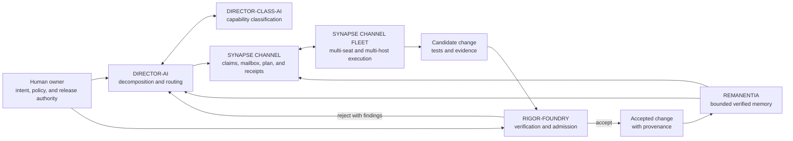

<!--
SPDX-License-Identifier: AGPL-3.0-or-later
Commercial license available
© Concepts 1996–2026 Miroslav Šotek. All rights reserved.
© Code 2020–2026 Miroslav Šotek. All rights reserved.
ORCID: 0009-0009-3560-0851
Contact: www.anulum.li | protoscience@anulum.li
SYNAPSE CHANNEL — roadmap
-->

# Roadmap

This roadmap describes direction, not promises. The authoritative record of
released changes is [`CHANGELOG.md`](CHANGELOG.md); the
[API and wire stability contract](docs/api-stability.md) defines which current
surfaces integrators may rely on.

## How to read this roadmap

SYNAPSE CHANNEL is still in its pre-1.0 line. Features below are labelled by
their real maturity:

- **Shipped** means the implementation, CLI or adapter, documentation, and
  repository tests exist in the current open-source package tree.
- **Experimental** means a working shipped surface is intentionally outside the
  stable pre-1.0 contract.
- **Active priority** means hardening or validation work, not a delivery date.
- **Research candidate** means no commitment to ship; it must earn its
  complexity and evidence.

## Ecosystem direction: a governed AI development loop

SYNAPSE CHANNEL is one component of a broader local-first development system.
The long-term direction connects six independently bounded products into a
continuous evidence loop:

The intended responsibilities are deliberately separate:

- **DIRECTOR-AI** turns owner intent into bounded work and routes it;
  **DIRECTOR-CLASS-AI** supplies capability and role classification.
- **SYNAPSE CHANNEL** coordinates identities, claims, tasks, handoffs, and
  receipts; **SYNAPSE CHANNEL FLEET** extends that coordination across seats,
  hosts, and model providers.
- **RIGOR-FOUNDRY** admits or rejects candidate changes against explicit,
  reproducible gates. A model's confidence is not admission evidence.
- **REMANENTIA** preserves bounded, attributable, verified context so later
  cycles can learn without treating every generated output as truth.
- The **human owner** retains policy, release, and irreversible authority.

The target is **self-evolving, never self-authorizing**: agents may propose,
implement, challenge, and improve the system, while independent roles and
fail-closed evidence gates decide what becomes durable state. "Slop-free" is an
engineering objective measured through provenance, review separation,
reproducible tests, and explicit admission criteria—not an absolute claim that
automation cannot fail.

This diagram states an ecosystem direction, not a shipped cross-project
contract. Each product's own roadmap remains authoritative for its current
interfaces, maturity, and release commitments.

## Shipped foundation

### Coordination, durability, and recovery

- File- and worktree-scoped **work claims** with overlap detection, expiring
  leases, epochs, optimistic-concurrency versions, staged-claim enforcement,
  Git hooks, and provider edit guards. See
  [Git-native claims](docs/git-claims.md).
- A typed task lifecycle and dependency-aware blackboard, append-only progress,
  atomic handoff, stalled-task supervision, resumable checkpoints, deadlock
  detection, and release receipts.
- An append-only SQLite WAL event log with restart replay, idempotency keys,
  reconnect cursors, bounded histories and buffers, archive/compaction tools,
  and optional SQLCipher protection for the live store. See
  [at-rest encryption](docs/at-rest-encryption.md).
- Identity-scoped mailbox, waiter, tmux, shell-hook, and worker-session
  ergonomics for keeping provider processes reachable without making presence
  itself a wake loop.

### Agent, protocol, and editor integrations

- An optional **MCP server** over stdio and a fail-closed outbound MCP client
  path, while the hub and core install remain MCP-agnostic. See the
  [MCP guide](docs/mcp.md).
- An **A2A Agent Card and HTTP+JSON bridge** with a published local support
  matrix and reproducible validation receipts. This is partial validation, not
  external A2A certification. See
  [A2A conformance](docs/a2a-conformance.md).
- Provider adapters and claim guards for Claude Code, Codex, Gemini CLI, Grok,
  Kimi Code, and OpenCode.
- A pinned **OpenCode** integration plus ACP-driven real-client paths for Zed,
  JetBrains, Neovim, and Emacs. See the
  [OpenCode integration guide](docs/opencode.md).
- Official Python and JavaScript clients, a read-only Go HTTP client, Git and
  shell integrations, and editor/IDE packaging surfaces.

### Governance, evidence, and operator visibility

- Human-in-the-loop approval request/decision/status flows, policy evaluation,
  access-control and role surfaces, universal receipts, release verification,
  Merkle evidence, postmortem, reliability, accounting, and causality tools.
- A dashboard and Studio projection for live claims, tasks, conflicts, security
  posture, receipts, governed operator actions, and observed peer state. See
  [Studio](docs/studio.md).
- Event-log ingestion and recall as the memory seam, rather than a second
  authoritative memory database.
- OpenTelemetry projection of causality evidence through an optional exporter;
  telemetry remains outside the core dependency set. See
  [observability](docs/observability.md).
- Capability cards, signed advisory cards, directories, manifests, and
  evidence-preserving local routing. Cards and routing recommendations do not
  grant authority.

### Security and multi-host primitives

- Shared-secret connect authentication, exposure guards, bounded rate policy,
  private runtime directories, owner-only secret loading, dashboard Host
  defence, webhook egress pinning, and shared-host attack regressions.
- Machine-key trust-on-first-use identity pins, operator identity bundles,
  optional ACL and role enforcement, per-message authentication, signed-event
  verification primitives, mTLS contexts, and certificate-pin trust bundles.
  The packaged profile and managed key lifecycle remain narrower than the
  underlying primitives. See [identity and ACL](docs/identity-and-acl.md) and
  [signed events and mTLS](docs/signed-events-mtls.md).
- Multi-hub observation, claim forwarding, protocol-version negotiation,
  federation bundle offer/fetch/import/rotate/revoke flows, and guarded relay
  primitives. Federation does not turn observed peer state into local
  authority. See [multi-hub sync](docs/multi-hub-sync.md) and the
  [federated trust model](docs/federated-trust-model.md).

## Shipped experimental surfaces

These surfaces work today but remain explicitly experimental until their
contracts and external evidence mature:

- A capability-limited WebAssembly tool sandbox with deny-by-default grants,
  bounded resources, approval support, and run receipts. It is not a general
  host or container isolation claim. See the
  [sandbox getting-started guide](docs/wasm-sandbox-getting-started.md).
- Declarative workflows compiled to the existing blackboard DAG, participant
  deliberation, semantic routing, adaptive TTL advice, automated-action advice,
  resource bidding, and other lab-tier analysis/governance helpers.
- Advanced federation, trust, encryption, and hardware-backed key adapters
  whose stable operator profiles are still being consolidated.

## Active pre-1.0 priorities

1. **Delivery integrity and secure outcomes.** Eliminate stale or misdirected
   wake traffic, finish outcome-oriented secure profiles, keep exposed hubs
   bounded by default, and extend replay-resistant durable trust state.
2. **A smaller golden path.** Make install → connect → claim → conflict refusal
   → handoff → verified receipt understandable without navigating the full
   advanced CLI surface.
3. **Protocol and platform evidence.** Freeze the 1.0 wire/API compatibility
   contract, exercise version-negotiation fixtures, and keep real Linux, macOS,
   and Windows filesystem semantics in CI.
4. **Operational recovery.** Exercise backup, restore, migration, corruption
   recovery, long-running soak, and measured capacity limits rather than
   inferring readiness from unit tests.
5. **External validation.** Publish reproducible successes and failures from
   independent fleets and security review. The project does not claim external
   certification, a completed pentest, or universal production suitability
   before that evidence exists.
6. **Stable boundaries.** Keep coordination core, integrations, security
   profiles, and labs visibly separated without replacing the blackboard with
   a second orchestration runtime.

The [0.x to 1.0 migration guide](docs/migration-1.0.md) records the concrete
freeze and release-cut checks.

## Research candidates

Each candidate remains optional and must arrive with a threat model, bounded
dependencies, real boundary tests, and a reversible adoption path:

- An **Agent Transaction Protocol** joining declared intent, scoped authority,
  dry-run evidence, governance, atomic apply, and independently verifiable
  receipts.
- Semantic claims beyond literal paths and Python symbols: exported APIs,
  OpenAPI operations, protobuf messages, database objects and migrations,
  Terraform resources, manifests, and CI/public contracts.
- Pre-execution read/write-set simulation and conflict-aware scheduling.
- Causal replay and counterfactual task-order analysis without exposing
  secrets.
- Per-operation, non-transferable capability tokens instead of shared mutation
  credentials.
- Managed workload identity such as OIDC or SPIFFE after demonstrated
  deployment demand.
- End-to-end encrypted channels only after identity, key lifecycle, recovery,
  and metadata-leakage contracts are independently validated.

## Explicit limits and non-goals

To keep the bus inspectable and local-first, SYNAPSE CHANNEL does not aim to
be:

- an internal consensus protocol, distributed lock manager, or CRDT system;
- a standalone graph database or a second authoritative task/memory store;
- an opaque hosted control plane required for the open-source core to work;
- an autonomous authority that grants permissions from capability cards,
  routing scores, trust rankings, model output, or dashboard state;
- a claim that agents are contained merely because they coordinate through the
  bus; or
- a substitute for operating-system isolation, code review, CI, independent
  security assessment, or operator judgement.
