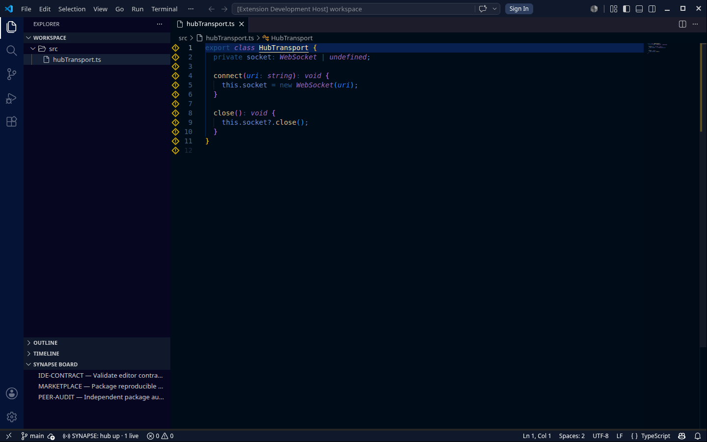
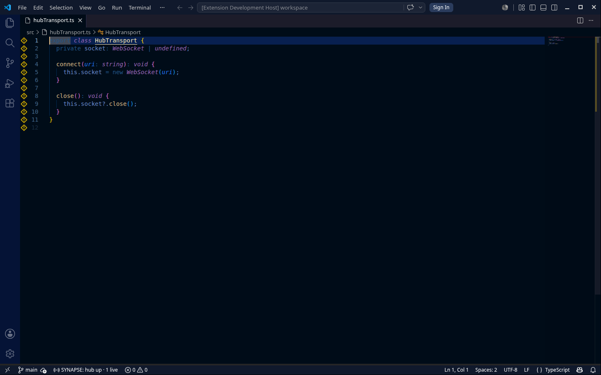

<!--
SPDX-License-Identifier: AGPL-3.0-or-later
Commercial license available
© Concepts 1996–2026 Miroslav Šotek. All rights reserved.
© Code 2020–2026 Miroslav Šotek. All rights reserved.
ORCID: 0009-0009-3560-0851
Contact: www.anulum.li | protoscience@anulum.li
-->

<p align="center">
  
</p>

# SYNAPSE CHANNEL for VS Code and Cursor

Coordinate people and coding agents before their edits collide. The extension
connects an editor to a SYNAPSE CHANNEL hub, shows current ownership, and keeps
claim and release operations beside the code they protect.

Version 0.3.0 is an experimental preview. Packaging produces an official
`vsce` archive for registry submission and a payload-equivalent, deterministic
archive for local review. Registry availability is established only by that
registry's listing.

## See coordination in the editor

The Explorer board and status bar show live hub state while gutter markers make
another participant's claim visible before you edit the file.



The overview ruler and every visible claimed line carry the same ownership cue.
Shape and hover text preserve the distinction without relying on colour alone.



Both images come from VS Code 1.128 connected to a disposable token-gated
SYNAPSE hub. They show the shipped extension rather than a mock-up.

## What it does

- **Live status** — distinguishes negotiated live state, stale last-good data,
  incompatible protocol, identity mismatch, and offline state.
- **Exact claims** — claims the active file in its canonical Git worktree.
  Identical relative paths in different workspace roots remain independent.
- **Exact release** — releases only the active file's task; other claims held by
  the same identity remain active.
- **Shared board** — presents declared tasks and their current state in the
  Explorer.
- **Claim gutter** — marks file, directory, worktree, and semantic-symbol scope.
  An unresolved semantic symbol produces one alert marker and never widens into
  a false whole-file claim.
- **Per-hub credentials** — stores one bearer in VS Code SecretStorage for each
  canonical hub URI. Tokens never belong in settings or workspace files.

Use these Command Palette actions:

- `SYNAPSE: Claim current file`
- `SYNAPSE: Release current file`
- `SYNAPSE: Show board`
- `SYNAPSE: Refresh hub health`
- `SYNAPSE: Set hub token`
- `SYNAPSE: Clear hub token`

## Connect

Set `synapse.hubUri` to the hub WebSocket URI. The default is
`ws://127.0.0.1:8876`. Set `synapse.identity` only when the workspace must use an
explicit registered identity; otherwise the extension derives one from the
workspace.

Run `SYNAPSE: Set hub token` to store a credential for the current URI. Changing
the URI never sends the previous hub's credential to the new endpoint. Changing
the URI or identity reconnects immediately and rejects an out-of-order
credential read.

Plain `ws://` is accepted only for `localhost`, IPv4 `127.0.0.0/8`, or IPv6
`::1`. A non-loopback hub must use trusted `wss://`; the extension refuses
remote plaintext before opening a socket. Never put a token in a URI, settings
JSON, query parameter, source file, or workspace file.

## Install the reviewed VSIX

Build from the extension directory:

```bash
npm ci
npm run package:vsix
```

Install the exact artifact in VS Code:

```bash
code --install-extension dist/synapse-channel-vscode.vsix --force
code --list-extensions --show-versions | grep '^anulum.synapse-channel-vscode@0.3.0$'
```

`dist/synapse-channel-vscode.registry.vsix` is the untouched archive emitted by
the pinned official `vsce` packager. It is the submission artifact for the VS
Code Marketplace and Open VSX. `dist/synapse-channel-vscode.vsix` contains the
same extension payload with deterministic ZIP metadata for local installation,
review, and reproducibility checks.

You can also choose **Extensions → Views and More Actions… → Install from
VSIX…**. Cursor and VSCodium accept the same VSIX through their corresponding
install-from-VSIX action or CLI.

To upgrade a local install, repeat the install command with the reviewed newer
VSIX and `--force`, then confirm the reported version. VS Code activates the
newer package under the same `anulum.synapse-channel-vscode` identity. Review
the [change log](CHANGELOG.md) and confirm the expected hub and credential state
before reconnecting a sensitive workspace.

## Security and privacy boundaries

The extension sends coordination frames only to the configured hub. It does
not include analytics, crash reporting, advertising, or a third-party telemetry
SDK. VS Code, Cursor, VSCodium, a registry, and a separately operated hub can
have their own logging or data policies.

SecretStorage protects the hub token at rest through the editor host. The token
authenticates the connection; it does not add identity signatures, per-message
authentication, certificate pinning, or end-to-end encryption. Mutations remain
disabled until protocol negotiation is live and compatible. Stale last-good
views never authorise a claim or release.

Read the extension [privacy notice](PRIVACY.md), [support policy](SUPPORT.md),
[licence](LICENSE), and repository
[security policy](https://github.com/anulum/synapse-channel/security/policy).

## Compatibility

| Surface | Supported path |
|---|---|
| VS Code 1.90+ | Local VSIX; VS Code Marketplace when listed there |
| Cursor | Local VSIX; its configured registry when listed there |
| VSCodium / Open VSX clients | Local VSIX; Open VSX when listed there |
| Virtual workspaces | Not supported; canonical filesystem worktrees are required |
| Untrusted workspaces | Not supported; trust is required before hub connection |

## Develop and verify

```bash
npm ci
npm run typecheck
npm run coverage
npm run build
xvfb-run -a npm run test:integration  # headless Linux
npm run package:vsix
```

The real Extension Development Host acceptance starts two disposable
token-gated Python hubs. It proves wrong-token refusal, isolated per-hub
SecretStorage, URI and identity reconnects, authenticated roster transitions,
canonical-root claims, and independent claim/release across two Git worktrees.

The upgrade acceptance installs packaged 0.2.0 and 0.3.0 releases into one
disposable VS Code profile. It stores a token through the real editor UI and
requires 0.3.0 to reconnect to the same token-gated hub without re-entry.

`package:vsix` preserves the official pinned `vsce` output, creates a separate
archive with normalised ZIP order and timestamps, and validates both payloads.
CI packages twice and requires equal SHA-256 digests for the deterministic
archive. Registry media and policy links are pinned to the exact Git commit;
the post-push `verify:registry-links` gate requires every pinned URL to return a
successful response before submission.

The package verifier checks the manifest and packaged entry point, fully
decodes every packaged image, validates listing and legal/support/privacy
links, and rejects source, tests, dependency trees, caches, common secret
filenames, and high-confidence embedded credentials.

The version-pinned VS Code test runtime is cached under
`.vscode-test-cache/` on the working drive. That cache, coverage output, source,
tests, scripts, and dependencies stay outside the VSIX.

## Support

Report reproducible bugs through the
[issue tracker](https://github.com/anulum/synapse-channel/issues). Use
[Discussions](https://github.com/anulum/synapse-channel/discussions) for usage
questions and workflow feedback. Report vulnerabilities privately according to
the [security policy](https://github.com/anulum/synapse-channel/security/policy).

SYNAPSE CHANNEL is available under AGPL-3.0-or-later. Commercial licensing is
available for deployments that need different terms.
