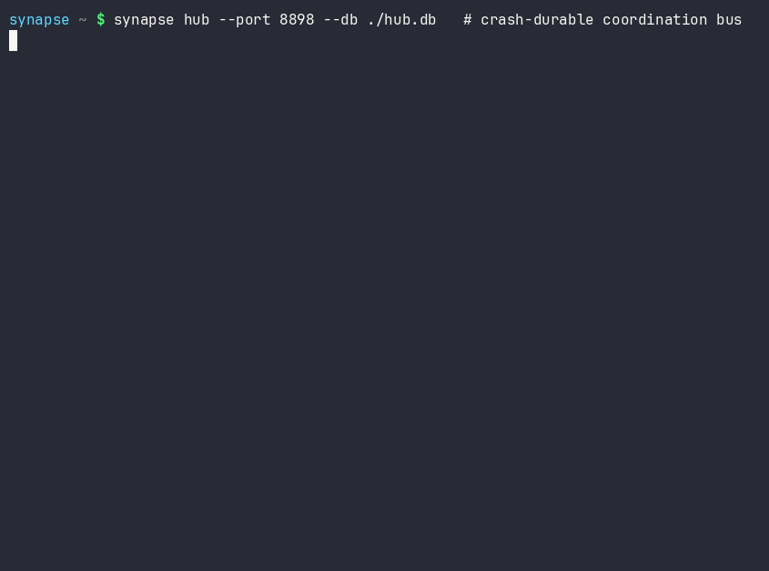

# SYNAPSE CHANNEL

**Stop parallel AI coding agents from clobbering each other's files.**

A local-first coordination bus for a fleet of AI agents working in parallel —
within one codebase or across a whole ecosystem of them. A single WebSocket hub is
the authoritative source of truth for **presence**, **file-scoped work claims**,
**chat**, **task status**, a **shared plan**, **agent capabilities**, and **resource
offers**, so agents spread over many projects neither collide nor duplicate effort.

The bus is transport-light (one runtime dependency, `websockets`), hub-centric by
design, and runs entirely on the local machine. Model workers reply on-channel
through any OpenAI-compatible endpoint, including a local Ollama server, with a
deterministic rule-based fallback for offline use.

Current `0.x` releases are pre-1.0 development releases. `1.0.0` is planned as
the first stable commercial release of SYNAPSE CHANNEL, with stable operational
contracts, support surfaces, and commercial licensing terms documented for that
line. SYNAPSE CHANNEL is seeking startup funding, strategic partners, and aligned
ecosystem co-owners; see [Commercial licensing](commercial.md) for the evaluation
and contact path.

Current `0.x` releases do not promise backward compatibility across minor
releases. Pin an exact package version when an integration needs a fixed target,
and review [API and wire stability](api-stability.md) plus the
[0.x to 1.0 migration guide](migration-1.0.md) before upgrading.

## Why a coordination bus

When several agents work across your repositories at once they need a shared,
authoritative view of who is doing what. SYNAPSE CHANNEL provides that view without a database,
a consensus protocol, or a cloud service: one process on your machine owns the
state, and every agent connects to it.

## What it gives you

- **Work claims** with file-scope overlap detection, expiring leases, and epochs.
- **Crash-durable persistence** (append-only SQLite WAL with replay) and
  **reconnect-safe** idempotency.
- A **typed task lifecycle**, **deadlock detection**, and a **shared blackboard**
  of declared tasks with dependencies and an append-only progress stream.
- **Atomic handoff**, an **LLM-free stall supervisor**, and **resumable
  checkpoints**.
- **Proportionate connect authentication** and **task-class routing** to tiered
  backends.
- **Direct messaging** — broadcast, a named group (`A,B`), or one agent — with a
  **per-agent inbox** an idle agent catches up from the durable feed.
- A **command line** for the whole flow (`synapse hub/worker/team/send/listen/
  relay/board/supervisor/manifest/task`) and **runnable examples**.

## Client paths: supported first

The hub speaks one wire protocol, but not every client surface carries the same
support weight. Choose in this order:

- **Supported core** — the paths fleets should build on today: the hub itself
  and the **`syn-*` / `synapse` CLI** (the complete flow above), release-gated
  and covered by the [API and wire stability](api-stability.md) contract.
- **Shipped adapter** — the **[MCP server face](mcp.md)** for MCP hosts such
  as Claude Code, Codex, Cursor, and Claude Desktop: release-gated and fully
  tested; classified as an adapter, so the stability contract freezes its
  named boundaries rather than the whole surface.
- **Validated, partial interop** — the **[A2A bridge](a2a-conformance.md)**:
  the official SDK completes discovery and the send/get/list/cancel lifecycle
  against it, and the official TCK HTTP+JSON MUST run records 55 passed with
  5 documented gaps — recorded evidence, not certification. The
  **[Go](go-client.md)** and **[JS](js-client.md)** clients embed within
  their stated boundaries.
- **Experimental** — the **cockpit** PWA and the installable **VS Code
  extension preview**: useful, moving fast, and not part of the stability
  contract. Expect surface changes between minor releases.

## Coming: Studio

The read-only dashboard is growing into an operator **[Studio](studio.md)** — a
control plane that answers, at a glance, what is happening, what is at risk, and what
is safe to do next. The instrument-panel design system, `/studio` reference page,
live `/studio/command` shell, security-posture panel, and event-log LiveFeed have
shipped. Local-first and read-only by default.

## Next steps

- [Installation](installation.md) · [Quick start](quickstart.md)
- [Coordination model](coordination-model.md) · [Policy engine](policy-engine.md) · [Agent trust graph](agent-trust-graph.md) · [Identity and ACL](identity-and-acl.md)
- [Wire protocol](protocol.md) · [API and wire stability](api-stability.md) · [0.x to 1.0 migration](migration-1.0.md) · [CLI reference](cli.md) · [Recipes](recipes.md) · [Examples](examples.md)
- [Deployment](deployment.md)

SYNAPSE CHANNEL is AGPL-3.0-or-later with a commercial licence available. See the
project's `NOTICE.md`.
