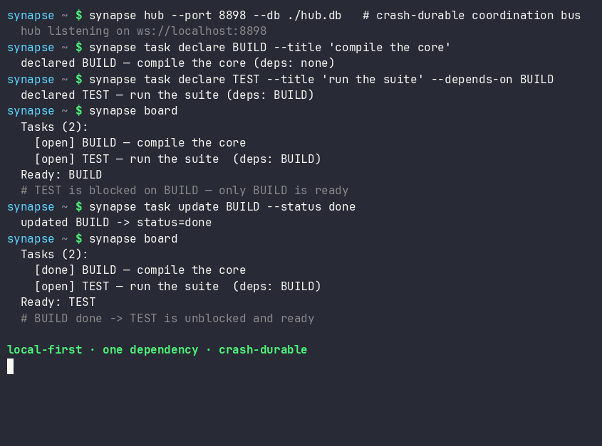

# Quick start

## First 60 seconds

Verify a clean install before connecting real agents:

```bash
python -m pip install synapse-channel
synapse doctor
synapse demo
synapse quickstart-coding
```

`synapse doctor` checks identity, hub exposure, local disk pressure,
reachability, and wake-listener setup. It may warn that no hub or waiter is
running on a fresh machine. It also warns when the checked filesystem is nearly
full; pass `--disk-path <path>` to inspect the mount that will hold your Synapse
state, caches, or build artefacts. The installed demo is self-contained: it
starts a temporary local hub, runs a planner/worker coordination flow, and
succeeds when it prints:

```text
success: coordination demo completed
```

`synapse quickstart-coding` creates a temporary workspace, runs the coding-agent
no-collision demo, removes that temporary workspace after success, and succeeds
when it prints:

```text
success: coding fleet demo completed
```

To inspect the same coding-agent workflow as files you can edit, scaffold a
persistent workspace:

```bash
synapse new coding-fleet ./demo-fleet
cd ./demo-fleet
python run_demo.py
```

That generated workspace succeeds when it prints:

```text
success: coding fleet demo completed
```

## Fastest safe trial path

Use this order when moving from the self-contained demos into a real checkout:

```bash
python -m pip install synapse-channel
synapse doctor
synapse demo
synapse quickstart-coding
synapse git-init --name trial-agent
synapse a2a-card --endpoint-url http://127.0.0.1:8877
synapse a2a-serve --endpoint-url http://127.0.0.1:8877
```

Run this in a disposable or already-versioned repository. `synapse doctor` checks
the local machine before you install hooks or start bridges. `synapse git-init
--name trial-agent` installs claim-aware git hooks and writes the `.synapse/`
conventions guide before any coding agent edits files. The A2A bridge step is
optional and local-only; it exposes an Agent Card and HTTP+JSON bridge for local
interop experiments, not an external conformance claim. Do not bind it
off-loopback without bearer auth.

A complete session — declare a plan with a dependency, complete a task, and watch the
dependent task unblock:



## Launch a team

Bring up a hub plus one or two local model workers in one command:

```bash
synapse team
```

## Multi-seat golden path (≈5 minutes)

Use this when two or more coding agents share one machine. It ends in the
**Studio command centre** — the operator front door for who is live, what is
claimed, and what is at risk.

```bash
# 1. Install + doctor
python -m pip install 'synapse-channel>=0.99.1'
synapse doctor

# 2. Durable hub (open loopback; add --team-secure when you have trust + role files)
mkdir -p ~/synapse
echo "dev-token-$(openssl rand -hex 8)" > ~/synapse/token
chmod 600 ~/synapse/token
synapse hub --port 8876 --db ~/synapse/hub.db --token-file ~/synapse/token &

# Optional multi-seat trust (identity binding + role grants + private directed):
# synapse identity keygen --subject myproj/alice --out-key alice.pem --enroll ~/synapse/trust.json
# synapse role grant myproj/coordinator myproj/alice --store ~/synapse/roles.json
# synapse hub --db ~/synapse/hub.db --token-file ~/synapse/token \
#   --team-secure --identity-trust ~/synapse/trust.json --role-grants ~/synapse/roles.json

# 3. Arm a wake waiter (directed-only) in each agent terminal
export SYNAPSE_TOKEN=$(cat ~/synapse/token)
syn-wait --directed-only   # background; re-arm after each wake

# 4. Claim work so agents never collide
synapse git-init --name myproj/alice
# …or synapse claim / lock for file scope in your workflow

# 5. Open Studio (front door is the command centre)
synapse dashboard --port 8765 --feeds-db ~/synapse/hub.db
# open http://127.0.0.1:8765/  → Studio command centre
# classic hub HTML: http://127.0.0.1:8765/classic
# Optional at-rest: hub --db-key-file + dashboard --feeds-db-key-file (see at-rest-encryption.md)
# Multi-machine fleet fabric pins released core: synapse-channel==0.99.1 (SYNAPSE-CHANNEL-FLEET)

# 6. Close out work with evidence-gated release (default story — not a bare release)
#    Observe checks, write a receipt, then drop the claim you own:
synapse verify-release BUILD --name myproj/alice \
  --run ".venv/bin/python -m pytest tests/ -q" \
  --output ~/synapse/receipt-BUILD.json
synapse release BUILD --name myproj/alice \
  --receipt ~/synapse/receipt-BUILD.json --receipt-json
```

Success looks like: `synapse who` shows agents and waiters; Studio shows a live
verdict and claim segments; a second agent cannot claim the same file scope; a
finished claim leaves a receipt-backed release on the hub (not an evidence-free
drop).

Check multi-seat trust and deaf agents (present without a `-rx` waiter):

```bash
synapse doctor --multi-seat \
  --identity-trust ~/synapse/trust.json \
  --role-grants ~/synapse/roles.json
```

A multi-seat roster without a token/trust/role materials warns with a
`--team-secure` remedy; agents online without waiters warn under `deaf-agents`.

### Evidence-gated release (default closeout)

Prefer **observed** evidence over hand-typed notes when you drop a claim:

1. `synapse verify-release TASK --name YOU --run "…" --output receipt.json` runs
   the declared commands, records exit codes and digests, and writes receipt JSON.
2. `synapse release TASK --name YOU --receipt receipt.json` drops **your** claim
   only when you still own it, attaching that receipt on the hub.
3. Optional: `synapse policy-check TASK --policy policy.toml --receipt-json receipt.json`
   for advisory policy evaluation before or after release.

Bare `synapse release TASK --name YOU` still works for emergency manual drops;
the multi-seat default story is verify → receipt → release. Details:
[CLI release / verify-release](cli.md) and the
[parallel-agents recipe](recipes.md#evidence-gated-release-default-closeout).

See [team-secure mode](team-secure.md) and [Studio](studio.md).

## Or run the pieces individually

```bash
synapse hub --port 8876                       # the coordination hub
synapse hub --port 8876 --db ./synapse.db     # crash-safe: resumes on restart
synapse worker --name FAST --provider ollama --model gemma3:4b
synapse worker --name OFFLINE --provider rule # no network, canned replies
```

## Talk to the channel

From another terminal:

```bash
synapse listen --name USER                    # stream messages
synapse send --name USER --target FAST "status of TASK-1?"
synapse board                                 # the shared task/progress plan
synapse manifest                              # advertised agent capabilities
```

## Point the CLI at another hub

Every command talks to `ws://localhost:8876` by default. To target a different
hub — a remote coordinator, or a second local hub on another port — set
`SYNAPSE_URI` once instead of repeating `--uri` on each command:

```bash
export SYNAPSE_URI=ws://coordinator.internal:8876
synapse who                                   # now queries the remote hub
synapse send --name USER --target FAST "ping" # so does every other command
```

An explicit `--uri` on a single command still overrides the environment for that
one call, and unsetting `SYNAPSE_URI` returns to the loopback default.

## Coordinate from code

Start a hub in another terminal first — `synapse hub --port 8876` — then connect
to it from your code. Connecting to an already-running hub keeps the example free
of the in-process startup race between binding the server and dialling it:

```python
import asyncio
import contextlib

from synapse_channel import SynapseAgent


async def main() -> None:
    checkpoint_saved = asyncio.Event()
    released = asyncio.Event()

    async def on_message(message: dict[str, object]) -> None:
        if message.get("task_id") != "refactor-parser":
            return
        if message.get("type") == "checkpoint_saved":
            checkpoint_saved.set()
        if message.get("type") == "release_granted":
            released.set()

    agent = SynapseAgent("ALPHA", on_message_callback=on_message, uri="ws://localhost:8876")
    agent_task = asyncio.create_task(agent.connect())
    # connect() is a single long-lived session; wait for the hub's welcome before
    # issuing verbs, and fail loudly if the hub is not up rather than acting on a
    # closed connection.
    if not await agent.wait_until_ready():
        raise RuntimeError("could not reach the hub — is `synapse hub` running?")

    await agent.claim("refactor-parser", note="splitting the tokenizer", paths=["src/parser"])
    await agent.save_checkpoint("refactor-parser", "step=2")
    await asyncio.wait_for(checkpoint_saved.wait(), timeout=5.0)
    await agent.update_task("refactor-parser", status="working")
    await agent.release("refactor-parser")
    await asyncio.wait_for(released.wait(), timeout=5.0)

    agent.running = False
    agent_task.cancel()
    with contextlib.suppress(asyncio.CancelledError):
        await agent_task


asyncio.run(main())
```

See the [coordination model](coordination-model.md) for what each verb guarantees.
