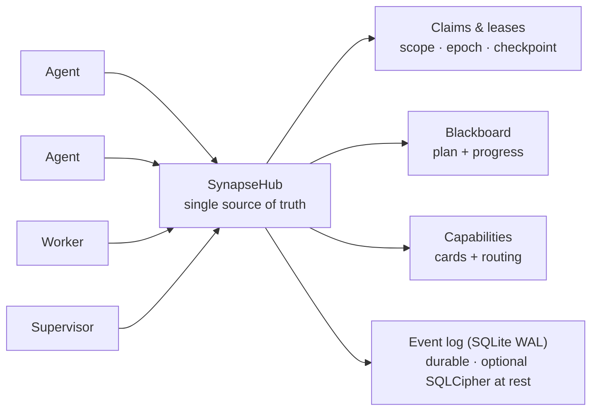

<!--
SPDX-License-Identifier: AGPL-3.0-or-later
Commercial license available
© Concepts 1996–2026 Miroslav Šotek. All rights reserved.
© Code 2020–2026 Miroslav Šotek. All rights reserved.
ORCID: 0009-0009-3560-0851
Contact: www.anulum.li | protoscience@anulum.li
SYNAPSE CHANNEL — Repository-Überblick (deutsche Übersetzung; das englische Original ist maßgeblich)
-->

<p align="center">
  <a href="../../README.md">English</a> ·
  <a href="README.zh-CN.md">简体中文</a> ·
  <a href="README.es.md">Español</a> ·
  <a href="README.pt-BR.md">Português (Brasil)</a> ·
  <a href="README.ja.md">日本語</a> ·
  <a href="README.ko.md">한국어</a> ·
  <strong>Deutsch</strong> ·
  <a href="README.fr.md">Français</a> ·
  <a href="README.sk.md">Slovenčina</a>
</p>

<p align="center">
  
</p>

<p align="center">
  <strong>Verhindern Sie, dass parallele KI-Coding-Agenten sich gegenseitig die Dateien überschreiben.</strong><br>
  Local-first-Koordinationsbus — file-scope claims, ein gemeinsamer Plan und dauerhafte leases — für ein Repository oder ein ganzes Ökosystem von Repositories.
</p>

<p align="center">
  <a href="https://github.com/anulum/synapse-channel/actions/workflows/ci.yml"></a>
  <a href="https://github.com/anulum/synapse-channel/actions/workflows/fuzz.yml"></a>
  <a href="https://github.com/anulum/synapse-channel/actions/workflows/link-check.yml"></a>
  <a href="https://github.com/anulum/synapse-channel/actions/workflows/clients-cockpit.yml"></a>
  <a href="https://github.com/anulum/synapse-channel/actions/workflows/codeql.yml"></a>
  <a href="https://pypi.org/project/synapse-channel/"></a>
  <a href="https://pypi.org/project/synapse-channel/"></a>
  <a href="https://pepy.tech/project/synapse-channel"></a>
  <a href="../../LICENSE"></a>
  <a href="https://www.remanentia.com/synapse/pricing.html"></a>
  
  <a href="https://codecov.io/gh/anulum/synapse-channel"></a>
  <a href="https://api.reuse.software/info/github.com/anulum/synapse-channel"></a>
  <a href="https://securityscorecards.dev/viewer/?uri=github.com/anulum/synapse-channel"></a>
  <a href="https://github.com/astral-sh/ruff"></a>
  <a href="https://doi.org/10.5281/zenodo.20801559"></a>
</p>

Ein Local-first-Koordinationsbus für eine Flotte parallel arbeitender KI-Agenten —
innerhalb eines einzelnen Repositorys oder verteilt über ein ganzes Ökosystem
davon. Ein WebSocket-Hub ist die gemeinsame Quelle der Wahrheit für **presence**,
**work claims**, **Chat**, **Task-Status** und **resource offers**: Agenten
adressieren einander über Projektgrenzen hinweg und teilen einen Plan, während
file-scope claims die Agenten eines Repositorys von den Dateien der jeweils
anderen fernhalten.

Der Bus ist transportleicht (eine einzige Abhängigkeit, `websockets`), bewusst
hub-zentrisch (ein Ort besitzt presence, leases und Historie) und läuft
vollständig auf der lokalen Maschine. Modell-Worker antworten auf dem Kanal über
jeden OpenAI-kompatiblen Endpunkt, einschließlich eines lokalen Ollama-Servers,
mit einem deterministischen regelbasierten Fallback für die Offline-Nutzung.

**Ihre bestehenden Agenten docken ohne neuen Code an.** Jeder Model-Context-
Protocol-Host — Claude Code, Claude Desktop, Cursor — erreicht den Bus über den
mitgelieferten `synapse mcp`-Server, der die Verben send, durable inbox, status,
claim, release, handoff und task als MCP-Tools bereitstellt, dazu board, agents
und resources als schreibgeschützte MCP-Resources. Agenten, die A2A sprechen,
verbinden sich stattdessen über die Agent-Card-Schnittstelle. Der Hub selbst
bleibt protokollagnostisch, und die Kerninstallation behält ihre einzige
Abhängigkeit — die MCP- und A2A-Adapter sind optionale Extras (`pip install
'synapse-channel[mcp]'`). Siehe den [MCP-Leitfaden](../mcp.md).

```bash
python -m pip install synapse-channel && synapse demo
```

<p align="center">
  <a href="https://pypi.org/project/synapse-channel/"><strong>Python-Paket holen</strong></a>
  &nbsp;·&nbsp;
  <a href="../../README.md#first-60-seconds">Die ersten 60 Sekunden ausführen</a>
  &nbsp;·&nbsp;
  <a href="../quickstart.md">Den Quickstart lesen</a>
</p>

## Koordinieren. Beobachten. Steuern.

Das tägliche Versprechen von Synapse sind drei explizite Schleifen:

- **Koordinieren**, bevor Agenten kollidieren: `synapse git-init`,
  `synapse git-claim`, `synapse git-claim-check --staged`, `synapse task` und
  `syn ack` verwandeln Arbeitsumfang, Abhängigkeiten und Nachweise in geteilten
  Zustand statt in Seitenkanal-Notizen.
- **Beobachten** Sie die Flotte aus dauerhaftem Zustand: `synapse who`,
  `synapse state`, `synapse dashboard`, `synapse event-query` und die Zeilen
  beobachteter Peers zeigen, wer anwesend ist, was geclaimt ist, was sich
  geändert hat und welche Peer-Hub-Fakten nur advisory sind.
- **Steuern** Sie riskante Aktionen mit Nachweisen: Policy-Prüfungen,
  Freigaben, release receipts, Merkle roots, ACL-Flächen, Föderation und
  Verschlüsselungsschlüssel-Kommandos machen Operator-Entscheidungen
  auditierbar. Governance-Flächen berichten standardmäßig; Operatoren
  entscheiden, was einen Merge, ein Release oder eine Cross-Hub-Aktion blockiert.
- **Schützen Sie das dauerhafte Log im Ruhezustand** mit optionaler
  **SQLCipher**-Seitenverschlüsselung für den Live-Event-Store des Hubs (plus
  Ganzdatei-AES-GCM-Umschläge für Relay-Logs, A2A-Zustand, Cursor und Archive).
  Siehe [SQLCipher live event store](../../README.md#sqlcipher-live-event-store-at-rest).

## Funktionswand

Die visuellen Zellen unten sind beschriftete Aufnahme-Platzhalter, keine
fehlenden Bilder. Kurze Produktaufnahmen ersetzen sie nach dem
Demo-Capture-Durchgang; die verlinkten Kommandos und die Dokumentation
beschreiben das heute ausgelieferte Verhalten.

| Ausgelieferte Koordinationsfläche | Beschrifteter visueller Slot |
|---|---|
| **Claim vor dem Edit.** [`synapse git-init`](../../README.md#git-native-claims) installiert claim-bewusste Git-Hooks; `synapse git-claim` zeichnet einen exakten Worktree-, Branch- und Pfadumfang auf, sodass ein überlappender claim abgelehnt werden kann, bevor Dateien auseinanderlaufen. | **Visueller Platzhalter — claim gutter:** ein Eigentümer ist sichtbar, während ein konkurrierender Edit abgelehnt wird. |
| **Ungeclaimte native Datei-Edits blockieren.** [Provider file-edit claim hooks](../claim-guard-hooks.md) adaptieren Claude Code `Edit\|Write`, Codex `apply_patch`, Gemini CLI `replace\|write_file` und Kimi `Edit\|Write` an eine einzige Live-Claim-Entscheidungsengine. | **Visueller Platzhalter — Edit-Ablehnung:** ein ungeclaimter Provider-Edit stoppt, bevor das native Datei-Tool läuft. |
| **Den Plan teilen.** `synapse task` und [`synapse board`](../coordination-model.md) halten Task-Zustand, Abhängigkeiten und bereite Arbeit auf dem Hub statt in getrennten Agenten-Notizen. | **Visueller Platzhalter — Board:** eine blockierte Aufgabe wird bereit, sobald ihre Abhängigkeit abgeschlossen ist. |
| **Arbeit ohne Eigentumslücke übergeben.** [Atomarer handoff](../coordination-model.md#4-hand-off-and-recover) verschiebt die gehaltene Aufgabe, den Umfang, den Status und den Checkpoint zu einem Online-Empfänger ohne Release-und-Reclaim-Fenster. | **Visueller Platzhalter — Handoff:** Eigentum und Checkpoint wandern gemeinsam zwischen zwei Seats. |
| **Einen dark seat aufdecken.** Nach 30 ununterbrochenen Sekunden ohne den exakten Waiter des Eigentümers sendet der Hub genau einen [`dark_seat_alert`](../protocol.md) für betroffene claims oder zugewiesene Arbeit, inklusive der Permanent-Arm-Abhilfe; er gibt Arbeit nicht automatisch frei und weist sie nicht neu zu. | **Visueller Platzhalter — Dark-Seat-Alarm:** der fehlende Waiter und das exakte Re-Arm-Kommando erscheinen neben der betroffenen Arbeit. |
| **Die Flotte aus einem Cockpit lesen.** [`synapse dashboard`](../studio.md) liefert die lokale Kommandozentrale, Task-Spalten mit exaktem Status, claims, Konflikte, Sicherheitslage und einen optionalen dauerhaften Event-Feed; die schreibgeschützte Studio-Projektion fügt dem Hub keine neue Autorität hinzu. | **Visueller Platzhalter — Cockpit:** live claims, Task-Zustand, Risiko und jüngste Ereignisse teilen sich eine Operator-Ansicht. |
| **Bestehende Agentenprotokolle am Rand anschließen.** [`synapse mcp`](../mcp.md) stellt Koordinationstools und schreibgeschützte Resources über stdio bereit; die [A2A-Bridge](../a2a-conformance.md) exponiert eine lokale Agent Card und eine HTTP+JSON-Fläche, wobei ihre Grenze der partiellen Validierung explizit bleibt. | **Visueller Platzhalter — MCP und A2A:** ein bestehender Agent erreicht denselben Hub über jeden der beiden Adapter. |

## Auf einen Blick

<p align="center">
  
</p>



Ein claim least eine Arbeitseinheit mit einem file scope, sodass zwei Agenten
nie dieselben Dateien bearbeiten; der Plan, handoffs, Checkpoints und ein
Stall-Supervisor halten die Arbeit in Bewegung; und das dauerhafte Event-Log
bedeutet, dass ein Hub-Neustart live leases wieder aufnimmt, statt sie zu
verlieren.

## Kern und optionale Schichten

SYNAPSE CHANNEL wird als ein installierbares Paket ausgeliefert, aber die
öffentliche Fläche ist gestuft, damit der schlanke Bus übersichtlich bleibt:

| Schicht | Taxonomie-Tier | Was dorthin gehört |
|---|---|---|
| Lokaler Koordinationskern | `stable` | Der Hub, send/wait/listen/arm, claims, tasks, locks, status, board, init und die Fleet-Bootstrap-Kommandos für die tägliche Koordination. |
| Edge-Adapter | `adapter` | MCP, A2A, Git-Hooks, tmux/Provider-Brücken, Shell-Hooks, Ingestion und Worker-Seats, die bestehende Tools mit dem Bus verbinden. |
| Operator-Analyse | `analysis` | Doctor, state, dashboard, causality, multihub, reliability, trust graph, directory, accounting, Fleet-Scorecard-Export, Manifeste und Event-Queries. Diese verändern den Koordinationszustand nicht; explizite Exportmodi können in eine vom Operator gewählte Senke schreiben. |
| Governance und Integrität | `governance` | Policy-Prüfungen, Freigaben, ACL-/Rollenflächen, Föderation, Merkle roots, release receipts, Reproduktion, Kompaktion, encrypt-key-/SQLCipher-Schlüsseloperationen. |
| Labor-Flächen | `experimental` | Benchmarking, participant fabric, route-task, sandbox, workflow, TTL advice, memory recall, auto-action und resource bidding. |

Die maßgebliche Karte ist [`synapse_channel.surface_taxonomy`](../../src/synapse_channel/surface_taxonomy.py),
und die generierte Operator-Ansicht ist [Public surface and stability](../public-surface.md).
Adapter und Labor-Flächen können aus demselben Paket installiert und genutzt
werden, ändern aber nicht den lokalen Kern mit seiner einzigen Abhängigkeit.

### Optionaler Participant memory recall

`participant ask`, `participant exchange` und `participant convene` können ihre
Seats mit begrenztem, schreibgeschütztem Recall aus REMANENTIAs leichtgewichtiger
HTTP-API umhüllen. Recall ist deaktiviert, solange `--memory-url` fehlt; kein
Speicherprozess wird implizit gestartet. Tokens werden nur über
`--memory-token-file` akzeptiert, und abgerufene Schnipsel gelangen in
`TurnRequest.context` innerhalb einer Data-only-Umzäunung, während der
Operator-Prompt unverändert bleibt.

```bash
synapse participant ask claude "review this design" \
  --memory-url http://127.0.0.1:8001 \
  --memory-token-file /run/secrets/remanentia
```

Aktuelle HTTP-Ergebnisse lassen REMANENTIAs Honesty-Achsen weg, daher wird
jeder abgerufene Treffer als boundary data gezeigt; Ähnlichkeit ist
Relevanz-Evidenz, keine Wahrheits-Evidenz. No-Hit- und Unavailable-Zustände
bleiben sichtbar, ohne den Provider-Turn scheitern zu lassen. Siehe
[Participant memory recall](../participant-memory.md) für Einrichtung, Grenzen,
CLI-Flags, Bibliotheksnutzung und Audit-Grenzen.

> **Kommt: Studio** — das Dashboard wächst zu einem Operator-**[Studio](../studio.md)**:
> eine Steuerungsebene, die auf einen Blick beantwortet, was geschieht, was
> gefährdet ist und was als Nächstes sicher getan werden kann. Das
> Instrumententafel-Designsystem, die `/studio`-Referenz, die Live-Shell
> `/studio/command`, das Sicherheitslage-Panel und der Event-Log-LiveFeed sind
> ausgeliefert. Local-first und standardmäßig schreibgeschützt — eine Workbench
> auf Organisationsebene ist als separate Schicht geplant.

## Installation

```bash
python -m pip install synapse-channel       # das Release von PyPI
python -m pip install -e ".[dev]"           # oder ein editierbarer Dev-Checkout
# optional: Seitenverschlüsselung des Live-Hub-Event-Stores (SQLCipher)
python -m pip install 'synapse-channel[sqlcipher]'
# optional: Ganzdatei-AES-GCM-Envelope-Helfer (encrypt-key profile/migrate/rekey)
python -m pip install 'synapse-channel[encryption]'
```

Halten Sie bei einem editierbaren Checkout das lokale `.venv` mit den
deklarierten dev-, docs- und benchmark-Extras des Repositorys abgeglichen:

```bash
.venv/bin/python tools/check_dev_dependency_drift.py --check
.venv/bin/python tools/audit_dependency_tooling.py --check
```

Die zweite Prüfung ist offline. Sie verifiziert, dass der lokale Preflight
weiterhin die erwarteten Tool-Gates abdeckt, GitHub Actions auf volle Commit-SHAs
gepinnt sind, Dependabot actions/Python/Docker abdeckt und die
PyPI-Publish-/Download-Metadatenflächen verdrahtet bleiben.

Damit wird das Kommando `synapse` installiert. Wie der Hub als dauerhaft
laufender lokaler Dienst oder Container betrieben wird, beschreibt der
[Deployment-Leitfaden](../deployment.md) (eine `systemd`-User-Unit und
`docker compose` liegen beide bei). Unter Linux installieren Sie nur einen
permanenten Exact-Identity-Waiter mit
`synapse arm install --identity myproject/agent --start`; er nutzt Mailbox-Replay
und `Restart=always`, ohne einen Hub zu installieren. Ein natives
Windows-Service-Setup wird nicht beansprucht; nutzen Sie WSL mit systemd, wie im
Deployment-Leitfaden dokumentiert.

Zwei optionale Shell-Annehmlichkeiten liegen dem CLI bei: `synapse completions
bash|zsh|fish` gibt Tab-Vervollständigung für jedes Subkommando aus (generiert
aus dem Live-Parser, driftet also nie), und `synapse install-shell-hook` fügt
den bewachten Block hinzu, der in jedem neuen Terminal automatisch einen
Wake-Listener armiert:

```bash
synapse completions bash > ~/.local/share/bash-completion/completions/synapse
synapse install-shell-hook          # Bash-, Zsh- und Fish-Terminals auto-armieren
```

## Die ersten 60 Sekunden

Verifizieren Sie auf einer sauberen Python-Umgebung das installierte CLI, bevor
Sie Agenten in ein echtes Repository einbinden:

```bash
python -m pip install synapse-channel
synapse doctor
synapse demo
synapse quickstart-coding
```

`synapse doctor` meldet lokale Setup-Probleme wie Identität, Hub-Exposition,
Druck auf das Root-Dateisystem und fehlende Waiter. Eine brandneue Maschine kann
warnen, dass kein Hub oder Waiter läuft; vor der Dienst-Einrichtung ist das zu
erwarten. `synapse demo` startet seinen eigenen lokalen Hub, fährt den
Claude/Codex-Pfad mit getrennten Claims, Konfliktverweigerung, Handoff und
verifiziertem Receipt und ist erfolgreich, wenn es Folgendes ausgibt:

```text
success: coordination demo completed
```

`synapse quickstart-coding` erstellt einen temporären Coding-Fleet-Workspace,
führt dasselbe kollisionsfreie Coding-Demo aus, das generierte Workspaces
verwenden, entfernt den temporären Workspace nach dem Erfolg und gibt aus:

```text
success: coding fleet demo completed
```

Oder führen Sie die gesamte First-Run-Sequenz als ein Kommando aus:

```bash
synapse fleet-init
```

Es führt den Doctor aus (`--fix`, um den standardmäßigen lokalen Hub und Waiter
zu reparieren), errichtet einen persistenten `./synapse-fleet`-Workspace,
sondiert, welche Provider-CLIs diese Maschine besetzen kann (claude, codex,
kimi, ollama, …), führt den Demo-Smoke aus und druckt den Plan der nächsten
Schritte — Waiter-Armierung, Seat-Kommandos je Provider, `git-init`, Dashboard —
mit dem eingesetzten Projektnamen des Workspaces.

## Der schnellste sichere Testpfad

Wenn die eigenständigen Demos bestanden sind, probieren Sie Synapse in dieser
Reihenfolge gegen einen echten Checkout:

```bash
python -m pip install synapse-channel
synapse doctor
synapse demo
synapse quickstart-coding
synapse git-init --name trial-agent
synapse dashboard --port 8765
synapse a2a-card --endpoint-url http://127.0.0.1:8877
synapse a2a-conformance
synapse a2a-serve --endpoint-url http://127.0.0.1:8877
```

Führen Sie dies in einem Wegwerf- oder bereits versionierten Repository aus.
`synapse git-init --name trial-agent` installiert die claim-bewussten Git-Hooks
und schreibt den lokalen `.synapse/`-Konventionsleitfaden, bevor Agenten Dateien
bearbeiten. Der A2A-Bridge-Schritt ist optional und nur lokal: Er lässt ein
anderes lokales Tool die Agent Card inspizieren oder mit der HTTP+JSON-Bridge
sprechen, ist aber kein externer Konformitätsanspruch. Binden Sie ihn nicht
außerhalb des Loopbacks ohne Bearer-Auth.

## Releases

Dieses Paket wird offen entwickelt und täglich dogfooded: Eine Flotte von
Coding-Agenten betreibt ihre eigene Koordination darauf, daher zeigen sich
Probleme im realen Einsatz und werden schnell behoben. Releases sind deshalb
häufig und meist klein — Fixes und Härtung statt Churn. Die aktuellen
`0.x`-Releases versprechen keine Rückwärtskompatibilität über Minor-Releases
hinweg. Das Wire-Vokabular und die öffentliche Python-API sind gegen
unbeabsichtigte Abweichungen geschützt, können sich aber in einem geprüften
`0.x`-Minor-Release bewusst ändern. Jede solche Änderung wird im Changelog und
in Migrationshinweisen dokumentiert; inkompatible Wire-Änderungen erhöhen
`WIRE_PROTOCOL_VERSION`. Ab `1.0.0` erfordert eine inkompatible Änderung der
stabilen öffentlichen Python-API eine neue Paket-Major-Version. Siehe
[API- und Wire-Stabilität](../api-stability.md).

`1.0.0` ist als erstes stabiles kommerzielles Release von SYNAPSE CHANNEL
geplant, mit den Betriebsverträgen, der Paketierung, der Support-Fläche und den
kommerziellen Lizenzbedingungen, die als Teil dieses Releases dokumentiert
werden.

SYNAPSE CHANNEL sucht Startup-Finanzierung, strategische Partner und
gleichgesinnte Ökosystem-Mitgestalter, die helfen wollen, die
Koordinationsschicht für die produktive Multi-Agenten-Entwicklung reifen zu
lassen. Siehe [kommerzielle Lizenzierung](../commercial.md) oder schreiben Sie
an `protoscience@anulum.li`.

Wenn Sie ein festes Ziel brauchen, pinnen Sie eine Version
(`synapse-channel==X.Y.Z`); für die neuesten Fixes folgen Sie dem jeweils
neuesten Release. Beides wird unterstützt.

---

Dies ist die Übersetzung des öffentlichen README-Teils. Die vollständige
Referenz — Quick start, Koordinationsmodell, Bibliotheksnutzung, Architektur,
Fähigkeitsinventar, Sicherheitslage, bekannte Grenzen, SYNAPSE CHANNEL Fleet,
kommerzielle Nutzung, Zitation und Lizenz — wird im kanonischen
[englischen README](../../README.md#quick-start) fortgesetzt. Das englische
Original ist stets maßgeblich; generierte Blöcke (capability snapshot,
Zitation) existieren nur dort.
