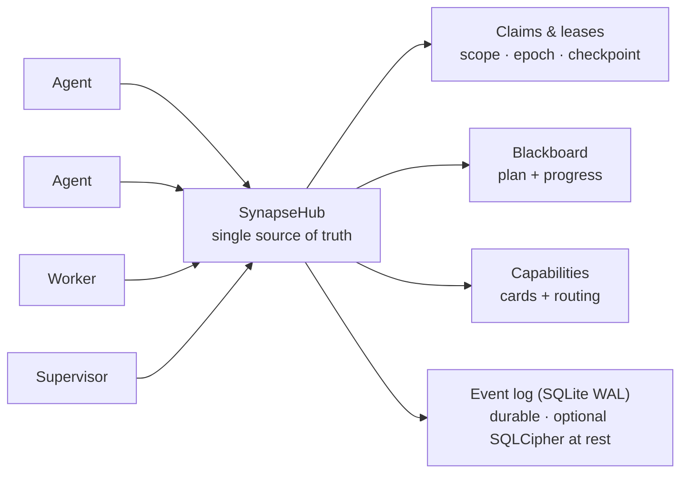

<!--
SPDX-License-Identifier: AGPL-3.0-or-later
Commercial license available
© Concepts 1996–2026 Miroslav Šotek. All rights reserved.
© Code 2020–2026 Miroslav Šotek. All rights reserved.
ORCID: 0009-0009-3560-0851
Contact: www.anulum.li | protoscience@anulum.li
SYNAPSE CHANNEL — visión general del repositorio (traducción al español; el original en inglés es canónico)
-->

<p align="center">
  <a href="../../README.md">English</a> ·
  <a href="README.zh-CN.md">简体中文</a> ·
  <strong>Español</strong> ·
  <a href="README.pt-BR.md">Português (Brasil)</a> ·
  <a href="README.ja.md">日本語</a> ·
  <a href="README.ko.md">한국어</a> ·
  <a href="README.de.md">Deutsch</a> ·
  <a href="README.fr.md">Français</a> ·
  <a href="README.sk.md">Slovenčina</a>
</p>

<p align="center">
  
</p>

<p align="center">
  <strong>Evite que los agentes de codificación con IA en paralelo se pisoteen los archivos unos a otros.</strong><br>
  Bus de coordinación local-first — file-scope claims, un plan compartido y leases duraderos — para un repositorio o todo un ecosistema de repositorios.
</p>

<p align="center">
  <a href="https://github.com/anulum/synapse-channel/actions/workflows/ci.yml"></a>
  <a href="https://github.com/anulum/synapse-channel/actions/workflows/fuzz.yml"></a>
  <a href="https://github.com/anulum/synapse-channel/actions/workflows/link-check.yml"></a>
  <a href="https://github.com/anulum/synapse-channel/actions/workflows/clients-cockpit.yml"></a>
  <a href="https://github.com/anulum/synapse-channel/actions/workflows/codeql.yml"></a>
  <a href="https://pypi.org/project/synapse-channel/"></a>
  <a href="https://pypi.org/project/synapse-channel/"></a>
  <a href="https://pepy.tech/project/synapse-channel"></a>
  <a href="../../LICENSE"></a>
  <a href="https://www.remanentia.com/synapse/pricing.html"></a>
  
  <a href="https://codecov.io/gh/anulum/synapse-channel"></a>
  <a href="https://api.reuse.software/info/github.com/anulum/synapse-channel"></a>
  <a href="https://securityscorecards.dev/viewer/?uri=github.com/anulum/synapse-channel"></a>
  <a href="https://github.com/astral-sh/ruff"></a>
  <a href="https://doi.org/10.5281/zenodo.20801559"></a>
</p>

Un bus de coordinación local-first para una flota de agentes de IA que trabajan
en paralelo — dentro de un único repositorio o repartidos por todo un ecosistema
de ellos. Un hub WebSocket es la fuente de verdad compartida para la
**presence**, los **work claims**, el **chat**, el **estado de tareas** y las
**resource offers**: los agentes se dirigen unos a otros entre proyectos y
comparten un mismo plan, mientras los file-scope claims mantienen a los agentes
de cada repositorio fuera de los archivos de los demás.

El bus es ligero en transporte (una sola dependencia, `websockets`), centrado
en el hub por diseño (un solo lugar posee la presence, los leases y el
historial) y se ejecuta por completo en la máquina local. Los workers de
modelos responden en el canal a través de cualquier endpoint compatible con
OpenAI, incluido un servidor Ollama local, con un fallback determinista basado
en reglas para el uso sin conexión.

**Sus agentes existentes se conectan sin código nuevo.** Cualquier host de
Model Context Protocol — Claude Code, Claude Desktop, Cursor — llega al bus a
través del servidor `synapse mcp` incluido, que expone los verbos send, durable
inbox, status, claim, release, handoff y task como herramientas MCP, además del
board, los agents y los resources como MCP resources de solo lectura. Los
agentes que hablan A2A se conectan en cambio a través de la fachada Agent Card.
El propio hub permanece agnóstico al protocolo y la instalación básica conserva
su única dependencia — los adaptadores MCP y A2A son extras opcionales
(`pip install 'synapse-channel[mcp]'`). Véase la [guía MCP](../mcp.md).

```bash
python -m pip install synapse-channel && synapse demo
```

<p align="center">
  <a href="https://pypi.org/project/synapse-channel/"><strong>Obtener el paquete de Python</strong></a>
  &nbsp;·&nbsp;
  <a href="../../README.md#first-60-seconds">Ejecutar los primeros 60 segundos</a>
  &nbsp;·&nbsp;
  <a href="../quickstart.md">Leer el quickstart</a>
</p>

## Coordinar. Observar. Gobernar.

La promesa diaria de Synapse son tres bucles explícitos:

- **Coordinar** antes de que los agentes colisionen: `synapse git-init`,
  `synapse git-claim`, `synapse git-claim-check --staged`, `synapse task` y
  `syn ack` convierten el alcance del trabajo, las dependencias y la evidencia
  en estado compartido en lugar de notas por canales laterales.
- **Observar** la flota desde un estado duradero: `synapse who`,
  `synapse state`, `synapse dashboard`, `synapse event-query` y las filas de
  peers observados muestran quién está presente, qué está claimado, qué cambió
  y qué hechos de peer-hubs son solo advisory.
- **Gobernar** las acciones arriesgadas con evidencia: comprobaciones de
  policy, aprobaciones, release receipts, Merkle roots, superficies ACL,
  federación y comandos de claves de cifrado hacen auditables las decisiones
  del operador. Las superficies de gobernanza informan por defecto; los
  operadores deciden qué bloquea un merge, una release o una acción cross-hub.
- **Proteger el registro duradero en reposo** con el cifrado de páginas
  **SQLCipher** opcional para el event store vivo del hub (más sobres AES-GCM
  de archivo completo para los registros de relay, el estado A2A, los cursores
  y los archivos). Véase
  [SQLCipher live event store](../../README.md#sqlcipher-live-event-store-at-rest).

## Muro de funcionalidades

Las celdas visuales de abajo son marcadores de captura etiquetados, no imágenes
faltantes. Grabaciones breves del producto las sustituirán tras la pasada de
captura de demos; los comandos enlazados y la documentación describen el
comportamiento entregado hoy.

| Superficie de coordinación entregada | Ranura visual etiquetada |
|---|---|
| **Claim antes de editar.** [`synapse git-init`](../../README.md#git-native-claims) instala hooks de Git conscientes de claims; `synapse git-claim` registra un worktree, una rama y un alcance de rutas exactos, de modo que un claim superpuesto pueda rechazarse antes de que los archivos diverjan. | **Marcador visual — claim gutter:** un propietario es visible mientras una edición competidora es rechazada. |
| **Bloquear ediciones nativas sin claim.** Los [hooks de claim de edición de archivos por provider](../claim-guard-hooks.md) adaptan Claude Code `Edit\|Write`, Codex `apply_patch`, Gemini CLI `replace\|write_file` y Kimi `Edit\|Write` a un único motor de decisión de claims en vivo. | **Marcador visual — denegación de edición:** una edición de provider sin claim se detiene antes de que se ejecute la herramienta de archivos nativa. |
| **Compartir el plan.** `synapse task` y [`synapse board`](../coordination-model.md) mantienen el estado de las tareas, las dependencias y el trabajo listo en el hub en lugar de en notas separadas de cada agente. | **Marcador visual — board:** una tarea bloqueada pasa a lista cuando su dependencia se completa. |
| **Traspasar el trabajo sin hueco de propiedad.** El [handoff atómico](../coordination-model.md#4-hand-off-and-recover) mueve la tarea retenida, el alcance, el estado y el checkpoint a un receptor en línea sin ventana de release-and-reclaim. | **Marcador visual — handoff:** la propiedad y el checkpoint se mueven juntos entre dos seats. |
| **Exponer un dark seat.** Tras 30 segundos continuos sin el waiter exacto del propietario, el hub emite un único [`dark_seat_alert`](../protocol.md) para los claims afectados o el trabajo asignado, incluida la corrección permanent-arm; no libera ni reasigna el trabajo automáticamente. | **Marcador visual — alerta de dark seat:** el waiter ausente y el comando exacto de rearme aparecen junto al trabajo afectado. |
| **Leer la flota desde una sola cabina.** [`synapse dashboard`](../studio.md) sirve el centro de mando local, columnas de tareas con estado exacto, claims, conflictos, postura de seguridad y un feed de eventos duradero opcional; la proyección Studio de solo lectura no añade ninguna autoridad nueva al hub. | **Marcador visual — cabina:** claims en vivo, estado de tareas, riesgo y eventos recientes comparten una única vista de operador. |
| **Conectar protocolos de agentes existentes en el borde.** [`synapse mcp`](../mcp.md) expone herramientas de coordinación y resources de solo lectura sobre stdio; el [puente A2A](../a2a-conformance.md) expone una Agent Card local y una superficie HTTP+JSON manteniendo explícita su frontera de validación parcial. | **Marcador visual — MCP y A2A:** un agente existente llega al mismo hub a través de cualquiera de los dos adaptadores. |

## De un vistazo

<p align="center">
  
</p>



Un claim arrienda (lease) una unidad de trabajo con un file scope, de modo que
dos agentes nunca editan los mismos archivos; el plan, los handoffs, los
checkpoints y un supervisor de estancamiento mantienen el trabajo en marcha; y
el registro de eventos duradero significa que un reinicio del hub reanuda los
leases vivos en lugar de perderlos.

## Núcleo y capas opcionales

SYNAPSE CHANNEL se entrega como un único paquete instalable, pero la superficie
pública está escalonada para que el bus esbelto se mantenga claro:

| Capa | Tier de taxonomía | Qué pertenece ahí |
|---|---|---|
| Núcleo de coordinación local | `stable` | El hub, send/wait/listen/arm, claims, tasks, locks, status, board, init y los comandos de bootstrap de flota usados para la coordinación diaria. |
| Adaptadores de borde | `adapter` | MCP, A2A, hooks de git, puentes tmux/provider, hooks de shell, ingestión y worker seats que conectan las herramientas existentes al bus. |
| Análisis de operador | `analysis` | Doctor, state, dashboard, causality, multihub, reliability, trust graph, directory, accounting, exportación del scorecard de flota, manifiestos y consultas de eventos. No mutan el estado de coordinación; los modos de exportación explícitos pueden escribir en un destino elegido por el operador. |
| Gobernanza e integridad | `governance` | Comprobaciones de policy, aprobaciones, superficies ACL/de roles, federación, Merkle roots, release receipts, reproducción, compactación, operaciones de claves encrypt-key / SQLCipher. |
| Superficies de laboratorio | `experimental` | Benchmarking, participant fabric, route-task, sandbox, workflow, TTL advice, memory recall, auto-action y resource bidding. |

El mapa autoritativo es [`synapse_channel.surface_taxonomy`](../../src/synapse_channel/surface_taxonomy.py)
y la vista de operador generada es [Public surface and stability](../public-surface.md).
Los adaptadores y las superficies de laboratorio pueden instalarse y usarse
desde el mismo paquete, pero no cambian el núcleo local de dependencia única.

### Participant memory recall opcional

`participant ask`, `participant exchange` y `participant convene` pueden
envolver sus seats con recall acotado y de solo lectura desde la API HTTP
ligera de REMANENTIA. El recall está desactivado a menos que `--memory-url`
esté presente; ningún proceso de memoria se inicia implícitamente. Los tokens
solo se aceptan mediante `--memory-token-file`, y los fragmentos recuperados
entran en `TurnRequest.context` dentro de un cercado data-only mientras el
prompt del operador permanece sin cambios.

```bash
synapse participant ask claude "review this design" \
  --memory-url http://127.0.0.1:8001 \
  --memory-token-file /run/secrets/remanentia
```

Los resultados HTTP actuales omiten los ejes de honestidad de REMANENTIA, así
que cada acierto recuperado se muestra como boundary data; la similitud es
evidencia de relevancia, no evidencia de verdad. Los estados no-hit y
unavailable permanecen visibles sin hacer fallar el turno del provider. Véase
[Participant memory recall](../participant-memory.md) para la configuración,
los límites, los flags de CLI, el uso como biblioteca y las fronteras de
auditoría.

> **Próximamente: Studio** — el dashboard está creciendo hacia un
> **[Studio](../studio.md)** de operador: un plano de control que responde, de
> un vistazo, qué está pasando, qué está en riesgo y qué es seguro hacer a
> continuación. El sistema de diseño de panel de instrumentos, la referencia
> `/studio`, el shell en vivo `/studio/command`, el panel de postura de
> seguridad y el LiveFeed del registro de eventos ya se han entregado.
> Local-first y de solo lectura por defecto — un banco de trabajo a nivel de
> organización está planificado como capa separada.

## Instalación

```bash
python -m pip install synapse-channel       # la release desde PyPI
python -m pip install -e ".[dev]"           # o un checkout de desarrollo editable
# opcional: cifrado de páginas del event store vivo del hub (SQLCipher)
python -m pip install 'synapse-channel[sqlcipher]'
# opcional: helpers de sobres AES-GCM de archivo completo (encrypt-key profile/migrate/rekey)
python -m pip install 'synapse-channel[encryption]'
```

Para un checkout editable, mantenga el `.venv` local alineado con los extras
dev, docs y benchmark declarados del repositorio:

```bash
.venv/bin/python tools/check_dev_dependency_drift.py --check
.venv/bin/python tools/audit_dependency_tooling.py --check
```

La segunda comprobación es sin conexión. Verifica que el preflight local sigue
cubriendo los tool gates esperados, que las GitHub Actions están fijadas a SHA
de commit completos, que Dependabot cubre actions/Python/Docker y que las
superficies de metadatos de publicación/descarga de PyPI siguen cableadas.

Esto instala el comando `synapse`. Para ejecutar el hub como servicio local
siempre activo o como contenedor, véase la [guía de despliegue](../deployment.md)
(se incluyen tanto una user unit de `systemd` como `docker compose`). En Linux,
instale solo un waiter permanente de identidad exacta con
`synapse arm install --identity myproject/agent --start`; usa mailbox replay y
`Restart=always`, sin instalar un hub. La configuración de un servicio nativo
de Windows no se reivindica; use WSL con systemd como documenta la guía de
despliegue.

Dos comodidades de shell opcionales acompañan al CLI: `synapse completions
bash|zsh|fish` imprime el autocompletado para cada subcomando (generado desde
el parser vivo, así que nunca deriva), y `synapse install-shell-hook` añade el
bloque protegido que arma automáticamente un wake listener en cada terminal
nuevo:

```bash
synapse completions bash > ~/.local/share/bash-completion/completions/synapse
synapse install-shell-hook          # auto-armar terminales Bash, Zsh y Fish
```

## Los primeros 60 segundos

En un entorno Python limpio, verifique el CLI instalado antes de conectar
agentes a un repositorio real:

```bash
python -m pip install synapse-channel
synapse doctor
synapse demo
synapse quickstart-coding
```

`synapse doctor` informa de problemas de configuración local como la identidad,
la exposición del hub, la presión sobre el sistema de archivos raíz y los
waiters ausentes. Una máquina totalmente nueva puede advertir que no hay hub ni
waiter en ejecución; eso es lo esperado antes de configurar el servicio.
`synapse demo` arranca su propio hub local y ejecuta la ruta Claude/Codex con
claims separados, rechazo del conflicto, handoff y receipt verificado. Tiene
éxito cuando imprime:

```text
success: coordination demo completed
```

`synapse quickstart-coding` crea un workspace coding-fleet temporal, ejecuta la
misma demo de codificación sin colisiones usada por los workspaces generados,
elimina el workspace temporal tras el éxito e imprime:

```text
success: coding fleet demo completed
```

O ejecute toda la secuencia de primer arranque como un solo comando:

```bash
synapse fleet-init
```

Ejecuta el doctor (`--fix` para reparar el hub local y el waiter por defecto),
levanta un workspace persistente `./synapse-fleet`, sondea qué CLI de providers
puede sentar esta máquina (claude, codex, kimi, ollama, …), ejecuta el smoke de
la demo e imprime el plan de próximos pasos — armado del waiter, comandos de
seat por provider, `git-init`, dashboard — con el nombre de proyecto del
workspace ya rellenado.

## La ruta de prueba segura más rápida

Cuando las demos autocontenidas pasen, pruebe Synapse contra un checkout real
en este orden:

```bash
python -m pip install synapse-channel
synapse doctor
synapse demo
synapse quickstart-coding
synapse git-init --name trial-agent
synapse dashboard --port 8765
synapse a2a-card --endpoint-url http://127.0.0.1:8877
synapse a2a-conformance
synapse a2a-serve --endpoint-url http://127.0.0.1:8877
```

Ejecute esto en un repositorio desechable o ya versionado. `synapse git-init
--name trial-agent` instala los hooks de git conscientes de claims y escribe la
guía local de convenciones `.synapse/` antes de que los agentes editen
archivos. El paso del puente A2A es opcional y solo local: permite a otra
herramienta local inspeccionar la Agent Card o hablar con el puente HTTP+JSON,
pero no es una reivindicación de conformidad externa. No lo vincule fuera del
loopback sin autenticación bearer.

## Releases

Este paquete se desarrolla en abierto y se dogfoodea a diario: una flota de
agentes de codificación ejecuta su propia coordinación sobre él, así que los
problemas afloran en el uso real y se corrigen rápido. Las releases son por
tanto frecuentes y en su mayoría pequeñas — correcciones y endurecimiento en
lugar de churn. Las releases `0.x` actuales no prometen retrocompatibilidad
entre releases menores. El vocabulario wire y la API pública de Python están
protegidos contra cambios accidentales, pero una release menor `0.x` revisada
puede modificar deliberadamente cualquiera de las dos superficies. Cada cambio
de este tipo se documenta en el changelog y en notas de migración; un cambio
wire incompatible incrementa `WIRE_PROTOCOL_VERSION`. A partir de `1.0.0`, un
cambio incompatible en la API pública estable de Python exige una nueva versión
mayor del paquete. Véase
[estabilidad de la API y del wire](../api-stability.md).

`1.0.0` está planificada como la primera release comercial estable de SYNAPSE
CHANNEL, con los contratos operativos, el empaquetado, la superficie de soporte
y los términos de licencia comercial documentados como parte de esa release.

SYNAPSE CHANNEL busca financiación inicial, socios estratégicos y copropietarios
de ecosistema afines que quieran ayudar a madurar la capa de coordinación para
el desarrollo multiagente en producción. Véase la
[licencia comercial](../commercial.md) o escriba a `protoscience@anulum.li`.

Si necesita un objetivo fijo, fije una versión (`synapse-channel==X.Y.Z`); para
obtener las últimas correcciones, siga la release más reciente. Ambas opciones
están soportadas.

---

Esta es la traducción de la parte pública del README. La referencia completa —
Quick start, modelo de coordinación, uso como biblioteca, arquitectura,
inventario de capacidades, postura de seguridad, limitaciones conocidas,
SYNAPSE CHANNEL Fleet, uso comercial, cita y licencia — continúa en el
[README en inglés](../../README.md#quick-start) canónico. El original en inglés
es siempre la referencia; los bloques generados (capability snapshot, cita)
existen solo allí.
