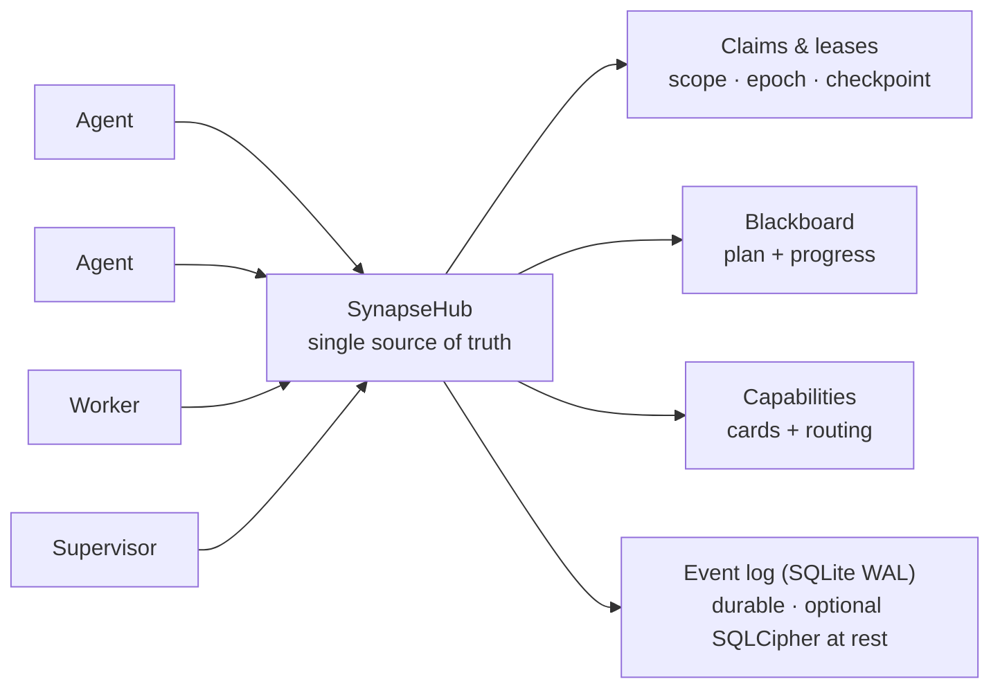

<!--
SPDX-License-Identifier: AGPL-3.0-or-later
Commercial license available
© Concepts 1996–2026 Miroslav Šotek. All rights reserved.
© Code 2020–2026 Miroslav Šotek. All rights reserved.
ORCID: 0009-0009-3560-0851
Contact: www.anulum.li | protoscience@anulum.li
SYNAPSE CHANNEL — aperçu du dépôt (traduction française ; l'original anglais fait foi)
-->

<p align="center">
  <a href="../../README.md">English</a> ·
  <a href="README.zh-CN.md">简体中文</a> ·
  <a href="README.es.md">Español</a> ·
  <a href="README.pt-BR.md">Português (Brasil)</a> ·
  <a href="README.ja.md">日本語</a> ·
  <a href="README.ko.md">한국어</a> ·
  <a href="README.de.md">Deutsch</a> ·
  <strong>Français</strong> ·
  <a href="README.sk.md">Slovenčina</a>
</p>

<p align="center">
  
</p>

<p align="center">
  <strong>Empêchez les agents de codage IA parallèles d'écraser mutuellement leurs fichiers.</strong><br>
  Bus de coordination local-first — file-scope claims, un plan partagé et des leases durables — pour un dépôt ou tout un écosystème de dépôts.
</p>

<p align="center">
  <a href="https://github.com/anulum/synapse-channel/actions/workflows/ci.yml"></a>
  <a href="https://github.com/anulum/synapse-channel/actions/workflows/fuzz.yml"></a>
  <a href="https://github.com/anulum/synapse-channel/actions/workflows/link-check.yml"></a>
  <a href="https://github.com/anulum/synapse-channel/actions/workflows/clients-cockpit.yml"></a>
  <a href="https://github.com/anulum/synapse-channel/actions/workflows/codeql.yml"></a>
  <a href="https://pypi.org/project/synapse-channel/"></a>
  <a href="https://pypi.org/project/synapse-channel/"></a>
  <a href="https://pepy.tech/project/synapse-channel"></a>
  <a href="../../LICENSE"></a>
  <a href="https://anulum.li/synapse/pricing.html"></a>
  
  <a href="https://codecov.io/gh/anulum/synapse-channel"></a>
  <a href="https://api.reuse.software/info/github.com/anulum/synapse-channel"></a>
  <a href="https://securityscorecards.dev/viewer/?uri=github.com/anulum/synapse-channel"></a>
  <a href="https://github.com/astral-sh/ruff"></a>
  <a href="https://doi.org/10.5281/zenodo.20801559"></a>
</p>

Un bus de coordination local-first pour une flotte d'agents IA travaillant en
parallèle — au sein d'un même dépôt ou répartis sur tout un écosystème de
dépôts. Un hub WebSocket est la source de vérité partagée pour la **presence**,
les **work claims**, le **chat**, l'**état des tâches** et les **resource
offers** : les agents s'adressent les uns aux autres à travers les projets et
partagent un même plan, tandis que les file-scope claims tiennent les agents
d'un dépôt à l'écart des fichiers des autres.

Le bus est léger côté transport (une seule dépendance, `websockets`), centré
sur le hub par conception (un seul endroit possède la presence, les leases et
l'historique) et s'exécute entièrement sur la machine locale. Les workers de
modèles répondent sur le canal via n'importe quel endpoint compatible OpenAI,
y compris un serveur Ollama local, avec un fallback déterministe à base de
règles pour l'usage hors ligne.

**Vos agents existants se branchent sans nouveau code.** Tout hôte Model
Context Protocol — Claude Code, Claude Desktop, Cursor — atteint le bus via le
serveur `synapse mcp` fourni, qui expose les verbes send, durable inbox,
status, claim, release, handoff et task comme outils MCP, plus le board, les
agents et les resources comme MCP resources en lecture seule. Les agents
parlant A2A se connectent quant à eux via la façade Agent Card. Le hub lui-même
reste agnostique au protocole et l'installation de base garde son unique
dépendance — les adaptateurs MCP et A2A sont des extras optionnels
(`pip install 'synapse-channel[mcp]'`). Voir le [guide MCP](../mcp.md).

```bash
python -m pip install synapse-channel && synapse demo
```

<p align="center">
  <a href="https://pypi.org/project/synapse-channel/"><strong>Obtenir le paquet Python</strong></a>
  &nbsp;·&nbsp;
  <a href="../../README.md#first-60-seconds">Lancer les 60 premières secondes</a>
  &nbsp;·&nbsp;
  <a href="../quickstart.md">Lire le quickstart</a>
</p>

## Coordonner. Observer. Gouverner.

La promesse quotidienne de Synapse tient en trois boucles explicites :

- **Coordonner** avant que les agents n'entrent en collision :
  `synapse git-init`, `synapse git-claim`, `synapse git-claim-check --staged`,
  `synapse task` et `syn ack` transforment le périmètre de travail, les
  dépendances et les preuves en état partagé plutôt qu'en notes de canaux
  parallèles.
- **Observer** la flotte depuis un état durable : `synapse who`,
  `synapse state`, `synapse dashboard`, `synapse event-query` et les lignes de
  peers observés montrent qui est présent, ce qui est claimé, ce qui a changé
  et quels faits de peer-hubs ne sont qu'advisory.
- **Gouverner** les actions risquées avec des preuves : contrôles de policy,
  approbations, release receipts, Merkle roots, surfaces ACL, fédération et
  commandes de clés de chiffrement rendent les décisions de l'opérateur
  auditables. Les surfaces de gouvernance rapportent par défaut ; les
  opérateurs décident de ce qui bloque un merge, une release ou une action
  cross-hub.
- **Protéger le journal durable au repos** avec le chiffrement de pages
  **SQLCipher** optionnel pour l'event store vivant du hub (plus des
  enveloppes AES-GCM de fichiers entiers pour les journaux de relais, l'état
  A2A, les curseurs et les archives). Voir
  [SQLCipher live event store](../../README.md#sqlcipher-live-event-store-at-rest).

## Mur des fonctionnalités

Les cellules visuelles ci-dessous sont des emplacements de capture étiquetés,
pas des images manquantes. De courts enregistrements produit les remplaceront
après la passe de capture de démo ; les commandes liées et la documentation
décrivent le comportement livré aujourd'hui.

| Surface de coordination livrée | Emplacement visuel étiqueté |
|---|---|
| **Claim avant l'édition.** [`synapse git-init`](../../README.md#git-native-claims) installe des hooks Git conscients des claims ; `synapse git-claim` enregistre un worktree, une branche et un périmètre de chemins exacts, de sorte qu'un claim en chevauchement peut être refusé avant que les fichiers ne divergent. | **Emplacement visuel — claim gutter :** un propriétaire est visible pendant qu'une édition concurrente est refusée. |
| **Bloquer les éditions natives non claimées.** Les [hooks de claim d'édition de fichiers par provider](../claim-guard-hooks.md) adaptent Claude Code `Edit\|Write`, Codex `apply_patch`, Gemini CLI `replace\|write_file` et Kimi `Edit\|Write` à un unique moteur de décision de claims en direct. | **Emplacement visuel — refus d'édition :** une édition provider non claimée s'arrête avant que l'outil de fichier natif ne s'exécute. |
| **Partager le plan.** `synapse task` et [`synapse board`](../coordination-model.md) gardent l'état des tâches, les dépendances et le travail prêt sur le hub plutôt que dans des notes d'agents séparées. | **Emplacement visuel — board :** une tâche bloquée devient prête quand sa dépendance s'achève. |
| **Transmettre le travail sans rupture de propriété.** Le [handoff atomique](../coordination-model.md#4-hand-off-and-recover) déplace la tâche détenue, le périmètre, l'état et le checkpoint vers un destinataire en ligne sans fenêtre de release-and-reclaim. | **Emplacement visuel — handoff :** la propriété et le checkpoint se déplacent ensemble entre deux seats. |
| **Exposer un dark seat.** Après 30 secondes continues sans le waiter exact du propriétaire, le hub émet un seul [`dark_seat_alert`](../protocol.md) pour les claims affectés ou le travail assigné, avec le remède permanent-arm ; il ne libère ni ne réassigne le travail automatiquement. | **Emplacement visuel — alerte dark seat :** le waiter manquant et la commande exacte de ré-armement apparaissent à côté du travail affecté. |
| **Lire la flotte depuis un seul cockpit.** [`synapse dashboard`](../studio.md) sert le centre de commandement local, les colonnes de tâches à état exact, les claims, les conflits, la posture de sécurité et un flux d'événements durable optionnel ; la projection Studio en lecture seule n'ajoute aucune nouvelle autorité au hub. | **Emplacement visuel — cockpit :** claims en direct, état des tâches, risque et événements récents partagent une même vue opérateur. |
| **Connecter les protocoles d'agents existants en bordure.** [`synapse mcp`](../mcp.md) expose les outils de coordination et des resources en lecture seule via stdio ; le [pont A2A](../a2a-conformance.md) expose une Agent Card locale et une surface HTTP+JSON tout en gardant explicite sa frontière de validation partielle. | **Emplacement visuel — MCP et A2A :** un agent existant atteint le même hub par l'un ou l'autre adaptateur. |

## En un coup d'œil

<p align="center">
  
</p>



Un claim loue (lease) une unité de travail avec un file scope, de sorte que
deux agents n'éditent jamais les mêmes fichiers ; le plan, les handoffs, les
checkpoints et un superviseur de blocage maintiennent le travail en mouvement ;
et le journal d'événements durable signifie qu'un redémarrage du hub reprend
les leases vivants au lieu de les perdre.

## Cœur et couches optionnelles

SYNAPSE CHANNEL est livré comme un seul paquet installable, mais la surface
publique est étagée pour que le bus épuré reste lisible :

| Couche | Tier de taxonomie | Ce qui y appartient |
|---|---|---|
| Cœur de coordination local | `stable` | Le hub, send/wait/listen/arm, claims, tasks, locks, status, board, init et les commandes de bootstrap de flotte utilisées pour la coordination quotidienne. |
| Adaptateurs de bordure | `adapter` | MCP, A2A, hooks git, ponts tmux/provider, hooks shell, ingestion et worker seats qui relient les outils existants au bus. |
| Analyse opérateur | `analysis` | Doctor, state, dashboard, causality, multihub, reliability, trust graph, directory, accounting, export de scorecard de flotte, manifestes et requêtes d'événements. Ils ne modifient pas l'état de coordination ; des modes d'export explicites peuvent écrire vers une destination choisie par l'opérateur. |
| Gouvernance et intégrité | `governance` | Contrôles de policy, approbations, surfaces ACL/rôles, fédération, Merkle roots, release receipts, reproduction, compaction, opérations de clés encrypt-key / SQLCipher. |
| Surfaces de laboratoire | `experimental` | Benchmarking, participant fabric, route-task, sandbox, workflow, TTL advice, memory recall, auto-action et resource bidding. |

La carte qui fait autorité est [`synapse_channel.surface_taxonomy`](../../src/synapse_channel/surface_taxonomy.py)
et la vue opérateur générée est [Public surface and stability](../public-surface.md).
Les adaptateurs et surfaces de laboratoire peuvent être installés et utilisés
depuis le même paquet, mais ils ne changent pas le cœur local à dépendance
unique.

### Participant memory recall optionnel

`participant ask`, `participant exchange` et `participant convene` peuvent
envelopper leurs seats d'un recall borné et en lecture seule depuis l'API HTTP
légère de REMANENTIA. Le recall est désactivé sauf si `--memory-url` est
présent ; aucun processus mémoire n'est démarré implicitement. Les tokens ne
sont acceptés que via `--memory-token-file`, et les extraits rappelés entrent
dans `TurnRequest.context` à l'intérieur d'une clôture data-only tandis que le
prompt de l'opérateur reste inchangé.

```bash
synapse participant ask claude "review this design" \
  --memory-url http://127.0.0.1:8001 \
  --memory-token-file /run/secrets/remanentia
```

Les résultats HTTP actuels omettent les axes d'honnêteté de REMANENTIA, donc
chaque résultat rappelé est montré comme boundary data ; la similarité est une
preuve de pertinence, pas une preuve de vérité. Les états no-hit et unavailable
restent visibles sans faire échouer le tour du provider. Voir
[Participant memory recall](../participant-memory.md) pour l'installation, les
limites, les flags CLI, l'usage en bibliothèque et les frontières d'audit.

> **À venir : Studio** — le dashboard grandit vers un **[Studio](../studio.md)**
> opérateur : un plan de contrôle qui répond, d'un coup d'œil, à ce qui se
> passe, ce qui est à risque et ce qu'il est sûr de faire ensuite. Le système
> de design en tableau de bord, la référence `/studio`, le shell en direct
> `/studio/command`, le panneau de posture de sécurité et le LiveFeed du
> journal d'événements sont livrés. Local-first et en lecture seule par
> défaut — un atelier au niveau de l'organisation est prévu comme couche
> séparée.

## Installation

```bash
python -m pip install synapse-channel       # la release depuis PyPI
python -m pip install -e ".[dev]"           # ou un checkout de dev éditable
# optionnel : chiffrement de pages de l'event store vivant du hub (SQLCipher)
python -m pip install 'synapse-channel[sqlcipher]'
# optionnel : helpers d'enveloppes AES-GCM de fichiers entiers (encrypt-key profile/migrate/rekey)
python -m pip install 'synapse-channel[encryption]'
```

Pour un checkout éditable, gardez le `.venv` local aligné avec les extras dev,
docs et benchmark déclarés du dépôt :

```bash
.venv/bin/python tools/check_dev_dependency_drift.py --check
.venv/bin/python tools/audit_dependency_tooling.py --check
```

La seconde vérification est hors ligne. Elle vérifie que le preflight local
couvre toujours les tool gates attendus, que les GitHub Actions sont épinglées
sur des SHA de commit complets, que Dependabot couvre actions/Python/Docker et
que les surfaces de métadonnées de publication/téléchargement PyPI restent
câblées.

Ceci installe la commande `synapse`. Pour exécuter le hub comme service local
permanent ou comme conteneur, voir le [guide de déploiement](../deployment.md)
(une user unit `systemd` et `docker compose` sont tous deux inclus). Sous
Linux, installez seulement un waiter permanent à identité exacte avec
`synapse arm install --identity myproject/agent --start` ; il utilise le
mailbox replay et `Restart=always`, sans installer de hub. La configuration
d'un service Windows natif n'est pas revendiquée ; utilisez WSL avec systemd
comme documenté dans le guide de déploiement.

Deux commodités shell optionnelles accompagnent le CLI : `synapse completions
bash|zsh|fish` imprime la complétion tabulaire pour chaque sous-commande
(générée depuis le parseur vivant, elle ne dérive donc jamais), et
`synapse install-shell-hook` ajoute le bloc gardé qui arme automatiquement un
wake listener dans chaque nouveau terminal :

```bash
synapse completions bash > ~/.local/share/bash-completion/completions/synapse
synapse install-shell-hook          # auto-armer les terminaux Bash, Zsh et Fish
```

## Les 60 premières secondes

Sur un environnement Python propre, vérifiez le CLI installé avant de câbler
des agents dans un vrai dépôt :

```bash
python -m pip install synapse-channel
synapse doctor
synapse demo
synapse quickstart-coding
```

`synapse doctor` signale les problèmes d'installation locale comme l'identité,
l'exposition du hub, la pression sur le système de fichiers racine et les
waiters manquants. Une machine toute neuve peut avertir qu'aucun hub ni waiter
ne tourne ; c'est attendu avant la mise en place du service. `synapse demo`
démarre son propre hub local, déroule un flux de coordination planner/worker
et réussit quand il imprime :

```text
success: coordination demo completed
```

`synapse quickstart-coding` crée un workspace coding-fleet temporaire, exécute
la même démo de codage sans collision utilisée par les workspaces générés,
supprime le workspace temporaire après le succès et imprime :

```text
success: coding fleet demo completed
```

Ou lancez toute la séquence de premier démarrage en une seule commande :

```bash
synapse fleet-init
```

Elle exécute le doctor (`--fix` pour réparer le hub local et le waiter par
défaut), échafaude un workspace persistant `./synapse-fleet`, sonde quels CLI
de providers cette machine peut asseoir (claude, codex, kimi, ollama, …),
exécute le smoke de démo et imprime le plan des étapes suivantes — armement du
waiter, commandes de seat par provider, `git-init`, dashboard — avec le nom de
projet du workspace renseigné.

## Le chemin d'essai sûr le plus rapide

Une fois les démos autonomes passées, essayez Synapse contre un vrai checkout
dans cet ordre :

```bash
python -m pip install synapse-channel
synapse doctor
synapse demo
synapse quickstart-coding
synapse git-init --name trial-agent
synapse dashboard --port 8765
synapse a2a-card --endpoint-url http://127.0.0.1:8877
synapse a2a-conformance
synapse a2a-serve --endpoint-url http://127.0.0.1:8877
```

Exécutez ceci dans un dépôt jetable ou déjà versionné. `synapse git-init
--name trial-agent` installe les hooks git conscients des claims et écrit le
guide de conventions local `.synapse/` avant que les agents n'éditent des
fichiers. L'étape du pont A2A est optionnelle et locale uniquement : elle
permet à un autre outil local d'inspecter l'Agent Card ou de parler au pont
HTTP+JSON, mais ce n'est pas une revendication de conformité externe. Ne le
liez pas hors du loopback sans authentification bearer.

## Releases

Ce paquet est développé au grand jour et dogfoodé quotidiennement : une flotte
d'agents de codage y fait tourner sa propre coordination, donc les problèmes
émergent en usage réel et sont corrigés rapidement. Les releases sont par
conséquent fréquentes et surtout petites — corrections et durcissement plutôt
que churn. Le protocole wire et l'API Python publique restent
rétrocompatibles au sein d'une version majeure ; tout changement cassant est
signalé dans le changelog.

Les releases `0.x` actuelles sont des releases de développement, pas la
ligne de release commerciale stable. La première release commerciale stable
de SYNAPSE CHANNEL est prévue avec les contrats opérationnels,
l'empaquetage, la surface de support et les conditions de licence
commerciale documentés dans le cadre de cette release.

SYNAPSE CHANNEL recherche un financement de démarrage, des partenaires
stratégiques et des co-acteurs d'écosystème alignés qui veulent aider à faire
mûrir la couche de coordination pour le développement multi-agents en
production. Voir la [licence commerciale](../commercial.md) ou écrire à
`protoscience@anulum.li`.

Si vous avez besoin d'une cible fixe, épinglez une version
(`synapse-channel==X.Y.Z`) ; pour obtenir les derniers correctifs, suivez la
release la plus récente. Les deux sont pris en charge.

---

Ceci est la traduction de la partie publique du README. La référence
complète — Quick start, modèle de coordination, usage en bibliothèque,
architecture, inventaire des capacités, posture de sécurité, limites connues,
SYNAPSE CHANNEL Fleet, usage commercial, citation et licence — se poursuit
dans le [README anglais](../../README.md#quick-start) canonique. L'original
anglais fait toujours foi ; les blocs générés (capability snapshot, citation)
n'existent que là-bas.
