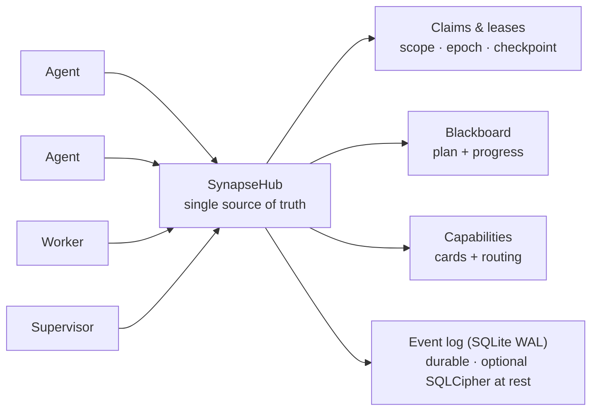

<!--
SPDX-License-Identifier: AGPL-3.0-or-later
Commercial license available
© Concepts 1996–2026 Miroslav Šotek. All rights reserved.
© Code 2020–2026 Miroslav Šotek. All rights reserved.
ORCID: 0009-0009-3560-0851
Contact: www.anulum.li | protoscience@anulum.li
SYNAPSE CHANNEL — リポジトリ概要（日本語訳。英語原文が正本です）
-->

<p align="center">
  <a href="../../README.md">English</a> ·
  <a href="README.zh-CN.md">简体中文</a> ·
  <a href="README.es.md">Español</a> ·
  <a href="README.pt-BR.md">Português (Brasil)</a> ·
  <strong>日本語</strong> ·
  <a href="README.ko.md">한국어</a> ·
  <a href="README.de.md">Deutsch</a> ·
  <a href="README.fr.md">Français</a> ·
  <a href="README.sk.md">Slovenčina</a>
</p>

<p align="center">
  
</p>

<p align="center">
  <strong>並列で動く AI コーディングエージェント同士がファイルを潰し合うのを止める。</strong><br>
  ローカルファーストの調整バス — file-scope claims、共有プラン、永続的な leases — を、単一リポジトリにも、リポジトリのエコシステム全体にも。
</p>

<p align="center">
  <a href="https://github.com/anulum/synapse-channel/actions/workflows/ci.yml"></a>
  <a href="https://github.com/anulum/synapse-channel/actions/workflows/fuzz.yml"></a>
  <a href="https://github.com/anulum/synapse-channel/actions/workflows/link-check.yml"></a>
  <a href="https://github.com/anulum/synapse-channel/actions/workflows/clients-cockpit.yml"></a>
  <a href="https://github.com/anulum/synapse-channel/actions/workflows/codeql.yml"></a>
  <a href="https://pypi.org/project/synapse-channel/"></a>
  <a href="https://pypi.org/project/synapse-channel/"></a>
  <a href="https://pepy.tech/project/synapse-channel"></a>
  <a href="../../LICENSE"></a>
  <a href="https://www.remanentia.com/synapse/pricing.html"></a>
  
  <a href="https://codecov.io/gh/anulum/synapse-channel"></a>
  <a href="https://api.reuse.software/info/github.com/anulum/synapse-channel"></a>
  <a href="https://securityscorecards.dev/viewer/?uri=github.com/anulum/synapse-channel"></a>
  <a href="https://github.com/astral-sh/ruff"></a>
  <a href="https://doi.org/10.5281/zenodo.20801559"></a>
</p>

並列に働く AI エージェントのフリートのための、ローカルファーストな調整バス —
単一リポジトリの中でも、リポジトリのエコシステム全体に広がっていても使えます。
1 つの WebSocket ハブが **presence**、**work claims**、**チャット**、
**タスク状態**、**resource offers** の共有された唯一の真実の源になります。
エージェントはプロジェクトを越えて互いに呼びかけ、1 つのプランを共有し、
file-scope claims が各リポジトリ内のエージェントを互いのファイルから遠ざけます。

このバスはトランスポートが軽く（依存関係はただ 1 つ、`websockets`）、設計上
ハブ中心（presence、leases、履歴を 1 か所が所有）で、すべてローカルマシン上で
動きます。モデルワーカーは、ローカルの Ollama サーバーを含む任意の OpenAI
互換エンドポイント経由でチャネル上に応答し、オフライン利用のための決定論的な
ルールベースのフォールバックも備えています。

**既存のエージェントは新しいコードなしで接続できます。** あらゆる Model
Context Protocol ホスト — Claude Code、Claude Desktop、Cursor — は、同梱の
`synapse mcp` サーバーを通じてバスに到達します。このサーバーは send、durable
inbox、status、claim、release、handoff、task の各動詞を MCP ツールとして、
さらに board、agents、resources を読み取り専用の MCP resources として公開
します。A2A を話すエージェントは代わりに Agent Card フェイスから接続します。
ハブ自体はプロトコルに依存せず、コアのインストールは単一依存のまま — MCP と
A2A のアダプターはオプションのエクストラです（`pip install
'synapse-channel[mcp]'`）。[MCP ガイド](../mcp.md)を参照してください。

```bash
python -m pip install synapse-channel && synapse demo
```

<p align="center">
  <a href="https://pypi.org/project/synapse-channel/"><strong>Python パッケージを入手</strong></a>
  &nbsp;·&nbsp;
  <a href="../../README.md#first-60-seconds">最初の 60 秒を実行</a>
  &nbsp;·&nbsp;
  <a href="../quickstart.md">クイックスタートを読む</a>
</p>

## 調整する。観測する。統制する。

Synapse の日々の約束は、3 つの明示的なループです。

- **調整する** — エージェントが衝突する前に：`synapse git-init`、
  `synapse git-claim`、`synapse git-claim-check --staged`、`synapse task`、
  `syn ack` が、作業スコープ・依存関係・証跡を、サイドチャネルのメモではなく
  共有状態に変えます。
- **観測する** — 永続状態からフリートを：`synapse who`、`synapse state`、
  `synapse dashboard`、`synapse event-query`、および観測されたピアの行が、
  誰が在席し、何が claim され、何が変わり、どのピアハブの事実が advisory に
  すぎないのかを示します。
- **統制する** — リスクのある操作を証跡付きで：policy チェック、承認、
  release receipts、Merkle roots、ACL サーフェス、フェデレーション、
  暗号鍵コマンドが、オペレーターの判断を監査可能にします。ガバナンスの
  サーフェスは既定では報告のみを行い、何が merge・release・クロスハブ操作を
  ブロックするかはオペレーターが決めます。
- **永続ログを保存時に保護する** — ハブのライブイベントストア向けの
  オプションの **SQLCipher** ページ暗号化（さらにリレーログ、A2A 状態、
  カーソル、アーカイブ向けのファイル全体 AES-GCM エンベロープ）。
  [SQLCipher live event store](../../README.md#sqlcipher-live-event-store-at-rest)
  を参照してください。

## 機能ウォール

以下のビジュアルセルはラベル付きのキャプチャ用プレースホルダーであり、
欠けている画像ではありません。デモキャプチャの工程の後に短いプロダクト録画へ
置き換わります。リンクされたコマンドとドキュメントは、今日出荷済みの挙動を
記述しています。

| 出荷済みの調整サーフェス | ラベル付きビジュアルスロット |
|---|---|
| **編集の前に claim。** [`synapse git-init`](../../README.md#git-native-claims) が claim 対応の Git フックをインストールし、`synapse git-claim` が正確な worktree・ブランチ・パスのスコープを記録するため、重複する claim はファイルが分岐する前に拒否できます。 | **ビジュアルプレースホルダー — claim gutter：** 競合する編集が拒否される間、1 人の所有者が可視化されます。 |
| **claim されていないネイティブなファイル編集をブロック。** [プロバイダーのファイル編集 claim フック](../claim-guard-hooks.md)は、Claude Code `Edit\|Write`、Codex `apply_patch`、Gemini CLI `replace\|write_file`、Kimi `Edit\|Write` を単一のライブ claim 判定エンジンに適合させます。 | **ビジュアルプレースホルダー — 編集拒否：** claim のないプロバイダー編集は、ネイティブのファイルツールが動く前に停止します。 |
| **プランを共有。** `synapse task` と [`synapse board`](../coordination-model.md) は、タスク状態・依存関係・準備完了の作業を、エージェントごとの別々のメモではなくハブ上に保ちます。 | **ビジュアルプレースホルダー — ボード：** ブロックされたタスクは、依存先が完了すると準備完了になります。 |
| **所有権の空白なしに作業を引き継ぐ。** [アトミックな handoff](../coordination-model.md#4-hand-off-and-recover) は、保持中のタスク・スコープ・状態・チェックポイントを、release-and-reclaim の窓なしにオンラインの受け手へ移します。 | **ビジュアルプレースホルダー — handoff：** 所有権とチェックポイントが 2 つの seat の間を一緒に移動します。 |
| **dark seat を暴く。** 所有者の正確な waiter が 30 秒間連続で不在になると、ハブは影響を受ける claims や割り当て済み作業について [`dark_seat_alert`](../protocol.md) を 1 回発行し、permanent-arm の対処法も含めます。作業を自動的に解放したり再割り当てしたりはしません。 | **ビジュアルプレースホルダー — dark seat アラート：** 欠けている waiter と正確な再アームコマンドが、影響を受ける作業の隣に表示されます。 |
| **1 つのコックピットからフリートを読む。** [`synapse dashboard`](../studio.md) は、ローカルの司令センター、正確な状態のタスク列、claims、競合、セキュリティ態勢、オプションの永続イベントフィードを提供します。読み取り専用の Studio プロジェクションはハブに新しい権限を一切追加しません。 | **ビジュアルプレースホルダー — コックピット：** ライブの claims、タスク状態、リスク、直近のイベントが 1 つのオペレータービューを共有します。 |
| **既存のエージェントプロトコルをエッジで接続。** [`synapse mcp`](../mcp.md) は調整ツールと読み取り専用 resources を stdio 上で公開し、[A2A ブリッジ](../a2a-conformance.md)はローカルの Agent Card と HTTP+JSON サーフェスを公開しつつ、部分検証という境界を明示し続けます。 | **ビジュアルプレースホルダー — MCP と A2A：** 既存のエージェントがどちらのアダプター経由でも同じハブに到達します。 |

## ひと目でわかる

<p align="center">
  
</p>



claim は file scope 付きで作業単位をリース（lease）するため、2 つの
エージェントが同じファイルを編集することは決してありません。プラン、
handoff、チェックポイント、ストール監視が作業を動かし続け、永続イベント
ログのおかげで、ハブの再起動はライブな leases を失うのではなく再開します。

## コアとオプションのレイヤー

SYNAPSE CHANNEL は 1 つのインストール可能なパッケージとして出荷されますが、
無駄のないバスを明快に保つため、公開サーフェスは段階化されています。

| レイヤー | タクソノミーの tier | そこに属するもの |
|---|---|---|
| ローカル調整コア | `stable` | ハブ、send/wait/listen/arm、claims、tasks、locks、status、board、init、そして日常の調整に使うフリートのブートストラップコマンド。 |
| エッジアダプター | `adapter` | MCP、A2A、git フック、tmux/プロバイダーのブリッジ、シェルフック、インジェスト、既存ツールをバスに接続する worker seats。 |
| オペレーター分析 | `analysis` | Doctor、state、dashboard、causality、multihub、reliability、trust graph、directory、accounting、フリートスコアカードのエクスポート、マニフェスト、イベントクエリ。これらは調整状態を変更しません。明示的なエクスポートモードはオペレーターの選んだ出力先へ書き込めます。 |
| ガバナンスと完全性 | `governance` | policy チェック、承認、ACL/ロールのサーフェス、フェデレーション、Merkle roots、release receipts、再現、コンパクション、encrypt-key / SQLCipher の鍵操作。 |
| ラボサーフェス | `experimental` | ベンチマーキング、participant fabric、route-task、sandbox、workflow、TTL advice、memory recall、auto-action、resource bidding。 |

正式なマップは [`synapse_channel.surface_taxonomy`](../../src/synapse_channel/surface_taxonomy.py)
で、生成されたオペレータービューは [Public surface and stability](../public-surface.md)
です。アダプターとラボサーフェスは同じパッケージからインストールして使えますが、
単一依存のローカルコアを変えることはありません。

### オプションの Participant memory recall

`participant ask`、`participant exchange`、`participant convene` は、
REMANENTIA の軽量 HTTP API からの、範囲を限った読み取り専用 recall で
自分の seat を包めます。`--memory-url` がなければ recall は無効で、メモリ
プロセスが暗黙に起動されることはありません。トークンは
`--memory-token-file` 経由でのみ受け付けられ、呼び出されたスニペットは
data-only のフェンス内で `TurnRequest.context` に入り、オペレーターの
プロンプトは変更されないままです。

```bash
synapse participant ask claude "review this design" \
  --memory-url http://127.0.0.1:8001 \
  --memory-token-file /run/secrets/remanentia
```

現在の HTTP 結果は REMANENTIA の honesty 軸を含まないため、呼び出された
ヒットはすべて boundary data として表示されます。類似度は関連性の証拠で
あって、真実の証拠ではありません。ヒットなし・利用不可の状態は、プロバイダー
のターンを失敗させることなく可視のままです。セットアップ、制限、CLI フラグ、
ライブラリでの利用、監査境界については
[Participant memory recall](../participant-memory.md) を参照してください。

> **近日公開：Studio** — ダッシュボードはオペレーター向けの
> **[Studio](../studio.md)** へ成長しつつあります。何が起きているか、何が
> リスクにあるか、次に何をしても安全かに、ひと目で答える制御プレーンです。
> 計器盤デザインシステム、`/studio` リファレンス、ライブの
> `/studio/command` シェル、セキュリティ態勢パネル、イベントログの LiveFeed
> は出荷済みです。ローカルファーストかつ既定で読み取り専用 — 組織レベルの
> ワークベンチは別レイヤーとして計画されています。

## インストール

```bash
python -m pip install synapse-channel       # PyPI のリリース
python -m pip install -e ".[dev]"           # または編集可能な dev チェックアウト
# オプション：ライブなハブのイベントストアのページ暗号化（SQLCipher）
python -m pip install 'synapse-channel[sqlcipher]'
# オプション：ファイル全体の AES-GCM エンベロープヘルパー（encrypt-key profile/migrate/rekey）
python -m pip install 'synapse-channel[encryption]'
```

編集可能なチェックアウトでは、ローカルの `.venv` をリポジトリが宣言する
dev・docs・benchmark のエクストラと揃えておいてください。

```bash
.venv/bin/python tools/check_dev_dependency_drift.py --check
.venv/bin/python tools/audit_dependency_tooling.py --check
```

2 つ目のチェックはオフラインです。ローカルの preflight が期待されるツール
ゲートを依然カバーしていること、GitHub Actions が完全なコミット SHA に
ピン留めされていること、Dependabot が actions/Python/Docker をカバーして
いること、PyPI の公開/ダウンロードメタデータのサーフェスが配線されたままで
あることを検証します。

これで `synapse` コマンドがインストールされます。ハブを常時稼働のローカル
サービスやコンテナとして動かす方法は[デプロイメントガイド](../deployment.md)
を参照してください（`systemd` のユーザーユニットと `docker compose` の両方が
同梱されています）。Linux では、
`synapse arm install --identity myproject/agent --start` で恒久的な
exact-identity waiter だけをインストールできます。これは mailbox replay と
`Restart=always` を使い、ハブはインストールしません。ネイティブな Windows
サービスのセットアップは主張していません。デプロイメントガイドに記載の
とおり、systemd 付きの WSL を使ってください。

CLI には 2 つのオプションのシェル便利機能が付属します。`synapse completions
bash|zsh|fish` はすべてのサブコマンドのタブ補完を出力し（ライブなパーサー
から生成されるため決してドリフトしません）、`synapse install-shell-hook` は
新しいターミナルごとに wake リスナーを自動アームするガード付きブロックを
追加します。

```bash
synapse completions bash > ~/.local/share/bash-completion/completions/synapse
synapse install-shell-hook          # Bash・Zsh・Fish ターミナルを自動アーム
```

## 最初の 60 秒

クリーンな Python 環境で、エージェントを実際のリポジトリに配線する前に、
インストール済みの CLI を検証してください。

```bash
python -m pip install synapse-channel
synapse doctor
synapse demo
synapse quickstart-coding
```

`synapse doctor` は、アイデンティティ、ハブの露出、ルートファイルシステムの
逼迫、waiter の不在といったローカルセットアップの問題を報告します。真新しい
マシンでは、ハブや waiter が動いていないと警告されるかもしれませんが、
サービスセットアップ前ならそれは想定どおりです。`synapse demo` は自前の
ローカルハブを起動し、Claude/Codex の個別 claim、競合拒否、handoff、
検証済み receipt までを実行し、次を出力すれば成功です。

```text
success: coordination demo completed
```

`synapse quickstart-coding` は一時的な coding-fleet ワークスペースを作り、
生成されたワークスペースが使うのと同じ無衝突コーディングデモを実行し、成功
後に一時ワークスペースを削除して、次を出力します。

```text
success: coding fleet demo completed
```

あるいは、最初の一連の手順全体を 1 コマンドで実行します。

```bash
synapse fleet-init
```

これは doctor を実行し（`--fix` で既定のローカルハブと waiter を修復）、
永続的な `./synapse-fleet` ワークスペースを組み立て、このマシンがどの
プロバイダー CLI を座らせられるかを調べ（claude、codex、kimi、ollama、…）、
デモのスモークを実行し、次のステップのプラン — waiter のアーム、
プロバイダーごとの seat コマンド、`git-init`、ダッシュボード — を
ワークスペースのプロジェクト名を埋めた形で出力します。

## 最速の安全なトライアルパス

自己完結のデモが通ったら、次の順序で実際のチェックアウトに対して Synapse を
試してください。

```bash
python -m pip install synapse-channel
synapse doctor
synapse demo
synapse quickstart-coding
synapse git-init --name trial-agent
synapse dashboard --port 8765
synapse a2a-card --endpoint-url http://127.0.0.1:8877
synapse a2a-conformance
synapse a2a-serve --endpoint-url http://127.0.0.1:8877
```

これは使い捨ての、あるいはすでにバージョン管理されたリポジトリで実行して
ください。`synapse git-init --name trial-agent` は claim 対応の git フックを
インストールし、エージェントがファイルを編集する前にローカルの `.synapse/`
規約ガイドを書き出します。A2A ブリッジのステップはオプションかつローカル
のみです。別のローカルツールが Agent Card を調べたり HTTP+JSON ブリッジと
話したりできますが、外部への適合性の主張ではありません。bearer 認証なしで
ループバックの外にバインドしないでください。

## リリース

このパッケージはオープンに開発され、毎日ドッグフーディングされています。
コーディングエージェントのフリートが自らの調整をこの上で走らせているため、
問題は実利用の中で表面化し、素早く修正されます。だからリリースは頻繁で、
ほとんどが小さいもの — チャーンではなく修正と強化です。現在の `0.x`
リリースでは、マイナーリリースをまたぐ後方互換性を保証しません。ワイヤ語彙と
公開 Python API は意図しないドリフトを防ぐテストで保護されていますが、
レビュー済みの `0.x` マイナーリリースで意図的に変更される場合があります。
その場合は changelog と移行ノートを更新し、ワイヤ非互換なら
`WIRE_PROTOCOL_VERSION` を上げます。`1.0.0` 以降、安定版の公開 Python API
に破壊的変更を加えるにはパッケージのメジャーリリースが必要です。
[API とワイヤの安定性](../api-stability.md)を参照してください。

`1.0.0` は SYNAPSE CHANNEL の最初の安定商用リリースとして計画されており、
運用契約、パッケージング、サポートサーフェス、商用ライセンス条件がその
リリースの一部として文書化されます。

SYNAPSE CHANNEL は、本番のマルチエージェント開発のための調整レイヤーを
成熟させる手助けをしたい、スタートアップ資金、戦略的パートナー、志を同じく
するエコシステムの共同オーナーを求めています。
[商用ライセンス](../commercial.md)を参照するか、`protoscience@anulum.li`
までご連絡ください。

固定のターゲットが必要なら、バージョンをピン留めしてください
（`synapse-channel==X.Y.Z`）。最新の修正が欲しいなら、最新リリースを追って
ください。どちらもサポートされています。

---

これは README の公開部分の翻訳です。完全なリファレンス — Quick start、
調整モデル、ライブラリとしての利用、アーキテクチャ、能力インベントリ、
セキュリティ態勢、既知の制限、SYNAPSE CHANNEL Fleet、商用利用、引用、
ライセンス — は正本の[英語 README](../../README.md#quick-start) に続きます。
英語原文が常に正であり、生成ブロック（capability snapshot、引用）はそこに
しか存在しません。
