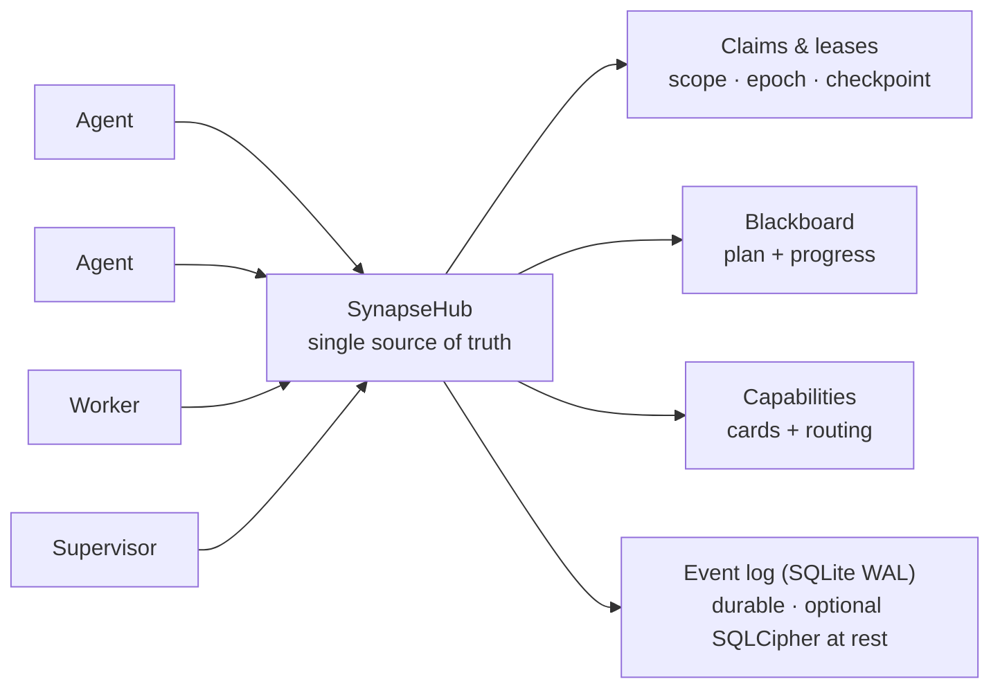

<!--
SPDX-License-Identifier: AGPL-3.0-or-later
Commercial license available
© Concepts 1996–2026 Miroslav Šotek. All rights reserved.
© Code 2020–2026 Miroslav Šotek. All rights reserved.
ORCID: 0009-0009-3560-0851
Contact: www.anulum.li | protoscience@anulum.li
SYNAPSE CHANNEL — 저장소 개요 (한국어 번역본이며, 영어 원문이 정본입니다)
-->

<p align="center">
  <a href="../../README.md">English</a> ·
  <a href="README.zh-CN.md">简体中文</a> ·
  <a href="README.es.md">Español</a> ·
  <a href="README.pt-BR.md">Português (Brasil)</a> ·
  <a href="README.ja.md">日本語</a> ·
  <strong>한국어</strong> ·
  <a href="README.de.md">Deutsch</a> ·
  <a href="README.fr.md">Français</a> ·
  <a href="README.sk.md">Slovenčina</a>
</p>

<p align="center">
  
</p>

<p align="center">
  <strong>병렬로 도는 AI 코딩 에이전트들이 서로의 파일을 덮어쓰지 못하게 하세요.</strong><br>
  로컬 우선 코디네이션 버스 — file-scope claims, 공유 플랜, 지속적인 leases — 하나의 저장소든 저장소 생태계 전체든.
</p>

<p align="center">
  <a href="https://github.com/anulum/synapse-channel/actions/workflows/ci.yml"></a>
  <a href="https://github.com/anulum/synapse-channel/actions/workflows/fuzz.yml"></a>
  <a href="https://github.com/anulum/synapse-channel/actions/workflows/link-check.yml"></a>
  <a href="https://github.com/anulum/synapse-channel/actions/workflows/clients-cockpit.yml"></a>
  <a href="https://github.com/anulum/synapse-channel/actions/workflows/codeql.yml"></a>
  <a href="https://pypi.org/project/synapse-channel/"></a>
  <a href="https://pypi.org/project/synapse-channel/"></a>
  <a href="https://pepy.tech/project/synapse-channel"></a>
  <a href="../../LICENSE"></a>
  <a href="https://anulum.li/synapse/pricing.html"></a>
  
  <a href="https://codecov.io/gh/anulum/synapse-channel"></a>
  <a href="https://api.reuse.software/info/github.com/anulum/synapse-channel"></a>
  <a href="https://securityscorecards.dev/viewer/?uri=github.com/anulum/synapse-channel"></a>
  <a href="https://github.com/astral-sh/ruff"></a>
  <a href="https://doi.org/10.5281/zenodo.20801559"></a>
</p>

병렬로 일하는 AI 에이전트 플릿을 위한 로컬 우선 코디네이션 버스 — 하나의
저장소 안에서도, 저장소 생태계 전체에 걸쳐서도 동작합니다. 하나의 WebSocket
허브가 **presence**, **work claims**, **채팅**, **작업 상태**, **resource
offers**의 공유된 단일 진실 원천이 됩니다. 에이전트들은 프로젝트를 넘나들며
서로를 호출하고 하나의 플랜을 공유하며, file-scope claims는 각 저장소의
에이전트들이 서로의 파일을 건드리지 못하게 지켜 줍니다.

이 버스는 전송 계층이 가볍고(단 하나의 의존성, `websockets`), 설계상 허브
중심이며(presence, leases, 히스토리를 한곳이 소유), 전부 로컬 머신에서
돌아갑니다. 모델 워커는 로컬 Ollama 서버를 포함한 어떤 OpenAI 호환
엔드포인트로도 채널 위에서 응답하며, 오프라인 사용을 위한 결정론적 규칙 기반
폴백도 갖추고 있습니다.

**기존 에이전트는 새 코드 없이 연결됩니다.** 어떤 Model Context Protocol
호스트든 — Claude Code, Claude Desktop, Cursor — 번들된 `synapse mcp` 서버를
통해 버스에 도달합니다. 이 서버는 send, durable inbox, status, claim,
release, handoff, task 동사를 MCP 도구로, 그리고 board, agents, resources를
읽기 전용 MCP resources로 노출합니다. A2A를 말하는 에이전트는 대신 Agent
Card 인터페이스로 연결합니다. 허브 자체는 프로토콜에 중립적이고 코어 설치는
단일 의존성을 유지합니다 — MCP와 A2A 어댑터는 선택적 extras입니다
(`pip install 'synapse-channel[mcp]'`). [MCP 가이드](../mcp.md)를 참고하세요.

```bash
python -m pip install synapse-channel && synapse demo
```

<p align="center">
  <a href="https://pypi.org/project/synapse-channel/"><strong>Python 패키지 받기</strong></a>
  &nbsp;·&nbsp;
  <a href="../../README.md#first-60-seconds">첫 60초 실행하기</a>
  &nbsp;·&nbsp;
  <a href="../quickstart.md">퀵스타트 읽기</a>
</p>

## 조율하고. 관찰하고. 통제한다.

Synapse의 일상적 약속은 세 가지 명시적인 루프입니다.

- **조율** — 에이전트들이 충돌하기 전에: `synapse git-init`,
  `synapse git-claim`, `synapse git-claim-check --staged`, `synapse task`,
  `syn ack`가 작업 범위, 의존 관계, 증거를 사이드 채널 메모가 아닌 공유
  상태로 바꿉니다.
- **관찰** — 지속 상태로부터 플릿을: `synapse who`, `synapse state`,
  `synapse dashboard`, `synapse event-query`, 그리고 관찰된 피어 행이 누가
  접속해 있고, 무엇이 claim되었고, 무엇이 바뀌었고, 어떤 피어 허브의 사실이
  advisory에 불과한지 보여 줍니다.
- **통제** — 위험한 행동을 증거와 함께: policy 검사, 승인, release receipts,
  Merkle roots, ACL 표면, 페더레이션, 암호화 키 명령이 운영자의 결정을 감사
  가능하게 만듭니다. 거버넌스 표면은 기본적으로 보고만 하며, 무엇이 merge,
  release, 크로스 허브 행동을 막을지는 운영자가 결정합니다.
- **저장 시 지속 로그 보호** — 허브의 라이브 이벤트 스토어를 위한 선택적
  **SQLCipher** 페이지 암호화(그리고 릴레이 로그, A2A 상태, 커서, 아카이브를
  위한 파일 전체 AES-GCM 봉투). 자세한 내용은
  [SQLCipher live event store](../../README.md#sqlcipher-live-event-store-at-rest)를
  참고하세요.

## 기능 월

아래 비주얼 셀은 라벨이 붙은 캡처 자리 표시자이지, 누락된 이미지가 아닙니다.
데모 캡처 작업 후 짧은 제품 녹화가 이를 대체할 예정이며, 링크된 명령과
문서는 오늘 출하된 동작을 설명합니다.

| 출하된 코디네이션 표면 | 라벨이 붙은 비주얼 슬롯 |
|---|---|
| **편집 전에 claim.** [`synapse git-init`](../../README.md#git-native-claims)이 claim 인식 Git 훅을 설치하고, `synapse git-claim`이 정확한 worktree, 브랜치, 경로 범위를 기록하므로, 겹치는 claim은 파일이 갈라지기 전에 거절될 수 있습니다. | **비주얼 자리 표시자 — claim gutter:** 경쟁하는 편집이 거절되는 동안 한 명의 소유자가 표시됩니다. |
| **claim 없는 네이티브 파일 편집 차단.** [프로바이더 파일 편집 claim 훅](../claim-guard-hooks.md)은 Claude Code `Edit\|Write`, Codex `apply_patch`, Gemini CLI `replace\|write_file`, Kimi `Edit\|Write`를 하나의 라이브 claim 결정 엔진에 적응시킵니다. | **비주얼 자리 표시자 — 편집 거부:** claim 없는 프로바이더 편집이 네이티브 파일 도구가 실행되기 전에 멈춥니다. |
| **플랜 공유.** `synapse task`와 [`synapse board`](../coordination-model.md)는 작업 상태, 의존 관계, 준비된 작업을 에이전트별 메모가 아닌 허브 위에 유지합니다. | **비주얼 자리 표시자 — 보드:** 막혀 있던 작업이 의존 작업이 완료되면 준비 상태가 됩니다. |
| **소유권 공백 없이 작업 인계.** [원자적 handoff](../coordination-model.md#4-hand-off-and-recover)는 보유 중인 작업, 범위, 상태, 체크포인트를 release-and-reclaim 창 없이 온라인 수신자에게 옮깁니다. | **비주얼 자리 표시자 — handoff:** 소유권과 체크포인트가 두 seat 사이를 함께 이동합니다. |
| **dark seat 드러내기.** 소유자의 정확한 waiter가 30초 연속 부재하면, 허브는 영향을 받는 claims나 할당된 작업에 대해 permanent-arm 해결책을 포함한 [`dark_seat_alert`](../protocol.md)를 한 번 발행합니다. 작업을 자동으로 해제하거나 재할당하지는 않습니다. | **비주얼 자리 표시자 — dark seat 경보:** 누락된 waiter와 정확한 재무장 명령이 영향을 받는 작업 옆에 나타납니다. |
| **하나의 콕핏에서 플릿 읽기.** [`synapse dashboard`](../studio.md)는 로컬 커맨드 센터, 정확한 상태의 작업 열, claims, 충돌, 보안 태세, 그리고 선택적인 지속 이벤트 피드를 제공합니다. 읽기 전용 Studio 프로젝션은 허브에 어떤 새로운 권한도 더하지 않습니다. | **비주얼 자리 표시자 — 콕핏:** 라이브 claims, 작업 상태, 리스크, 최근 이벤트가 하나의 운영자 뷰를 공유합니다. |
| **기존 에이전트 프로토콜을 엣지에서 연결.** [`synapse mcp`](../mcp.md)는 코디네이션 도구와 읽기 전용 resources를 stdio로 노출하고, [A2A 브리지](../a2a-conformance.md)는 부분 검증이라는 경계를 명시적으로 유지하면서 로컬 Agent Card와 HTTP+JSON 표면을 노출합니다. | **비주얼 자리 표시자 — MCP와 A2A:** 기존 에이전트가 어느 어댑터로든 같은 허브에 도달합니다. |

## 한눈에 보기

<p align="center">
  
</p>



claim은 file scope와 함께 작업 단위를 리스(lease)하므로 두 에이전트가 같은
파일을 편집하는 일은 결코 없습니다. 플랜, handoff, 체크포인트, 정체 감독자가
작업을 계속 움직이게 하고, 지속 이벤트 로그 덕분에 허브 재시작은 라이브
leases를 잃는 대신 재개합니다.

## 코어와 선택적 레이어

SYNAPSE CHANNEL은 설치 가능한 하나의 패키지로 출하되지만, 날렵한 버스를
명료하게 유지하기 위해 공개 표면은 단계화되어 있습니다.

| 레이어 | 택소노미 tier | 거기에 속하는 것 |
|---|---|---|
| 로컬 코디네이션 코어 | `stable` | 허브, send/wait/listen/arm, claims, tasks, locks, status, board, init, 그리고 일상적 코디네이션에 쓰이는 플릿 부트스트랩 명령들. |
| 엣지 어댑터 | `adapter` | MCP, A2A, git 훅, tmux/프로바이더 브리지, 셸 훅, 인제스천, 기존 도구를 버스에 연결하는 worker seats. |
| 운영자 분석 | `analysis` | Doctor, state, dashboard, causality, multihub, reliability, trust graph, directory, accounting, 플릿 스코어카드 내보내기, 매니페스트, 이벤트 쿼리. 이들은 코디네이션 상태를 변경하지 않으며, 명시적 내보내기 모드는 운영자가 선택한 대상에 쓸 수 있습니다. |
| 거버넌스와 무결성 | `governance` | policy 검사, 승인, ACL/역할 표면, 페더레이션, Merkle roots, release receipts, 재현, 컴팩션, encrypt-key / SQLCipher 키 작업. |
| 랩 표면 | `experimental` | 벤치마킹, participant fabric, route-task, sandbox, workflow, TTL advice, memory recall, auto-action, resource bidding. |

권위 있는 지도는 [`synapse_channel.surface_taxonomy`](../../src/synapse_channel/surface_taxonomy.py)이고,
생성된 운영자 뷰는 [Public surface and stability](../public-surface.md)입니다.
어댑터와 랩 표면은 같은 패키지에서 설치해 사용할 수 있지만, 단일 의존성
로컬 코어를 바꾸지는 않습니다.

### 선택적 Participant memory recall

`participant ask`, `participant exchange`, `participant convene`은
REMANENTIA의 경량 HTTP API로부터의 한정된 읽기 전용 recall로 자기 seat를
감쌀 수 있습니다. `--memory-url`이 없으면 recall은 비활성화되며, 어떤 메모리
프로세스도 암묵적으로 시작되지 않습니다. 토큰은 `--memory-token-file`로만
받아들여지고, 호출된 스니펫은 data-only 울타리 안에서
`TurnRequest.context`로 들어가며 운영자 프롬프트는 그대로 유지됩니다.

```bash
synapse participant ask claude "review this design" \
  --memory-url http://127.0.0.1:8001 \
  --memory-token-file /run/secrets/remanentia
```

현재 HTTP 결과에는 REMANENTIA의 honesty 축이 빠져 있으므로, 호출된 모든
히트는 boundary data로 표시됩니다. 유사도는 관련성의 증거이지 진실의 증거가
아닙니다. no-hit과 unavailable 상태는 프로바이더 턴을 실패시키지 않으면서
계속 보입니다. 설정, 한계, CLI 플래그, 라이브러리 사용, 감사 경계는
[Participant memory recall](../participant-memory.md)을 참고하세요.

> **곧 출시: Studio** — 대시보드는 운영자용 **[Studio](../studio.md)**로
> 성장하는 중입니다. 무슨 일이 일어나고 있는지, 무엇이 위험한지, 다음에
> 무엇을 해도 안전한지 한눈에 답하는 컨트롤 플레인입니다. 계기판 디자인
> 시스템, `/studio` 레퍼런스, 라이브 `/studio/command` 셸, 보안 태세 패널,
> 이벤트 로그 LiveFeed가 출하되었습니다. 로컬 우선이며 기본은 읽기 전용 —
> 조직 수준 워크벤치는 별도 레이어로 계획되어 있습니다.

## 설치

```bash
python -m pip install synapse-channel       # PyPI의 릴리스
python -m pip install -e ".[dev]"           # 또는 편집 가능한 dev 체크아웃
# 선택: 라이브 허브 이벤트 스토어 페이지 암호화 (SQLCipher)
python -m pip install 'synapse-channel[sqlcipher]'
# 선택: 파일 전체 AES-GCM 봉투 헬퍼 (encrypt-key profile/migrate/rekey)
python -m pip install 'synapse-channel[encryption]'
```

편집 가능한 체크아웃에서는 로컬 `.venv`를 저장소가 선언한 dev, docs,
benchmark extras와 맞춰 두세요.

```bash
.venv/bin/python tools/check_dev_dependency_drift.py --check
.venv/bin/python tools/audit_dependency_tooling.py --check
```

두 번째 검사는 오프라인입니다. 로컬 preflight가 기대되는 도구 게이트를
여전히 커버하는지, GitHub Actions가 전체 커밋 SHA에 고정되어 있는지,
Dependabot이 actions/Python/Docker를 커버하는지, PyPI 게시/다운로드
메타데이터 표면이 연결된 상태인지 검증합니다.

이것으로 `synapse` 명령이 설치됩니다. 허브를 상시 가동 로컬 서비스나
컨테이너로 돌리는 방법은 [배포 가이드](../deployment.md)를 참고하세요
(`systemd` 사용자 유닛과 `docker compose`가 모두 포함되어 있습니다).
Linux에서는
`synapse arm install --identity myproject/agent --start`로 영구적인
exact-identity waiter만 설치할 수 있습니다. 이는 mailbox replay와
`Restart=always`를 사용하며 허브는 설치하지 않습니다. 네이티브 Windows
서비스 설정은 주장하지 않습니다. 배포 가이드에 문서화된 대로 systemd가 있는
WSL을 사용하세요.

CLI에는 두 가지 선택적 셸 편의 기능이 딸려 있습니다. `synapse completions
bash|zsh|fish`는 모든 하위 명령의 탭 완성을 출력하고(라이브 파서에서
생성되므로 결코 드리프트하지 않습니다), `synapse install-shell-hook`은 새
터미널마다 wake 리스너를 자동 무장하는 보호된 블록을 추가합니다.

```bash
synapse completions bash > ~/.local/share/bash-completion/completions/synapse
synapse install-shell-hook          # Bash, Zsh, Fish 터미널 자동 무장
```

## 첫 60초

깨끗한 Python 환경에서, 에이전트를 실제 저장소에 연결하기 전에 설치된
CLI를 검증하세요.

```bash
python -m pip install synapse-channel
synapse doctor
synapse demo
synapse quickstart-coding
```

`synapse doctor`는 아이덴티티, 허브 노출, 루트 파일시스템 압박, waiter 부재
같은 로컬 설정 문제를 보고합니다. 완전히 새 머신은 허브나 waiter가 돌고
있지 않다고 경고할 수 있는데, 서비스 설정 전이라면 그게 정상입니다.
`synapse demo`는 자체 로컬 허브를 시작해 planner/worker 코디네이션 흐름을
구동하고, 다음을 출력하면 성공입니다.

```text
success: coordination demo completed
```

`synapse quickstart-coding`은 임시 coding-fleet 워크스페이스를 만들고,
생성된 워크스페이스가 쓰는 것과 같은 무충돌 코딩 데모를 실행한 뒤, 성공
후 임시 워크스페이스를 제거하고 다음을 출력합니다.

```text
success: coding fleet demo completed
```

또는 첫 실행 시퀀스 전체를 하나의 명령으로 실행하세요.

```bash
synapse fleet-init
```

이는 doctor를 실행하고(`--fix`로 기본 로컬 허브와 waiter를 복구), 지속적인
`./synapse-fleet` 워크스페이스를 골격화하고, 이 머신이 어떤 프로바이더
CLI를 앉힐 수 있는지 탐지하고(claude, codex, kimi, ollama, …), 데모
스모크를 실행한 뒤, 워크스페이스의 프로젝트 이름이 채워진 다음 단계 플랜 —
waiter 무장, 프로바이더별 seat 명령, `git-init`, 대시보드 — 을 출력합니다.

## 가장 빠른 안전 시험 경로

자체 완결형 데모가 통과하면, 다음 순서로 실제 체크아웃에 대해 Synapse를
시험해 보세요.

```bash
python -m pip install synapse-channel
synapse doctor
synapse demo
synapse quickstart-coding
synapse git-init --name trial-agent
synapse dashboard --port 8765
synapse a2a-card --endpoint-url http://127.0.0.1:8877
synapse a2a-conformance
synapse a2a-serve --endpoint-url http://127.0.0.1:8877
```

이것은 일회용이거나 이미 버전 관리되는 저장소에서 실행하세요. `synapse
git-init --name trial-agent`는 claim 인식 git 훅을 설치하고, 에이전트가
파일을 편집하기 전에 로컬 `.synapse/` 규약 가이드를 작성합니다. A2A 브리지
단계는 선택적이며 로컬 전용입니다. 다른 로컬 도구가 Agent Card를 살펴보거나
HTTP+JSON 브리지와 대화할 수 있게 하지만, 외부 적합성 주장은 아닙니다.
bearer 인증 없이 루프백 밖에 바인딩하지 마세요.

## 릴리스

이 패키지는 공개적으로 개발되고 매일 도그푸딩됩니다. 코딩 에이전트 플릿이
그 위에서 자기 자신의 코디네이션을 돌리므로, 문제는 실사용에서 드러나고
빠르게 고쳐집니다. 따라서 릴리스는 잦고 대부분 작습니다 — 휘젓기가 아니라
수정과 강화입니다. 와이어 프로토콜과 공개 Python API는 메이저 버전 안에서
하위 호환을 유지하며, 모든 파괴적 변경은 체인지로그에 명시됩니다.

현재의 `0.x` 릴리스는 개발 릴리스이지, 안정적인 상용 릴리스 라인이
아닙니다. SYNAPSE CHANNEL의 첫 안정 상용 릴리스가 계획되어 있으며, 운영
계약, 패키징, 지원 표면, 상용 라이선스 조건이 그 릴리스의 일부로
문서화됩니다.

SYNAPSE CHANNEL은 프로덕션 멀티 에이전트 개발을 위한 코디네이션 레이어를
성숙시키는 데 힘을 보태고 싶은 스타트업 자금, 전략적 파트너, 뜻을 같이하는
생태계 공동 소유자를 찾고 있습니다. [상용 라이선스](../commercial.md)를
참고하거나 `protoscience@anulum.li`로 연락 주세요.

고정된 대상이 필요하면 버전을 고정하세요(`synapse-channel==X.Y.Z`). 최신
수정을 원하면 최신 릴리스를 따라가세요. 둘 다 지원됩니다.

---

이것은 README 공개 부분의 번역입니다. 전체 레퍼런스 — Quick start,
코디네이션 모델, 라이브러리 사용, 아키텍처, 능력 인벤토리, 보안 태세, 알려진
한계, SYNAPSE CHANNEL Fleet, 상용 이용, 인용, 라이선스 — 는 정본인
[영어 README](../../README.md#quick-start)에서 이어집니다. 영어 원문이 항상
기준이며, 생성 블록(capability snapshot, 인용)은 그곳에만 존재합니다.
