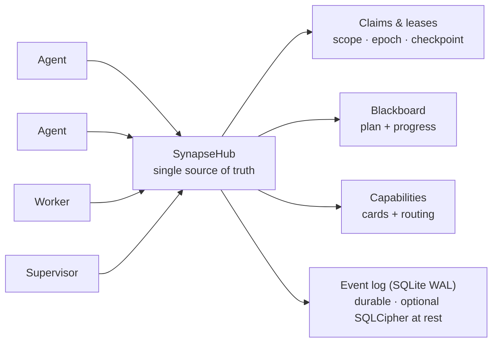

<!--
SPDX-License-Identifier: AGPL-3.0-or-later
Commercial license available
© Concepts 1996–2026 Miroslav Šotek. All rights reserved.
© Code 2020–2026 Miroslav Šotek. All rights reserved.
ORCID: 0009-0009-3560-0851
Contact: www.anulum.li | protoscience@anulum.li
SYNAPSE CHANNEL — visão geral do repositório (tradução em português do Brasil; o original em inglês é canônico)
-->

<p align="center">
  <a href="../../README.md">English</a> ·
  <a href="README.zh-CN.md">简体中文</a> ·
  <a href="README.es.md">Español</a> ·
  <strong>Português (Brasil)</strong> ·
  <a href="README.ja.md">日本語</a> ·
  <a href="README.ko.md">한국어</a> ·
  <a href="README.de.md">Deutsch</a> ·
  <a href="README.fr.md">Français</a> ·
  <a href="README.sk.md">Slovenčina</a>
</p>

<p align="center">
  
</p>

<p align="center">
  <strong>Impeça que agentes de codificação com IA em paralelo sobrescrevam os arquivos uns dos outros.</strong><br>
  Barramento de coordenação local-first — file-scope claims, um plano compartilhado e leases duráveis — para um repositório ou um ecossistema inteiro deles.
</p>

<p align="center">
  <a href="https://github.com/anulum/synapse-channel/actions/workflows/ci.yml"></a>
  <a href="https://github.com/anulum/synapse-channel/actions/workflows/fuzz.yml"></a>
  <a href="https://github.com/anulum/synapse-channel/actions/workflows/link-check.yml"></a>
  <a href="https://github.com/anulum/synapse-channel/actions/workflows/clients-cockpit.yml"></a>
  <a href="https://github.com/anulum/synapse-channel/actions/workflows/codeql.yml"></a>
  <a href="https://pypi.org/project/synapse-channel/"></a>
  <a href="https://pypi.org/project/synapse-channel/"></a>
  <a href="https://pepy.tech/project/synapse-channel"></a>
  <a href="../../LICENSE"></a>
  <a href="https://anulum.li/synapse/pricing.html"></a>
  
  <a href="https://codecov.io/gh/anulum/synapse-channel"></a>
  <a href="https://api.reuse.software/info/github.com/anulum/synapse-channel"></a>
  <a href="https://securityscorecards.dev/viewer/?uri=github.com/anulum/synapse-channel"></a>
  <a href="https://github.com/astral-sh/ruff"></a>
  <a href="https://doi.org/10.5281/zenodo.20801559"></a>
</p>

Um barramento de coordenação local-first para uma frota de agentes de IA
trabalhando em paralelo — dentro de um único repositório ou espalhados por um
ecossistema inteiro deles. Um hub WebSocket é a fonte de verdade compartilhada
para **presence**, **work claims**, **chat**, **status de tarefas** e
**resource offers**: os agentes se endereçam entre projetos e compartilham um
único plano, enquanto os file-scope claims mantêm os agentes de cada
repositório longe dos arquivos uns dos outros.

O barramento é leve no transporte (uma única dependência, `websockets`),
centrado no hub por concepção (um único lugar possui a presence, os leases e o
histórico) e roda inteiramente na máquina local. Os workers de modelos
respondem no canal por meio de qualquer endpoint compatível com OpenAI,
incluindo um servidor Ollama local, com um fallback determinístico baseado em
regras para uso offline.

**Seus agentes existentes se conectam sem código novo.** Qualquer host de
Model Context Protocol — Claude Code, Claude Desktop, Cursor — alcança o
barramento pelo servidor `synapse mcp` incluído, que expõe os verbos send,
durable inbox, status, claim, release, handoff e task como ferramentas MCP,
além do board, dos agents e dos resources como MCP resources somente leitura.
Agentes que falam A2A conectam-se pela fachada Agent Card. O próprio hub
permanece agnóstico a protocolos e a instalação básica mantém sua única
dependência — os adaptadores MCP e A2A são extras opcionais
(`pip install 'synapse-channel[mcp]'`). Veja o [guia MCP](../mcp.md).

```bash
python -m pip install synapse-channel && synapse demo
```

<p align="center">
  <a href="https://pypi.org/project/synapse-channel/"><strong>Obter o pacote Python</strong></a>
  &nbsp;·&nbsp;
  <a href="../../README.md#first-60-seconds">Rodar os primeiros 60 segundos</a>
  &nbsp;·&nbsp;
  <a href="../quickstart.md">Ler o quickstart</a>
</p>

## Coordenar. Observar. Governar.

A promessa diária do Synapse são três laços explícitos:

- **Coordenar** antes que os agentes colidam: `synapse git-init`,
  `synapse git-claim`, `synapse git-claim-check --staged`, `synapse task` e
  `syn ack` transformam escopo de trabalho, dependências e evidências em
  estado compartilhado em vez de notas por canais laterais.
- **Observar** a frota a partir de estado durável: `synapse who`,
  `synapse state`, `synapse dashboard`, `synapse event-query` e as linhas de
  peers observados mostram quem está presente, o que está claimado, o que
  mudou e quais fatos de peer-hubs são apenas advisory.
- **Governar** ações arriscadas com evidências: verificações de policy,
  aprovações, release receipts, Merkle roots, superfícies ACL, federação e
  comandos de chaves de criptografia tornam as decisões do operador
  auditáveis. As superfícies de governança relatam por padrão; os operadores
  decidem o que bloqueia um merge, uma release ou uma ação cross-hub.
- **Proteger o log durável em repouso** com a criptografia de páginas
  **SQLCipher** opcional para o event store vivo do hub (mais envelopes
  AES-GCM de arquivo inteiro para logs de relay, estado A2A, cursores e
  arquivos). Veja
  [SQLCipher live event store](../../README.md#sqlcipher-live-event-store-at-rest).

## Mural de funcionalidades

As células visuais abaixo são espaços reservados de captura rotulados, não
imagens ausentes. Gravações curtas do produto vão substituí-las após a etapa
de captura de demos; os comandos referenciados e a documentação descrevem o
comportamento entregue hoje.

| Superfície de coordenação entregue | Espaço visual rotulado |
|---|---|
| **Claim antes de editar.** [`synapse git-init`](../../README.md#git-native-claims) instala hooks de Git cientes de claims; `synapse git-claim` registra um worktree, um branch e um escopo de caminhos exatos, de modo que um claim sobreposto possa ser recusado antes que os arquivos divirjam. | **Espaço visual — claim gutter:** um proprietário fica visível enquanto uma edição concorrente é recusada. |
| **Bloquear edições nativas sem claim.** Os [hooks de claim de edição de arquivos por provider](../claim-guard-hooks.md) adaptam Claude Code `Edit\|Write`, Codex `apply_patch`, Gemini CLI `replace\|write_file` e Kimi `Edit\|Write` a um único motor de decisão de claims ao vivo. | **Espaço visual — negação de edição:** uma edição de provider sem claim é interrompida antes de a ferramenta nativa de arquivos rodar. |
| **Compartilhar o plano.** `synapse task` e [`synapse board`](../coordination-model.md) mantêm o estado das tarefas, as dependências e o trabalho pronto no hub em vez de em notas separadas dos agentes. | **Espaço visual — board:** uma tarefa bloqueada torna-se pronta quando sua dependência é concluída. |
| **Repassar o trabalho sem lacuna de propriedade.** O [handoff atômico](../coordination-model.md#4-hand-off-and-recover) move a tarefa retida, o escopo, o status e o checkpoint para um destinatário online sem janela de release-and-reclaim. | **Espaço visual — handoff:** propriedade e checkpoint movem-se juntos entre dois seats. |
| **Expor um dark seat.** Após 30 segundos contínuos sem o waiter exato do proprietário, o hub emite um único [`dark_seat_alert`](../protocol.md) para os claims afetados ou o trabalho atribuído, incluindo o remédio permanent-arm; ele não libera nem reatribui trabalho automaticamente. | **Espaço visual — alerta de dark seat:** o waiter ausente e o comando exato de rearme aparecem ao lado do trabalho afetado. |
| **Ler a frota de um único cockpit.** [`synapse dashboard`](../studio.md) serve o centro de comando local, colunas de tarefas com status exato, claims, conflitos, postura de segurança e um feed de eventos durável opcional; a projeção Studio somente leitura não adiciona nenhuma autoridade nova ao hub. | **Espaço visual — cockpit:** claims ao vivo, estado de tarefas, risco e eventos recentes compartilham uma única visão de operador. |
| **Conectar protocolos de agentes existentes na borda.** [`synapse mcp`](../mcp.md) expõe ferramentas de coordenação e resources somente leitura via stdio; a [ponte A2A](../a2a-conformance.md) expõe um Agent Card local e uma superfície HTTP+JSON mantendo explícita sua fronteira de validação parcial. | **Espaço visual — MCP e A2A:** um agente existente alcança o mesmo hub por qualquer um dos adaptadores. |

## Em resumo

<p align="center">
  
</p>



Um claim arrenda (lease) uma unidade de trabalho com um file scope, de modo que
dois agentes nunca editam os mesmos arquivos; o plano, os handoffs, os
checkpoints e um supervisor de travamento mantêm o trabalho em movimento; e o
log de eventos durável significa que um reinício do hub retoma os leases vivos
em vez de perdê-los.

## Núcleo e camadas opcionais

O SYNAPSE CHANNEL é entregue como um único pacote instalável, mas a superfície
pública é escalonada para que o barramento enxuto permaneça claro:

| Camada | Tier de taxonomia | O que pertence ali |
|---|---|---|
| Núcleo de coordenação local | `stable` | O hub, send/wait/listen/arm, claims, tasks, locks, status, board, init e os comandos de bootstrap de frota usados na coordenação diária. |
| Adaptadores de borda | `adapter` | MCP, A2A, hooks de git, pontes tmux/provider, hooks de shell, ingestão e worker seats que conectam ferramentas existentes ao barramento. |
| Análise de operador | `analysis` | Doctor, state, dashboard, causality, multihub, reliability, trust graph, directory, accounting, exportação de scorecard da frota, manifestos e consultas de eventos. Eles não mutam o estado de coordenação; modos de exportação explícitos podem escrever em um destino escolhido pelo operador. |
| Governança e integridade | `governance` | Verificações de policy, aprovações, superfícies ACL/de papéis, federação, Merkle roots, release receipts, reprodução, compactação, operações de chaves encrypt-key / SQLCipher. |
| Superfícies de laboratório | `experimental` | Benchmarking, participant fabric, route-task, sandbox, workflow, TTL advice, memory recall, auto-action e resource bidding. |

O mapa autoritativo é [`synapse_channel.surface_taxonomy`](../../src/synapse_channel/surface_taxonomy.py)
e a visão de operador gerada é [Public surface and stability](../public-surface.md).
Adaptadores e superfícies de laboratório podem ser instalados e usados a partir
do mesmo pacote, mas não mudam o núcleo local de dependência única.

### Participant memory recall opcional

`participant ask`, `participant exchange` e `participant convene` podem
envolver seus seats com recall limitado e somente leitura da API HTTP leve da
REMANENTIA. O recall fica desativado a menos que `--memory-url` esteja
presente; nenhum processo de memória é iniciado implicitamente. Tokens são
aceitos apenas via `--memory-token-file`, e os trechos recuperados entram em
`TurnRequest.context` dentro de uma cerca data-only enquanto o prompt do
operador permanece inalterado.

```bash
synapse participant ask claude "review this design" \
  --memory-url http://127.0.0.1:8001 \
  --memory-token-file /run/secrets/remanentia
```

Os resultados HTTP atuais omitem os eixos de honestidade da REMANENTIA, então
cada acerto recuperado é mostrado como boundary data; similaridade é evidência
de relevância, não evidência de verdade. Os estados no-hit e unavailable
permanecem visíveis sem falhar o turno do provider. Veja
[Participant memory recall](../participant-memory.md) para configuração,
limites, flags de CLI, uso como biblioteca e fronteiras de auditoria.

> **Em breve: Studio** — o dashboard está crescendo para um
> **[Studio](../studio.md)** de operador: um plano de controle que responde,
> num relance, o que está acontecendo, o que está em risco e o que é seguro
> fazer em seguida. O sistema de design de painel de instrumentos, a
> referência `/studio`, o shell ao vivo `/studio/command`, o painel de postura
> de segurança e o LiveFeed do log de eventos já foram entregues. Local-first
> e somente leitura por padrão — uma bancada em nível de organização está
> planejada como camada separada.

## Instalação

```bash
python -m pip install synapse-channel       # a release do PyPI
python -m pip install -e ".[dev]"           # ou um checkout de dev editável
# opcional: criptografia de páginas do event store vivo do hub (SQLCipher)
python -m pip install 'synapse-channel[sqlcipher]'
# opcional: helpers de envelopes AES-GCM de arquivo inteiro (encrypt-key profile/migrate/rekey)
python -m pip install 'synapse-channel[encryption]'
```

Para um checkout editável, mantenha o `.venv` local alinhado com os extras
dev, docs e benchmark declarados do repositório:

```bash
.venv/bin/python tools/check_dev_dependency_drift.py --check
.venv/bin/python tools/audit_dependency_tooling.py --check
```

A segunda verificação é offline. Ela confirma que o preflight local ainda
cobre os tool gates esperados, que as GitHub Actions estão fixadas em SHAs de
commit completos, que o Dependabot cobre actions/Python/Docker e que as
superfícies de metadados de publicação/download do PyPI continuam ligadas.

Isso instala o comando `synapse`. Para rodar o hub como um serviço local
sempre ativo ou um contêiner, veja o [guia de implantação](../deployment.md)
(uma user unit `systemd` e `docker compose` estão ambos incluídos). No Linux,
instale apenas um waiter permanente de identidade exata com
`synapse arm install --identity myproject/agent --start`; ele usa mailbox
replay e `Restart=always`, sem instalar um hub. A configuração de serviço
nativo do Windows não é reivindicada; use WSL com systemd conforme documentado
no guia de implantação.

Duas conveniências de shell opcionais acompanham o CLI: `synapse completions
bash|zsh|fish` imprime o completamento por tab para cada subcomando (gerado a
partir do parser vivo, então nunca deriva), e `synapse install-shell-hook`
adiciona o bloco guardado que arma automaticamente um wake listener em cada
novo terminal:

```bash
synapse completions bash > ~/.local/share/bash-completion/completions/synapse
synapse install-shell-hook          # auto-armar terminais Bash, Zsh e Fish
```

## Os primeiros 60 segundos

Em um ambiente Python limpo, verifique o CLI instalado antes de ligar agentes
a um repositório real:

```bash
python -m pip install synapse-channel
synapse doctor
synapse demo
synapse quickstart-coding
```

`synapse doctor` relata problemas de configuração local como identidade,
exposição do hub, pressão no sistema de arquivos raiz e waiters ausentes. Uma
máquina novinha pode avisar que nenhum hub ou waiter está rodando; isso é
esperado antes da configuração do serviço. `synapse demo` inicia seu próprio
hub local e conduz o caminho Claude/Codex com claims separados, recusa de
conflito, handoff e receipt verificado. Ele é bem-sucedido quando imprime:

```text
success: coordination demo completed
```

`synapse quickstart-coding` cria um workspace coding-fleet temporário, executa
a mesma demo de codificação sem colisões usada pelos workspaces gerados,
remove o workspace temporário após o sucesso e imprime:

```text
success: coding fleet demo completed
```

Ou rode toda a sequência de primeira execução como um único comando:

```bash
synapse fleet-init
```

Ele executa o doctor (`--fix` para reparar o hub local e o waiter padrão),
monta um workspace persistente `./synapse-fleet`, sonda quais CLIs de
providers esta máquina consegue assentar (claude, codex, kimi, ollama, …),
roda o smoke da demo e imprime o plano dos próximos passos — armar o waiter,
comandos de seat por provider, `git-init`, dashboard — com o nome do projeto
do workspace preenchido.

## O caminho de teste seguro mais rápido

Depois que as demos autocontidas passarem, experimente o Synapse contra um
checkout real nesta ordem:

```bash
python -m pip install synapse-channel
synapse doctor
synapse demo
synapse quickstart-coding
synapse git-init --name trial-agent
synapse dashboard --port 8765
synapse a2a-card --endpoint-url http://127.0.0.1:8877
synapse a2a-conformance
synapse a2a-serve --endpoint-url http://127.0.0.1:8877
```

Rode isso em um repositório descartável ou já versionado. `synapse git-init
--name trial-agent` instala os hooks de git cientes de claims e escreve o guia
local de convenções `.synapse/` antes que os agentes editem arquivos. A etapa
da ponte A2A é opcional e apenas local: ela permite que outra ferramenta local
inspecione o Agent Card ou converse com a ponte HTTP+JSON, mas não é uma
reivindicação de conformidade externa. Não a vincule fora do loopback sem
autenticação bearer.

## Releases

Este pacote é desenvolvido abertamente e dogfoodado diariamente: uma frota de
agentes de codificação roda sua própria coordenação sobre ele, então os
problemas aparecem no uso real e são corrigidos rapidamente. As releases são,
portanto, frequentes e em geral pequenas — correções e endurecimento em vez de
churn. As releases `0.x` atuais não prometem retrocompatibilidade entre
releases menores. O vocabulário wire e a API Python pública são protegidos
contra deriva acidental, mas uma release menor `0.x` revisada pode alterar
deliberadamente qualquer uma dessas superfícies. Toda mudança assim é
documentada no changelog e em notas de migração; uma mudança wire incompatível
incrementa `WIRE_PROTOCOL_VERSION`. A partir da `1.0.0`, uma mudança
incompatível na API Python pública estável exige uma nova versão principal do
pacote. Veja [estabilidade da API e do wire](../api-stability.md).

A `1.0.0` está planejada como a primeira release comercial estável do SYNAPSE
CHANNEL, com os contratos operacionais, o empacotamento, a superfície de suporte
e os termos de licenciamento comercial documentados como parte dessa release.

O SYNAPSE CHANNEL busca financiamento inicial, parceiros estratégicos e
coproprietários de ecossistema alinhados que queiram ajudar a amadurecer a
camada de coordenação para o desenvolvimento multiagente em produção. Veja o
[licenciamento comercial](../commercial.md) ou escreva para
`protoscience@anulum.li`.

Se você precisa de um alvo fixo, fixe uma versão (`synapse-channel==X.Y.Z`);
para obter as correções mais recentes, acompanhe a release mais nova. Ambos
são suportados.

---

Esta é a tradução da parte pública do README. A referência completa — Quick
start, modelo de coordenação, uso como biblioteca, arquitetura, inventário de
capacidades, postura de segurança, limitações conhecidas, SYNAPSE CHANNEL
Fleet, uso comercial, citação e licença — continua no
[README em inglês](../../README.md#quick-start) canônico. O original em inglês
é sempre a referência; os blocos gerados (capability snapshot, citação)
existem apenas lá.
