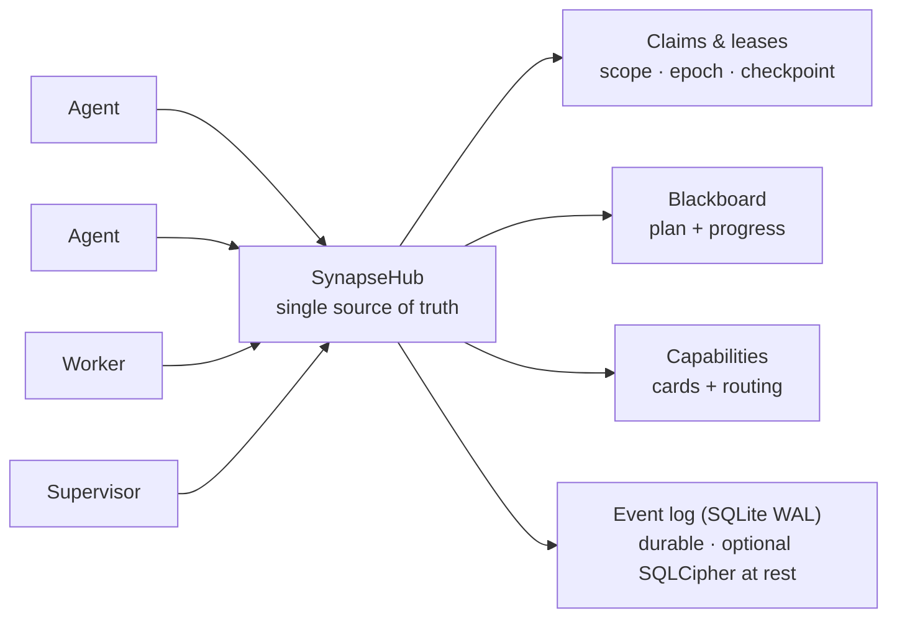

<!--
SPDX-License-Identifier: AGPL-3.0-or-later
Commercial license available
© Concepts 1996–2026 Miroslav Šotek. All rights reserved.
© Code 2020–2026 Miroslav Šotek. All rights reserved.
ORCID: 0009-0009-3560-0851
Contact: www.anulum.li | protoscience@anulum.li
SYNAPSE CHANNEL — prehľad repozitára (slovenský preklad; anglický originál je kanonický)
-->

<p align="center">
  <a href="../../README.md">English</a> ·
  <a href="README.zh-CN.md">简体中文</a> ·
  <a href="README.es.md">Español</a> ·
  <a href="README.pt-BR.md">Português (Brasil)</a> ·
  <a href="README.ja.md">日本語</a> ·
  <a href="README.ko.md">한국어</a> ·
  <a href="README.de.md">Deutsch</a> ·
  <a href="README.fr.md">Français</a> ·
  <strong>Slovenčina</strong>
</p>

<p align="center">
  
</p>

<p align="center">
  <strong>Zastavte paralelné AI kódovacie agenty, aby si navzájom neprepisovali súbory.</strong><br>
  Local-first koordinačná zbernica — file-scope claims, zdieľaný plán a trvalé leases — pre jeden repozitár alebo celý ekosystém repozitárov.
</p>

<p align="center">
  <a href="https://github.com/anulum/synapse-channel/actions/workflows/ci.yml"></a>
  <a href="https://github.com/anulum/synapse-channel/actions/workflows/fuzz.yml"></a>
  <a href="https://github.com/anulum/synapse-channel/actions/workflows/link-check.yml"></a>
  <a href="https://github.com/anulum/synapse-channel/actions/workflows/clients-cockpit.yml"></a>
  <a href="https://github.com/anulum/synapse-channel/actions/workflows/codeql.yml"></a>
  <a href="https://pypi.org/project/synapse-channel/"></a>
  <a href="https://pypi.org/project/synapse-channel/"></a>
  <a href="https://pepy.tech/project/synapse-channel"></a>
  <a href="../../LICENSE"></a>
  <a href="https://www.remanentia.com/synapse/pricing.html"></a>
  
  <a href="https://codecov.io/gh/anulum/synapse-channel"></a>
  <a href="https://api.reuse.software/info/github.com/anulum/synapse-channel"></a>
  <a href="https://securityscorecards.dev/viewer/?uri=github.com/anulum/synapse-channel"></a>
  <a href="https://github.com/astral-sh/ruff"></a>
  <a href="https://doi.org/10.5281/zenodo.20801559"></a>
</p>

Local-first koordinačná zbernica pre flotilu AI agentov pracujúcich paralelne —
v jednom repozitári alebo naprieč celým ekosystémom repozitárov. Jeden
WebSocket hub je zdieľaným zdrojom pravdy pre **presence**, **work claims**,
**chat**, **stav úloh** a **resource offers**: agenti sa navzájom oslovujú
naprieč projektmi a zdieľajú jeden plán, zatiaľ čo file-scope claims držia
agentov v každom repozitári mimo súborov toho druhého.

Zbernica je transportne ľahká (jediná závislosť, `websockets`), zámerne
hub-centrická (jedno miesto vlastní presence, leases a históriu) a beží celá na
lokálnom stroji. Modeloví workeri odpovedajú na kanáli cez ľubovoľný
OpenAI-kompatibilný endpoint vrátane lokálneho Ollama servera, s deterministickým
pravidlovým fallbackom pre offline použitie.

**Vaši existujúci agenti sa pripoja bez nového kódu.** Ľubovoľný Model Context
Protocol host — Claude Code, Claude Desktop, Cursor — sa dostane na zbernicu cez
pribalený `synapse mcp` server, ktorý sprístupňuje verby send, durable inbox,
status, claim, release, handoff a task ako MCP nástroje, plus board, agents
a resources ako read-only MCP resources. Agenti hovoriaci A2A sa pripájajú cez
Agent Card rozhranie. Samotný hub zostáva protokolovo agnostický a základná
inštalácia si drží jedinú závislosť — MCP a A2A adaptéry sú voliteľné extra
(`pip install 'synapse-channel[mcp]'`). Pozri [MCP príručku](../mcp.md).

```bash
python -m pip install synapse-channel && synapse demo
```

<p align="center">
  <a href="https://pypi.org/project/synapse-channel/"><strong>Získajte Python balík</strong></a>
  &nbsp;·&nbsp;
  <a href="../../README.md#first-60-seconds">Spustite prvých 60 sekúnd</a>
  &nbsp;·&nbsp;
  <a href="../quickstart.md">Prečítajte si quickstart</a>
</p>

## Koordinovať. Pozorovať. Spravovať.

Každodenný prísľub Synapse tvoria tri explicitné slučky:

- **Koordinovať** skôr, než sa agenti zrazia: `synapse git-init`,
  `synapse git-claim`, `synapse git-claim-check --staged`, `synapse task`
  a `syn ack` premieňajú rozsah práce, závislosti a evidenciu na zdieľaný stav
  namiesto poznámok v bočných kanáloch.
- **Pozorovať** flotilu z trvalého stavu: `synapse who`, `synapse state`,
  `synapse dashboard`, `synapse event-query` a riadky pozorovaných peerov
  ukazujú, kto je prítomný, čo je claimnuté, čo sa zmenilo a ktoré fakty
  peer-hubov sú len advisory.
- **Spravovať** rizikové akcie s evidenciou: policy kontroly, schválenia,
  release receipts, Merkle roots, ACL plochy, federácia a príkazy pre šifrovacie
  kľúče robia rozhodnutia operátora auditovateľnými. Governance plochy štandardne
  reportujú; operátori rozhodujú, čo blokuje merge, release alebo cross-hub akciu.
- **Chrániť trvalý log v pokoji** voliteľným **SQLCipher** stránkovým šifrovaním
  živého event store hubu (plus celosúborové AES-GCM obálky pre relay logy,
  A2A stav, kurzory a archívy). Pozri
  [SQLCipher live event store](../../README.md#sqlcipher-live-event-store-at-rest).

## Stena funkcií

Vizuálne bunky nižšie sú označené placeholdery záznamov, nie chýbajúce obrázky.
Krátke produktové nahrávky ich nahradia po demo-capture kole; odkazované príkazy
a dokumentácia opisujú dnes dodané správanie.

| Dodaná koordinačná plocha | Označený vizuálny slot |
|---|---|
| **Claim pred editom.** [`synapse git-init`](../../README.md#git-native-claims) inštaluje claim-aware Git hooky; `synapse git-claim` zaznamená presný worktree, vetvu a rozsah ciest, takže prekrývajúci sa claim možno odmietnuť skôr, než sa súbory rozídu. | **Vizuálny placeholder — claim gutter:** jeden vlastník je viditeľný, zatiaľ čo konkurenčný edit je odmietnutý. |
| **Blokovanie neclaimnutých natívnych editov súborov.** [Provider file-edit claim hooky](../claim-guard-hooks.md) adaptujú Claude Code `Edit\|Write`, Codex `apply_patch`, Gemini CLI `replace\|write_file` a Kimi `Edit\|Write` na jeden živý claim-rozhodovací engine. | **Vizuálny placeholder — odmietnutie editu:** neclaimnutý provider edit sa zastaví skôr, než sa spustí natívny súborový nástroj. |
| **Zdieľanie plánu.** `synapse task` a [`synapse board`](../coordination-model.md) držia stav úloh, závislosti a pripravenú prácu na hube namiesto oddelených poznámok agentov. | **Vizuálny placeholder — board:** blokovaná úloha sa stane pripravenou, keď sa jej závislosť dokončí. |
| **Odovzdanie práce bez medzery vo vlastníctve.** [Atomický handoff](../coordination-model.md#4-hand-off-and-recover) presúva držanú úlohu, rozsah, stav a checkpoint na online príjemcu bez okna release-and-reclaim. | **Vizuálny placeholder — handoff:** vlastníctvo a checkpoint sa presúvajú spolu medzi dvoma seatmi. |
| **Odhalenie dark seatu.** Po 30 nepretržitých sekundách bez presného waitera vlastníka hub vyšle jeden [`dark_seat_alert`](../protocol.md) pre dotknuté claims alebo pridelenú prácu, vrátane permanent-arm nápravy; prácu automaticky neuvoľňuje ani nepresúva. | **Vizuálny placeholder — dark-seat alert:** chýbajúci waiter a presný re-arm príkaz sa zobrazia vedľa dotknutej práce. |
| **Čítanie flotily z jedného kokpitu.** [`synapse dashboard`](../studio.md) servíruje lokálne veliteľské centrum, stĺpce úloh s presným stavom, claims, konflikty, bezpečnostný postoj a voliteľný trvalý event feed; read-only Studio projekcia nepridáva hubu žiadnu novú autoritu. | **Vizuálny placeholder — kokpit:** živé claims, stav úloh, riziko a nedávne udalosti zdieľajú jeden operátorský pohľad. |
| **Pripojenie existujúcich agentových protokolov na okraji.** [`synapse mcp`](../mcp.md) sprístupňuje koordinačné nástroje a read-only resources cez stdio; [A2A bridge](../a2a-conformance.md) sprístupňuje lokálnu Agent Card a HTTP+JSON plochu, pričom jej hranica čiastočnej validácie zostáva explicitná. | **Vizuálny placeholder — MCP a A2A:** existujúci agent sa dostane k tomu istému hubu cez ktorýkoľvek adaptér. |

## Na prvý pohľad

<p align="center">
  
</p>



Claim prenajíma (lease) jednotku práce s file scope, takže dvaja agenti nikdy
needitujú tie isté súbory; plán, handoffy, checkpointy a stall supervisor držia
prácu v pohybe; a trvalý event log znamená, že reštart hubu obnoví živé leases
namiesto ich straty.

## Jadro a voliteľné vrstvy

SYNAPSE CHANNEL sa dodáva ako jeden inštalovateľný balík, ale verejná plocha je
odstupňovaná, aby štíhla zbernica zostala prehľadná:

| Vrstva | Taxonomický tier | Čo tam patrí |
|---|---|---|
| Lokálne koordinačné jadro | `stable` | Hub, send/wait/listen/arm, claims, tasks, locks, status, board, init a fleet bootstrap príkazy používané na každodennú koordináciu. |
| Edge adaptéry | `adapter` | MCP, A2A, git hooky, tmux/provider mosty, shell hooky, ingescia a worker seaty, ktoré pripájajú existujúce nástroje na zbernicu. |
| Operátorská analýza | `analysis` | Doctor, state, dashboard, causality, multihub, reliability, trust graph, directory, accounting, fleet scorecard export, manifesty a event queries. Tieto nemenia koordinačný stav; explicitné exportné režimy môžu zapisovať do operátorom zvoleného sinku. |
| Governance a integrita | `governance` | Policy kontroly, schválenia, ACL/rolové plochy, federácia, Merkle roots, release receipts, reprodukcia, kompakcia, encrypt-key / SQLCipher kľúčové operácie. |
| Laboratórne plochy | `experimental` | Benchmarking, participant fabric, route-task, sandbox, workflow, TTL advice, memory recall, auto-action a resource bidding. |

Autoritatívna mapa je [`synapse_channel.surface_taxonomy`](../../src/synapse_channel/surface_taxonomy.py)
a generovaný operátorský pohľad je [Public surface and stability](../public-surface.md).
Adaptéry a laboratórne plochy možno inštalovať a používať z toho istého balíka,
ale nemenia lokálne jadro s jedinou závislosťou.

### Voliteľný Participant memory recall

`participant ask`, `participant exchange` a `participant convene` môžu obaliť
svoje seaty ohraničeným, read-only recallom z ľahkého HTTP API REMANENTIE.
Recall je vypnutý, pokiaľ nie je prítomné `--memory-url`; žiadny pamäťový proces
sa nespúšťa implicitne. Tokeny sa prijímajú len cez `--memory-token-file`
a recallnuté úryvky vstupujú do `TurnRequest.context` vo vnútri data-only
ohraničenia, zatiaľ čo operátorský prompt zostáva nezmenený.

```bash
synapse participant ask claude "review this design" \
  --memory-url http://127.0.0.1:8001 \
  --memory-token-file /run/secrets/remanentia
```

Aktuálne HTTP výsledky vynechávajú honesty osi REMANENTIE, takže každý
recallnutý hit sa zobrazuje ako boundary data; podobnosť je evidencia
relevancie, nie evidencia pravdy. No-hit a unavailable stavy zostávajú viditeľné
bez zlyhania provider turnu. Pozri
[Participant memory recall](../participant-memory.md) pre setup, limity, CLI
flagy, knižničné použitie a hranice auditu.

> **Prichádza: Studio** — dashboard rastie do operátorského **[Studia](../studio.md)**:
> riadiacej roviny, ktorá na prvý pohľad odpovedá, čo sa deje, čo je v riziku
> a čo je bezpečné urobiť ďalej. Dizajnový systém prístrojovej dosky, `/studio`
> referencia, živý `/studio/command` shell, panel bezpečnostného postoja
> a event-log LiveFeed už boli dodané. Local-first a štandardne read-only —
> workbench na úrovni organizácie je plánovaný ako samostatná vrstva.

## Inštalácia

```bash
python -m pip install synapse-channel       # release z PyPI
python -m pip install -e ".[dev]"           # alebo editovateľný dev checkout
# voliteľné: stránkové šifrovanie živého hub event-store (SQLCipher)
python -m pip install 'synapse-channel[sqlcipher]'
# voliteľné: celosúborové AES-GCM envelope helpery (encrypt-key profile/migrate/rekey)
python -m pip install 'synapse-channel[encryption]'
```

Pri editovateľnom checkoute držte lokálny `.venv` zarovnaný s deklarovanými
dev, docs a benchmark extra závislosťami repozitára:

```bash
.venv/bin/python tools/check_dev_dependency_drift.py --check
.venv/bin/python tools/audit_dependency_tooling.py --check
```

Druhá kontrola je offline. Overuje, že lokálny preflight stále pokrýva očakávané
tool gates, GitHub Actions sú pripnuté na plné commit SHA, Dependabot pokrýva
actions/Python/Docker a plochy PyPI publish/download metadát zostávajú zapojené.

Toto nainštaluje príkaz `synapse`. Ako spustiť hub ako vždy zapnutú lokálnu
službu alebo kontajner, pozri [deployment príručku](../deployment.md)
(`systemd` user unit aj `docker compose` sú pribalené). Na Linuxe nainštalujete
len permanentný exact-identity waiter cez
`synapse arm install --identity myproject/agent --start`; používa mailbox replay
a `Restart=always`, bez inštalácie hubu. Natívny Windows service setup nie je
deklarovaný; použite WSL so systemd podľa deployment príručky.

S CLI sa dodávajú dve voliteľné shell pohodlia: `synapse completions
bash|zsh|fish` vypíše tab completion pre každý subpríkaz (generované zo živého
parsera, takže nikdy nedriftuje) a `synapse install-shell-hook` pridá strážený
blok, ktorý v každom novom termináli automaticky armuje wake listener:

```bash
synapse completions bash > ~/.local/share/bash-completion/completions/synapse
synapse install-shell-hook          # auto-arm Bash, Zsh a Fish terminálov
```

## Prvých 60 sekúnd

Na čistom Python prostredí overte nainštalované CLI skôr, než zapojíte agentov
do skutočného repozitára:

```bash
python -m pip install synapse-channel
synapse doctor
synapse demo
synapse quickstart-coding
```

`synapse doctor` reportuje lokálne setup problémy ako identita, expozícia hubu,
tlak na root filesystem a chýbajúce waitery. Úplne nový stroj môže varovať, že
nebeží žiadny hub ani waiter; pred setupom služby je to očakávané. `synapse
demo` spustí vlastný lokálny hub a prevedie Claude/Codex tok s oddelenými
claimami, odmietnutím konfliktu, handoffom a overeným receiptom. Uspeje, keď
vypíše:

```text
success: coordination demo completed
```

`synapse quickstart-coding` vytvorí dočasný coding-fleet workspace, spustí to
isté bezkolízne coding demo používané generovanými workspacemi, po úspechu
dočasný workspace odstráni a vypíše:

```text
success: coding fleet demo completed
```

Alebo spustite celú first-run sekvenciu ako jeden príkaz:

```bash
synapse fleet-init
```

Spustí doctor (`--fix` na opravu predvoleného lokálneho hubu a waitera),
vyskladá perzistentný `./synapse-fleet` workspace, sonduje, ktoré provider CLI
tento stroj vie usadiť (claude, codex, kimi, ollama, …), spustí demo smoke
a vypíše plán ďalších krokov — armovanie waitera, per-provider seat príkazy,
`git-init`, dashboard — s doplneným menom projektu workspacu.

## Najrýchlejšia bezpečná skúšobná cesta

Keď samostatné demá prejdú, vyskúšajte Synapse proti skutočnému checkoutu
v tomto poradí:

```bash
python -m pip install synapse-channel
synapse doctor
synapse demo
synapse quickstart-coding
synapse git-init --name trial-agent
synapse dashboard --port 8765
synapse a2a-card --endpoint-url http://127.0.0.1:8877
synapse a2a-conformance
synapse a2a-serve --endpoint-url http://127.0.0.1:8877
```

Spúšťajte to v jednorazovom alebo už verzovanom repozitári. `synapse git-init
--name trial-agent` nainštaluje claim-aware git hooky a zapíše lokálnu
`.synapse/` príručku konvencií skôr, než agenti editujú súbory. A2A bridge krok
je voliteľný a len lokálny: umožní inému lokálnemu nástroju prezrieť Agent Card
alebo hovoriť s HTTP+JSON bridgeom, ale nie je to externý conformance claim.
Nebindujte ho mimo loopback bez bearer auth.

## Releasy

Tento balík sa vyvíja otvorene a denne sa dogfooduje: flotila kódovacích agentov
na ňom prevádzkuje vlastnú koordináciu, takže problémy sa objavia v reálnom
použití a rýchlo sa opravia. Releasy sú preto časté a väčšinou malé — opravy
a hardening namiesto churnu. Aktuálne `0.x` releasy nesľubujú spätnú
kompatibilitu medzi minor releasmi. Wire slovník a verejné Python API chránia
testy pred náhodným driftom, no skontrolovaný `0.x` minor release môže
ktorúkoľvek z týchto plôch zámerne zmeniť. Každá taká zmena musí byť v
changelogu a migračných poznámkach; nekompatibilná wire zmena zvýši
`WIRE_PROTOCOL_VERSION`. Od `1.0.0` vyžaduje breaking zmena stabilného verejného
Python API novú major verziu balíka. Pozri
[stabilitu API a wire protokolu](../api-stability.md).

`1.0.0` je plánovaný ako prvý stabilný komerčný release SYNAPSE CHANNEL
s operačnými kontraktmi, balením, support plochou a podmienkami komerčného
licencovania zdokumentovanými ako súčasť toho releasu.

SYNAPSE CHANNEL hľadá startup financovanie, strategických partnerov a spriaznených
spoluvlastníkov ekosystému, ktorí chcú pomôcť dozrieť koordinačnú vrstvu pre
produkčný multi-agentový vývoj. Pozri [komerčné licencovanie](../commercial.md)
alebo napíšte na `protoscience@anulum.li`.

Ak potrebujete pevný cieľ, pripnite verziu (`synapse-channel==X.Y.Z`); ak chcete
najnovšie opravy, sledujte najnovší release. Oboje je podporované.

---

Toto je preklad verejnej časti README. Kompletná referencia — Quick start,
model koordinácie, použitie ako knižnica, architektúra, inventár schopností,
bezpečnostný postoj, známe obmedzenia, SYNAPSE CHANNEL Fleet, komerčné použitie,
citácia a licencia — pokračuje v kanonickom
[anglickom README](../../README.md#quick-start). Anglický originál je vždy
smerodajný; generované bloky (capability snapshot, citácia) existujú len tam.
