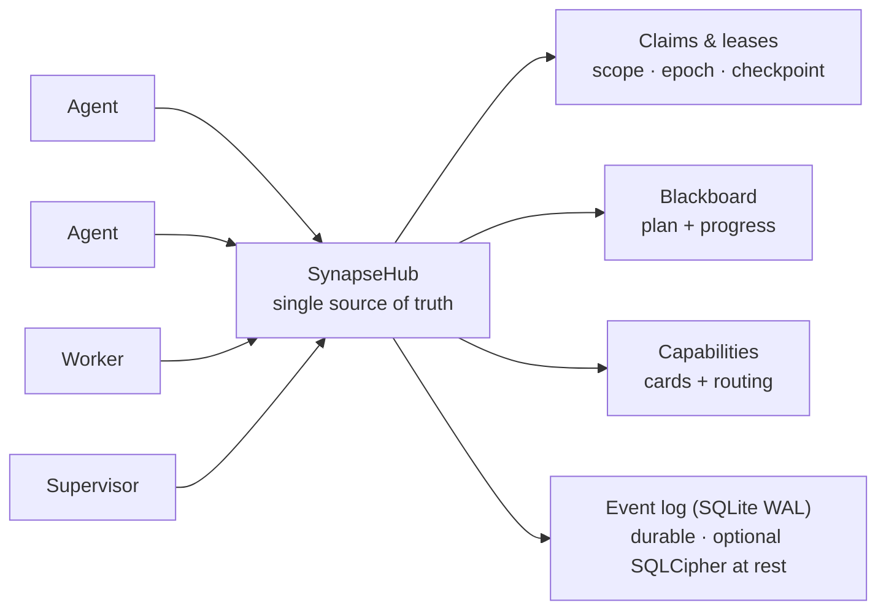

<!--
SPDX-License-Identifier: AGPL-3.0-or-later
Commercial license available
© Concepts 1996–2026 Miroslav Šotek. All rights reserved.
© Code 2020–2026 Miroslav Šotek. All rights reserved.
ORCID: 0009-0009-3560-0851
Contact: www.anulum.li | protoscience@anulum.li
SYNAPSE CHANNEL — 仓库概览（简体中文翻译；英文原文为准）
-->

<p align="center">
  <a href="../../README.md">English</a> ·
  <strong>简体中文</strong> ·
  <a href="README.es.md">Español</a> ·
  <a href="README.pt-BR.md">Português (Brasil)</a> ·
  <a href="README.ja.md">日本語</a> ·
  <a href="README.ko.md">한국어</a> ·
  <a href="README.de.md">Deutsch</a> ·
  <a href="README.fr.md">Français</a> ·
  <a href="README.sk.md">Slovenčina</a>
</p>

<p align="center">
  
</p>

<p align="center">
  <strong>阻止并行的 AI 编码智能体互相覆盖彼此的文件。</strong><br>
  本地优先的协调总线 — file-scope claims、共享计划和持久的 leases — 适用于单个仓库，也适用于整个仓库生态。
</p>

<p align="center">
  <a href="https://github.com/anulum/synapse-channel/actions/workflows/ci.yml"></a>
  <a href="https://github.com/anulum/synapse-channel/actions/workflows/fuzz.yml"></a>
  <a href="https://github.com/anulum/synapse-channel/actions/workflows/link-check.yml"></a>
  <a href="https://github.com/anulum/synapse-channel/actions/workflows/clients-cockpit.yml"></a>
  <a href="https://github.com/anulum/synapse-channel/actions/workflows/codeql.yml"></a>
  <a href="https://pypi.org/project/synapse-channel/"></a>
  <a href="https://pypi.org/project/synapse-channel/"></a>
  <a href="https://pepy.tech/project/synapse-channel"></a>
  <a href="../../LICENSE"></a>
  <a href="https://www.remanentia.com/synapse/pricing.html"></a>
  
  <a href="https://codecov.io/gh/anulum/synapse-channel"></a>
  <a href="https://api.reuse.software/info/github.com/anulum/synapse-channel"></a>
  <a href="https://securityscorecards.dev/viewer/?uri=github.com/anulum/synapse-channel"></a>
  <a href="https://github.com/astral-sh/ruff"></a>
  <a href="https://doi.org/10.5281/zenodo.20801559"></a>
</p>

一条本地优先的协调总线，服务于并行工作的 AI 智能体舰队 — 无论是在单个仓库
之内，还是分布在整个仓库生态之中。一个 WebSocket 中枢（hub）是
**presence**、**work claims**、**聊天**、**任务状态**和 **resource offers**
的共享唯一事实来源：智能体跨项目相互寻址并共享同一份计划，而 file-scope
claims 让任一仓库内的智能体互不触碰对方的文件。

这条总线在传输层非常轻量（只有一个依赖，`websockets`），在设计上以 hub 为
中心（由一处统一拥有 presence、leases 和历史记录），并且完全运行在本地
机器上。模型 worker 通过任何兼容 OpenAI 的端点在信道上应答，包括本地的
Ollama 服务器，并为离线使用提供确定性的规则回退。

**你现有的智能体无需新代码即可接入。** 任何 Model Context Protocol 宿主 —
Claude Code、Claude Desktop、Cursor — 都能通过随附的 `synapse mcp` 服务器
到达总线，它把 send、durable inbox、status、claim、release、handoff、task
这些动词暴露为 MCP 工具，并把 board、agents、resources 暴露为只读 MCP
resources。会说 A2A 的智能体则通过 Agent Card 界面接入。hub 本身保持协议
无关，核心安装保持单一依赖 — MCP 和 A2A 适配器是可选的 extras
（`pip install 'synapse-channel[mcp]'`）。参见 [MCP 指南](../mcp.md)。

```bash
python -m pip install synapse-channel && synapse demo
```

<p align="center">
  <a href="https://pypi.org/project/synapse-channel/"><strong>获取 Python 包</strong></a>
  &nbsp;·&nbsp;
  <a href="../../README.md#first-60-seconds">运行最初 60 秒</a>
  &nbsp;·&nbsp;
  <a href="../quickstart.md">阅读快速入门</a>
</p>

## 协调。观察。治理。

Synapse 的日常承诺是三条显式回路：

- **协调** — 在智能体相撞之前：`synapse git-init`、`synapse git-claim`、
  `synapse git-claim-check --staged`、`synapse task` 和 `syn ack` 把工作
  范围、依赖关系和证据变成共享状态，而不是旁路笔记。
- **观察** — 从持久状态读取舰队：`synapse who`、`synapse state`、
  `synapse dashboard`、`synapse event-query` 以及被观察的对等行展示谁在线、
  什么被 claim、什么发生了变化、哪些对等 hub 的事实只是 advisory。
- **治理** — 用证据约束高风险操作：policy 检查、审批、release receipts、
  Merkle roots、ACL 表面、联邦（federation）和加密密钥命令使操作员的决策
  可审计。治理表面默认只报告；由操作员决定什么会阻止一次 merge、release
  或跨 hub 操作。
- **保护静态的持久日志** — 为 hub 的实时事件存储提供可选的 **SQLCipher**
  页级加密（另有面向中继日志、A2A 状态、游标和归档的整文件 AES-GCM 信封）。
  参见 [SQLCipher live event store](../../README.md#sqlcipher-live-event-store-at-rest)。

## 功能墙

下方的视觉单元格是带标签的截屏占位符，不是缺失的图片。短的产品录像会在
演示捕捉环节之后替换它们；链接的命令和文档描述的是今天已交付的行为。

| 已交付的协调表面 | 带标签的视觉插槽 |
|---|---|
| **先 claim 再编辑。** [`synapse git-init`](../../README.md#git-native-claims) 安装感知 claim 的 Git 钩子；`synapse git-claim` 记录精确的 worktree、分支和路径范围，使重叠的 claim 可以在文件分叉之前被拒绝。 | **视觉占位 — claim gutter：** 一个所有者可见，而一个竞争编辑被拒绝。 |
| **阻止未 claim 的原生文件编辑。** [各提供商的文件编辑 claim 钩子](../claim-guard-hooks.md)把 Claude Code `Edit\|Write`、Codex `apply_patch`、Gemini CLI `replace\|write_file` 和 Kimi `Edit\|Write` 适配到同一个实时 claim 决策引擎。 | **视觉占位 — 编辑拒绝：** 未 claim 的提供商编辑在原生文件工具运行之前就被停下。 |
| **共享计划。** `synapse task` 和 [`synapse board`](../coordination-model.md) 把任务状态、依赖关系和就绪工作保存在 hub 上，而不是各个智能体分散的笔记里。 | **视觉占位 — 看板：** 被阻塞的任务在其依赖完成后变为就绪。 |
| **交接工作而不产生所有权空档。** [原子 handoff](../coordination-model.md#4-hand-off-and-recover) 把持有的任务、范围、状态和检查点移交给在线接收者，没有 release-and-reclaim 的窗口期。 | **视觉占位 — handoff：** 所有权和检查点在两个 seat 之间一起移动。 |
| **揭露 dark seat。** 当所有者的精确 waiter 连续缺席 30 秒后，hub 会针对受影响的 claims 或已分配的工作发出一条 [`dark_seat_alert`](../protocol.md)，并附上 permanent-arm 补救方法；它不会自动释放或重新分配工作。 | **视觉占位 — dark seat 警报：** 缺失的 waiter 和精确的重新武装命令出现在受影响工作的旁边。 |
| **从一个座舱读取整个舰队。** [`synapse dashboard`](../studio.md) 提供本地指挥中心、精确状态的任务列、claims、冲突、安全态势和可选的持久事件流；只读的 Studio 投影不为 hub 增加任何新权限。 | **视觉占位 — 座舱：** 实时 claims、任务状态、风险和近期事件共享同一个操作员视图。 |
| **在边缘接入既有的智能体协议。** [`synapse mcp`](../mcp.md) 通过 stdio 暴露协调工具和只读 resources；[A2A 桥](../a2a-conformance.md)暴露本地 Agent Card 和 HTTP+JSON 表面，同时让其部分验证的边界保持显式。 | **视觉占位 — MCP 与 A2A：** 既有智能体通过任一适配器到达同一个 hub。 |

## 一览

<p align="center">
  
</p>



一个 claim 以 file scope 租用（lease）一个工作单元，因此两个智能体绝不会
编辑相同的文件；计划、handoff、检查点和停滞监督者让工作持续推进；持久的
事件日志意味着 hub 重启会恢复存活的 leases，而不是丢失它们。

## 核心与可选层

SYNAPSE CHANNEL 以单个可安装的包交付，但公开表面是分层的，以保持精简总线
的清晰：

| 层 | 分类 tier | 归属内容 |
|---|---|---|
| 本地协调核心 | `stable` | hub、send/wait/listen/arm、claims、tasks、locks、status、board、init，以及日常协调使用的舰队引导命令。 |
| 边缘适配器 | `adapter` | MCP、A2A、git 钩子、tmux/提供商桥、shell 钩子、摄取，以及把既有工具接到总线上的 worker seats。 |
| 操作员分析 | `analysis` | Doctor、state、dashboard、causality、multihub、reliability、trust graph、directory、accounting、舰队记分卡导出、清单和事件查询。它们不改变协调状态；显式导出模式可以写入操作员选定的目标。 |
| 治理与完整性 | `governance` | policy 检查、审批、ACL/角色表面、联邦、Merkle roots、release receipts、复现、压实，以及 encrypt-key / SQLCipher 密钥操作。 |
| 实验表面 | `experimental` | 基准测试、participant fabric、route-task、sandbox、workflow、TTL advice、memory recall、auto-action 和 resource bidding。 |

权威地图是 [`synapse_channel.surface_taxonomy`](../../src/synapse_channel/surface_taxonomy.py)，
生成的操作员视图是 [Public surface and stability](../public-surface.md)。
适配器和实验表面可以从同一个包安装和使用，但它们不改变单一依赖的本地核心。

### 可选的 Participant memory recall

`participant ask`、`participant exchange` 和 `participant convene` 可以用
来自 REMANENTIA 轻量 HTTP API 的受限只读 recall 包裹它们的 seat。除非提供
`--memory-url`，否则 recall 处于禁用状态；不会隐式启动任何记忆进程。令牌
只通过 `--memory-token-file` 接受，被召回的片段在 data-only 围栏内进入
`TurnRequest.context`，而操作员的提示词保持不变。

```bash
synapse participant ask claude "review this design" \
  --memory-url http://127.0.0.1:8001 \
  --memory-token-file /run/secrets/remanentia
```

当前的 HTTP 结果不含 REMANENTIA 的 honesty 轴，因此每个被召回的命中都显示
为 boundary data；相似度是相关性证据，不是真实性证据。no-hit 和 unavailable
状态保持可见，而不会让提供商的回合失败。设置、限制、CLI 标志、库用法和
审计边界参见 [Participant memory recall](../participant-memory.md)。

> **即将到来：Studio** — dashboard 正在成长为一个操作员
> **[Studio](../studio.md)**：一个一眼就能回答正在发生什么、什么有风险、
> 接下来做什么是安全的控制平面。仪表盘设计系统、`/studio` 参考、实时
> `/studio/command` shell、安全态势面板和事件日志 LiveFeed 均已交付。
> 本地优先且默认只读 — 组织级工作台计划作为独立的一层。

## 安装

```bash
python -m pip install synapse-channel       # 来自 PyPI 的发行版
python -m pip install -e ".[dev]"           # 或可编辑的开发检出
# 可选：hub 实时事件存储的页级加密（SQLCipher）
python -m pip install 'synapse-channel[sqlcipher]'
# 可选：整文件 AES-GCM 信封助手（encrypt-key profile/migrate/rekey）
python -m pip install 'synapse-channel[encryption]'
```

对于可编辑的检出，请让本地 `.venv` 与仓库声明的 dev、docs 和 benchmark
extras 保持对齐：

```bash
.venv/bin/python tools/check_dev_dependency_drift.py --check
.venv/bin/python tools/audit_dependency_tooling.py --check
```

第二个检查是离线的。它验证本地 preflight 仍然覆盖预期的工具门禁、GitHub
Actions 已固定到完整的提交 SHA、Dependabot 覆盖 actions/Python/Docker，
且 PyPI 发布/下载元数据表面保持接线。

这会安装 `synapse` 命令。要把 hub 作为常驻本地服务或容器运行，参见
[部署指南](../deployment.md)（`systemd` 用户单元和 `docker compose` 均已
附带）。在 Linux 上，用
`synapse arm install --identity myproject/agent --start` 只安装一个永久的
精确身份 waiter；它使用 mailbox replay 和 `Restart=always`，不安装 hub。
不主张原生的 Windows 服务安装；请按部署指南所述使用带 systemd 的 WSL。

CLI 附带两个可选的 shell 便利：`synapse completions bash|zsh|fish` 为每个
子命令输出 Tab 补全（从实时解析器生成，因此永不漂移），而
`synapse install-shell-hook` 添加受保护的代码块，在每个新终端中自动武装
一个 wake 监听器：

```bash
synapse completions bash > ~/.local/share/bash-completion/completions/synapse
synapse install-shell-hook          # 自动武装 Bash、Zsh 和 Fish 终端
```

## 最初 60 秒

在干净的 Python 环境上，先验证已安装的 CLI，再把智能体接入真实仓库：

```bash
python -m pip install synapse-channel
synapse doctor
synapse demo
synapse quickstart-coding
```

`synapse doctor` 报告本地设置问题，例如身份、hub 暴露、根文件系统压力和
缺失的 waiter。全新的机器可能会警告没有 hub 或 waiter 在运行；在服务设置
之前这是预期的。`synapse demo` 启动自己的本地 hub，执行 Claude/Codex
分离 claim、冲突拒绝、handoff 和已验证 receipt 的完整流程，并在打印以下
内容时成功：

```text
success: coordination demo completed
```

`synapse quickstart-coding` 创建一个临时的 coding-fleet 工作区，运行与生成
的工作区相同的无碰撞编码演示，成功后删除临时工作区，并打印：

```text
success: coding fleet demo completed
```

或者把整个首次运行序列作为一条命令执行：

```bash
synapse fleet-init
```

它运行 doctor（`--fix` 修复默认的本地 hub 和 waiter），搭建持久的
`./synapse-fleet` 工作区，探测这台机器能安置哪些提供商 CLI（claude、
codex、kimi、ollama、…），运行演示冒烟测试，并打印下一步计划 — waiter
武装、每个提供商的 seat 命令、`git-init`、dashboard — 并填好工作区的
项目名。

## 最快的安全试用路径

在自包含演示通过后，按此顺序在真实检出上试用 Synapse：

```bash
python -m pip install synapse-channel
synapse doctor
synapse demo
synapse quickstart-coding
synapse git-init --name trial-agent
synapse dashboard --port 8765
synapse a2a-card --endpoint-url http://127.0.0.1:8877
synapse a2a-conformance
synapse a2a-serve --endpoint-url http://127.0.0.1:8877
```

请在一次性的或已被版本控制的仓库中运行。`synapse git-init
--name trial-agent` 会在智能体编辑文件之前安装感知 claim 的 git 钩子并写入
本地 `.synapse/` 约定指南。A2A 桥步骤是可选且仅限本地的：它让另一个本地
工具查看 Agent Card 或与 HTTP+JSON 桥对话，但这不是对外的合规主张。没有
bearer 认证时，不要把它绑定到环回之外。

## 发行

这个包公开开发并且每天自用（dogfood）：一支编码智能体舰队在它上面运行自己
的协调，因此问题会在真实使用中浮现并被快速修复。所以发行频繁且大多很小 —
是修复和加固，而不是折腾。当前 `0.x` 发行不承诺跨次版本的向后兼容。wire
词汇和公开 Python API 有测试防止意外漂移，但经过评审的 `0.x` 次版本仍可
有意修改任一接口面。此类变更必须写入 changelog 和迁移说明；wire 不兼容
变更还必须提升 `WIRE_PROTOCOL_VERSION`。从 `1.0.0` 起，稳定公开 Python API
的破坏性变更需要新的包主版本。参见
[API 与 wire 稳定性](../api-stability.md)。

`1.0.0` 已规划为 SYNAPSE CHANNEL 的第一个稳定商业发行，其运营契约、打包、
支持面和商业许可条款将作为该发行的一部分写入文档。

SYNAPSE CHANNEL 正在寻求启动资金、战略伙伴和志同道合的生态共同拥有者，
一起把协调层打磨到适合生产环境的多智能体开发。参见
[商业许可](../commercial.md)，或写信至 `protoscience@anulum.li`。

如果你需要固定目标，请固定一个版本（`synapse-channel==X.Y.Z`）；要获得
最新修复，请跟随最新发行。两者都受支持。

---

这是 README 公开部分的翻译。完整参考 — Quick start、协调模型、库用法、
架构、能力清单、安全态势、已知限制、SYNAPSE CHANNEL Fleet、商业使用、引用
和许可 — 在权威的[英文 README](../../README.md#quick-start) 中继续。英文
原文始终为准；生成的区块（capability snapshot、引用）只存在于那里。
