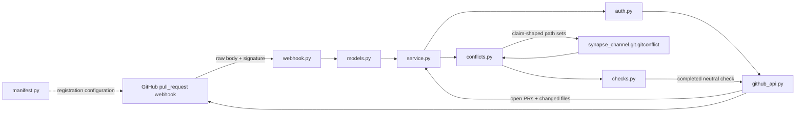

<!--
SPDX-License-Identifier: AGPL-3.0-or-later
Commercial license available
© Concepts 1996–2026 Miroslav Šotek. All rights reserved.
© Code 2020–2026 Miroslav Šotek. All rights reserved.
ORCID: 0009-0009-3560-0851
Contact: www.anulum.li | protoscience@anulum.li
SYNAPSE GITHUB APP — hosting-neutral stage-two architecture
-->

# Managed GitHub App architecture

Status: owner-approved stage 2 build contract, 2026-07-11. The backlog approval
dated 2026-07-02 covers the manifest and Checks API skeleton. It does not choose
a host, create an App registration, or authorize deployment.

## Requirements

The integration must:

1. render a reproducible GitHub App manifest with only `pull_requests:read`,
   `checks:write`, and the implicit metadata read permission;
2. verify `X-Hub-Signature-256` over the unmodified request body before JSON
   parsing, using HMAC-SHA256 and constant-time comparison;
3. accept only bounded `pull_request` events and extract a typed installation,
   repository, head, base, and pull-request identity;
4. authenticate as the App with a short-lived RS256 JWT, exchange it for a
   one-hour installation token, and scope that token back down to the two App
   permissions;
5. read bounded open-PR and changed-file pages, map them onto the existing
   `synapse_channel.git.gitconflict.find_conflicts` contract, and publish one
   completed `neutral` check for the event head;
6. stay stateless, advisory, independently installable, and outside
   `synapse_channel.core`;
7. fail visibly on invalid signatures, malformed payloads, incomplete API data,
   redirects, oversized responses, or transport failures. It must never publish
   a clean verdict from incomplete evidence.

## Boundary and component flow



The managed package imports one existing local-core function:
`find_conflicts`. The core imports nothing from this integration. GitHub auth,
HTTP, webhooks, secrets, rate limits, and hosting therefore cannot leak into the
single-dependency local runtime.

## Directory and responsibilities

```text
integrations/github-app/
├── ARCHITECTURE.md          decision record and invariants
├── LICENSE                  AGPL-3.0-or-later distribution terms
├── NOTICE.md                licensing and attribution notice
├── README.md                operator-facing skeleton usage and limits
├── pyproject.toml           independent package and strict tool policy
├── requirements-dev.txt     hash-locked test/build toolchain
├── src/synapse_github_app/
│   ├── auth.py              RS256 App JWT and installation token model
│   ├── checks.py            bounded neutral Check Run projection
│   ├── conflicts.py         PR snapshots to the core conflict finder
│   ├── errors.py            typed redaction-safe boundary failures
│   ├── github_api.py        fixed-origin REST transport and pagination
│   ├── json_boundary.py     strict UTF-8, finite, depth-bounded JSON
│   ├── manifest.py          least-privilege manifest renderer
│   ├── models.py            typed webhook/API boundary parsing
│   ├── service.py           one-event stateless orchestration
│   └── webhook.py           raw-body HMAC verification and bounded decoding
└── tests/                   one focused test surface per production module
```

No module owns more than one boundary. In particular, the service coordinates
already-validated models and does not implement cryptography, HTTP, rendering,
or path-overlap logic itself.

## Data contracts and bounds

- Webhook bodies: at most 1 MiB; JSON nesting at most 64 levels.
- Delivery identifiers: non-empty printable strings, at most 128 characters.
- Repository owner/name and refs: typed and length-bounded before URL or Markdown
  use. REST paths are assembled only from percent-encoded validated fields.
- Open pull requests: at most 100 per event evaluation.
- Changed files: at most 3,000 per pull request, matching GitHub's documented
  endpoint ceiling. A full page at the final bound is treated as truncated.
- REST responses: at most 4 MiB each; redirects are refused so credentials never
  cross the configured API origin.
- Check output: deterministic, Markdown-escaped, bounded below the Checks API
  output limit, and always `conclusion: neutral`.

If an API bound is reached, the service publishes an explicitly incomplete
neutral advisory only when it still has enough evidence to name actual overlaps;
otherwise it raises and creates no check. It never says “no conflict” from a
truncated inventory.

## Authentication and secret handling

The App JWT uses RS256, an issued-at time 60 seconds in the past, and an expiry
no more than ten minutes ahead. Private-key bytes and webhook secrets enter the
library through explicit constructor arguments; they are never logged, returned,
written, or placed in exception text. Installation tokens are opaque strings:
their length and prefix are not assumed, and the API-provided expiry is retained.

Production configuration must provide secrets from the eventual host's secret
store. Selecting that store and host is stage 3 and remains owner-gated.

## HTTP and hosting seam

The package exposes a synchronous `handle_pull_request` application service and
an injectable REST transport. It does not bind a socket, pick WSGI/ASGI, create a
database, schedule workers, or persist tenant data. A future host adapter owns
request routing, concurrency, delivery de-duplication, retries, observability,
and secret injection without changing the conflict or check contracts.

Loopback HTTP is accepted only through an explicit test/development switch so a
real local HTTP server can exercise the production transport. Every non-loopback
API origin must use HTTPS.

## Verification story

- GitHub's published HMAC known-answer vector verifies the raw webhook boundary.
- A generated RSA key verifies real RS256 JWT claims and signature.
- A local `ThreadingHTTPServer` exercises actual HTTP requests for token exchange,
  PR/file pagination, and Check Run creation; no HTTP client mock stands in for
  the production transport.
- The end-to-end service test sends a signed real webhook through the parser,
  reads PR data from the local API server, calls the shipped core conflict finder,
  and inspects the captured neutral Check Run payload.
- Dedicated CI runs strict mypy, Ruff, Bandit, 100% line/branch coverage, package
  build, wheel-content and licence-file inspection, and dependency audit for
  this package.

## Explicitly deferred

- manifest-code conversion and custody of the generated private key/secret;
- public App registration, hosting provider, deployment, DNS, queues, retries,
  tenancy, persistence, billing, comments, and required-check enforcement;
- durable delivery de-duplication and multi-tenant rate-limit scheduling.

Those items require the stage 3 owner decision. This stage supplies the bounded,
tested seam they can host without changing the local-first core.
